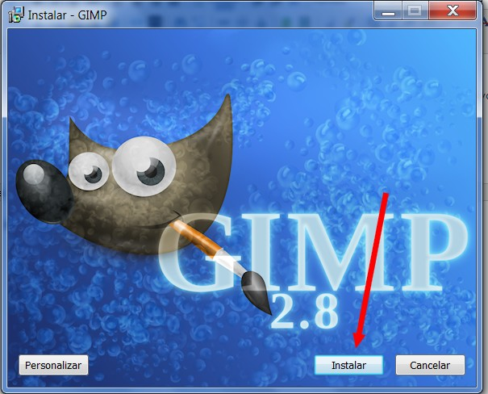
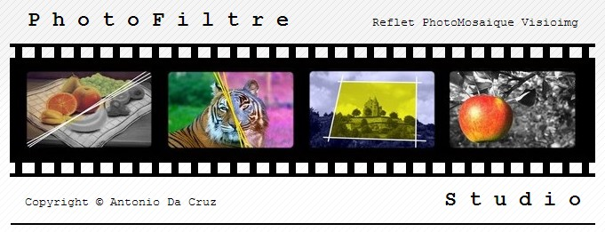

# 1.1 Instalar los programas

**CONOCIMIENTOS PREVIOS**

*   Conocimientos informáticos a nivel de usuario: saber descargar un programa de la red (internet), guardarlo en una carpeta e instalar un programa en el disco duro seleccionando diferentes opciones.
*   Descomprimir archivos.

**1\. Instalar GIMP en tu equipo**

_1.1 Instalación en Windows_

*   En el sitio web oficial del proyecto GIMP podrás encontrar la versión más reciente o que se adapta a tu sistema: [http://www.gimp.org/](http://www.gimp.org/)
*   Si deseas instalar una versión portable....

_1.2 Instalación en Linux_

*   GIMP viene instalado por defecto como editor de gráficos de la mayoría de distribuciones de Linux.

_1.3 Proceso de instalación (Windows)_

1.  1.  Descarga la [versión de Gimp](http://sourceforge.net/projects/gimp-win/files/GIMP%20%2B%20GTK%2B%20%28stable%20release%29/GIMP%202.8.6/gimp-2.8.6-setup.exe/download?accel_key=71%3A1383605438%3Ahttp%253A//www.gimp.org/downloads/%3A1a0d63dd%2499e19f59767599716d478145a95947df73b7dbb0&click_id=85ed86c4-45a3-11e3-bea3-0200ac1d1d8f&source=accel).
    2.  Hacer doble clic en el archivo **gimp-2-8-4-setup.exe.**
    3.  Elige el idioma.
    4.  Puedes personalizar las instalación, pero te recomiendo que sigas las instrucciones por defecto.

Imagen 4: captura de pantalla propia

**2\. Instalar otras aplicaciones**

Como ya hemos comentado anteriormente, vamos a basar todo nuestro trabajo en GIMP... no obstante hemos elegido también **Photofiltre** por tres razones:

*   Está instalado en los **tablets** del programa Pizarrra Digital.
*   Hay **versiones gratuitas**.
*   Es potente, **fácil e intuitivo**.

Imagen 5: captura de pantalla propia

1.  **Descarga Photofiltre**:

*   *   [Photofiltre Studio X](http://www.photofiltre-studio.com/download-en.htm): La versión más completa. Tiene una pega. Es una versión de prueba y a los 30 días deja de funcionar.
    *   [Photofiltre 7](http://www.photofiltre-studio.com/pf7-en.htm): Es una versión más limitada pero muy útil. Es gratuita. Está en inglés, pero descargando un plugin se puede traducir.
        *   Traducción a español. Descargar este archivo comprimido [StudioEs.zip](http://static.infomaniak.ch/photofiltre/utils/StudioES.zip).
        *   Descomprimir el archivo. y copiarlo en la carpeta que has instalado Photofiltre: C://Programfiles (x86)/Photofiltre 7.
        *   Eliminar el archivo **StudioEN.plg**
        *   **¡Ya está!**
    *   [Photofiltre 7 (portable)](http://aularagon.catedu.es/materialesaularagon2013/imagen/PhotoFiltre7.zip): Una versión portable es la que no es necesario instalarla en el ordenador. Funcionará en todos los equipos sin necesidad de instalación. **¡RECOMENDAMOS ÉSTA!**

1.  **Descarga** el archivo comprimido.
2.  **Descomprime** el archivo en una carpeta de tu disco duro.
3.  Se creará una carpeta llamada **PhotoFiltre7**. Dentro de esa carpeta, haz doble clic en el archivo ejecutable **PhotoFiltre7.exe**, y se cargará el programa.

**NOTA IMPORTANTE**: es posible que alguna de estas versiones no funcione bien en Windows Vista o Windows 7.

2\. **PhotoScape**.

*   Otra alternativa que te proponemos es [PhotoScape](http://www.photoscape.org/ps/main/index.php?lc=es). Es un programa gratuito y que tiene muchas y variadas funciones. Lo puedes descargar e instalarlo en tu ordenador. De este programa no vamos a dar referencias en este curso, pero si te gusta más, lo puedes utilizar.

**3\. Aplicaciones on-line**

Hay muchas y muy variadas. Lo bueno de estas aplicaciones es que son gratuitas, no es necesario instalarlas y las puedes usar desde cualquier equipo y cualquier sistema operativo. Solo necesitas un navegador. De todas ellas ellas destacamos **Pixlr**. Haremos referencias a esta herramienta a lo largo de este curso.

*   [Acceder a al editor Pixlr](http://pixlr.com/editor/).

## Importante

**Este curso estará basado en GIMP, Photofiltre y Pixrl. De todas formas puedes usar el editor que más se adecue a tus necesidades.**

