# 1.1 Picasa

Presentación creada por Julián Trullenque con [Picasa web](http://picasa.google.com/) con imágenes libres descargadas de Internet

<object type="application/x-shockwave-flash" data="https://static.googleusercontent.com/external_content/picasaweb.googleusercontent.com/slideshow.swf" width="715" height="402"><param name="src" value="https://static.googleusercontent.com/external_content/picasaweb.googleusercontent.com/slideshow.swf"><param name="flashvars" value="host=picasaweb.google.com&amp;hl=en_US&amp;feat=flashalbum&amp;RGB=0x000000&amp;feed=https%3A%2F%2Fpicasaweb.google.com%2Fdata%2Ffeed%2Fapi%2Fuser%2F109351649918197108771%2Falbumid%2F5947313864020835521%3Falt%3Drss%26kind%3Dphoto%26hl%3Den_US"><param name="pluginspage" value="http://www.macromedia.com/go/getflashplayer"></object>

### 1\. ¿Qué es Picasa?

Picasa es una herramienta web para visualizar, organizar y editar fotografías digitales. Adicionalmente, Picasa posee un sitio web integrado para compartir fotos. La única limitación es el espacio de que disponemos en esta gratuidad. 1024 Mb, o lo que es lo mismo 1Gb. Picasa nos va a permitir dos funcionalidades:

*   **Como repositorio o almacén de fotos ON-LINE**: es sencilla, tenemos que estar conectados a Internet y nos va a permitir subir las fotos desde nuestro equipo a la web y desde aquí publicarlas y compartirlas organizadas en álbumes.
*   Como programa **INSTALABLE**: es necesario instalar el programa en nuestro ordenador, nos permite organizar nuestras fotos, editarlas... En este curso no entraremos en profundidad en este software ya que hemos trabajado con otros programas que nos parecen mejores y más completos, pero si te interesa el tema te ofrecemos un manual on-line que te ayudará en la tarea.

### 2\. Entramos en la web de Picasa

1\. **Buscamos en Google.es** la palabra "picasa" y entre otras, nos aparecen estas dos opciones:

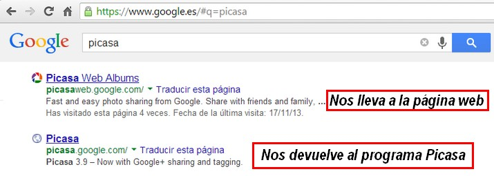

*   Si queremos descargar el programa entramos en [http://picasa.google.com/](http://picasa.google.com/)
*   Si queremos is directamente a la web para subir fotografías iremos a [http://picasaweb.google.com](http://picasaweb.google.com)

En nuestro caso vamos a elegir la **segunda opción**.

**2\. Entrar en** [http://picasaweb.google.com](picasaweb.google.com)

A hacer ingresar la URL [http://picasaweb.google.com](picasaweb.google.com) nos pedirá directamente que entremos con nuestro nombre de usuario y contraseña.

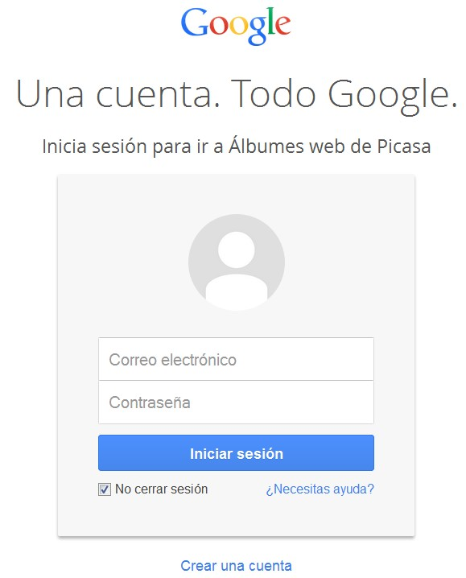

**3\. Entorno de trabajo**

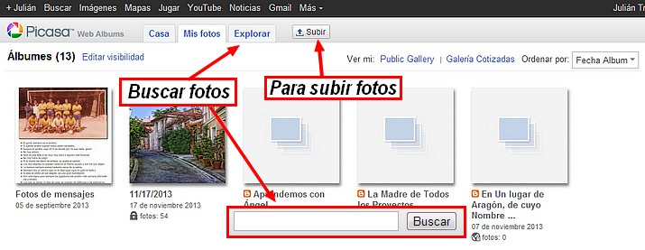

### 3\. Subir fotografías y crear un álbum

1º Una vez que has entrado en la web de Picasa, verás los álbumes que tienes creados. Para subir fotos o crear otro álbum haz **clic en Subir**.

2º Aparecerá esta pantalla. Ponemos el nombre que queremos al álbum o bien seleccionamos uno ya existente. Tenemos dos métodos para subir las fotografías:

1.  1.  Haciendo clic en Selecto Photos For Your Computer nos abrirá una ventana donde tendremos que buscar la carpeta donde tenemos guardadas las fotos.
    2.  Arrastrar desde la carpeta al centro de la imagen.

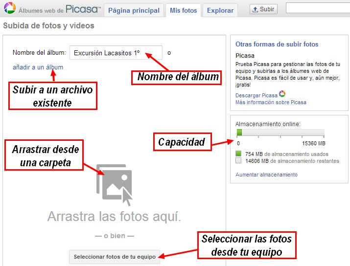

3º Ya solamente falta esperar a que se suban las fotos elegidas.

### 4\. Configuración de privacidad

Para configurar la privacidad de nuestro álbum, que no de nuestra cuenta (cada álbum puede tener una privacidad diferente):

1º Hacemos **clic en "Editar"**, un botón que está en la parte lateral derecha.

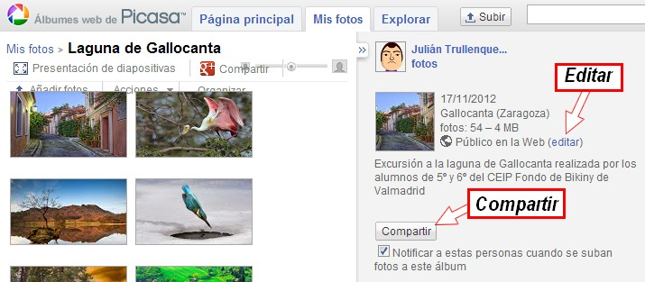

2º Hecho ésto nos aparecerá un **formulario** en el que podremos poner el título del álbum, una descripción en incluso situarlo en un mapa. Hay una pestaña que nos dejará configurar la **privacidad del álbum**.

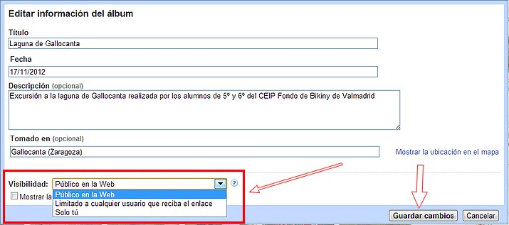

3º En el menús desplegable **"Visibiliad"** aparecerán tres opciones:

*   *   **Público en la Web**: Todos los usuarios de la Web pueden ver los álbumes públicos.
    *   **Limitado a cualquier usuario que reciba el enlace**: Todos los usuarios que reciban el enlace podrán ver estos álbumes.
    *   **Solo tú**: Esta opción supone el máximo nivel de privacidad, por lo que solo tú podrás ver estos álbumes.

### 5\. Compartir un álbum

**Compartir un álbum resulta muy útil** para, en primer lugar que **los seguidores estén notificados** de todos los cambios que se van produciendo y en segundo lugar para **colaborar entre varios autores en la publicación** de fotos en ese álbum. Pero también se corre el riesgo de dar permisos a otras personas y que puedan borrar y manipular las fotos con buena o mala intención. Veamos como se invita a colaborar.

1º Con el álbum abierto, hacer clic en **Share**.

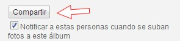

2º Aparecerá un **cuadro de diálogo siguiente**:

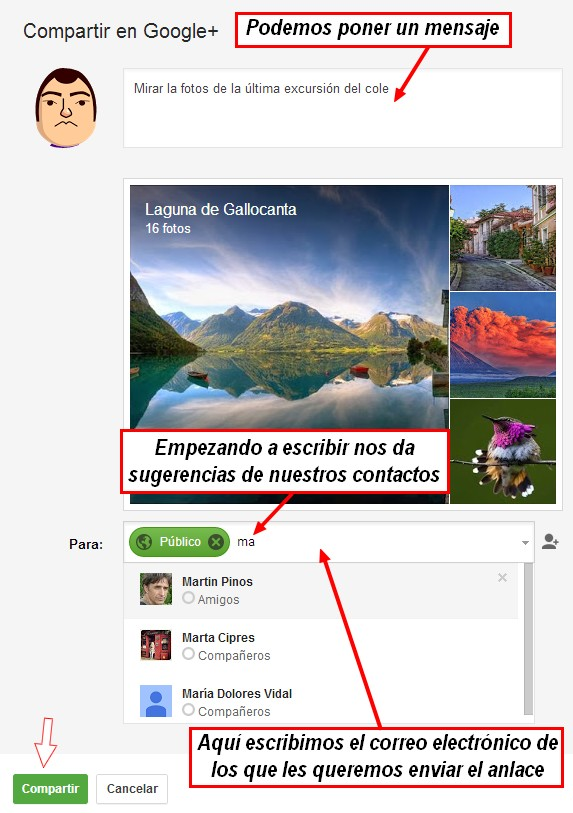

3º Hacemos clic en **Aceptar**. Y ya hemos compartido nuestro álbum.

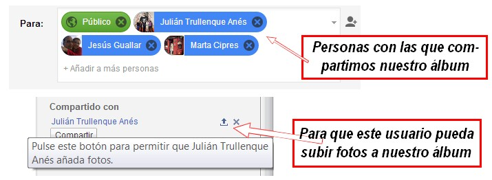

3º Podemos compartir dos clases de permisos, en uno solo pueden ver las fotos pero serán notificados de cada cambio, con el otro permiso podrán subir también fotos.

## Tarea

1.  El tutor habrá compartido ya un álbum contigo, si no es así solicítale por correo que lo haga.
2.  Sube en ese álbum dos o tres fotos que hayas hecho tú mismo. 
3.  ¿Sabrías crear un álbum y compartirlo con todos los miembros del curso.

### 6\. Publicar un álbum

Para publicar un álbum de Picasa es necesario que hayamos puesto la visibilidad como pública. Podremos hacer dos cosas con el álbum:

1.  Compartir un enlace.
2.  Insertar una presentación de diapositivas en un blog o página web.

Veamos cómo se hace:

1º Con le álbum abierto (recuerda que tiene que ser público). Hacemos **clic en Enlazar este álbum** y no aparecerá este diálogo.

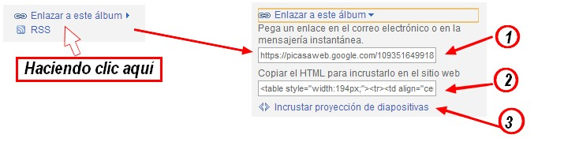

2º Nos aparecerán 3 opciones:

1.  Un enlace para ponerlo en una web.
2.  Un enlace con una imagen qn la que la hacer clic nos llevará al álbum.
3.  Un botón para crear un pase de diapositivas (lo vemos con más detenimiento).

**7\. Publicar un pase de diapositivas en una web o un blog**

1.  En la página **Mis fotos**, haz clic en el álbum.
2.  A la derecha de la página, haz clic en **Enlazar a este álbum**.
3.  Haz clic en **Incrustar proyección de diapositivas**.
4.  Selecciona la configuración de la presentación de diapositivas, como el tamaño de la imagen, los títulos y la reproducción automática.
5.  A continuación, copia el código HTML resultante (Ctrl+C).
6.  Pega el código HTML en el código fuente de tu blog (Ctrl+V).

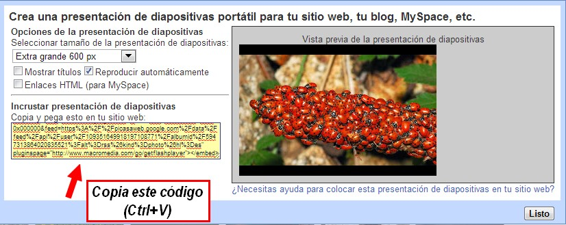

Mira este tutorial para ver cómo se hace:

<object type="application/x-shockwave-flash" data="http://aularagon.catedu.es/materialesaularagon2013/imagen/picasa.swf" width="715" height="538"><param name="src" value="http://aularagon.catedu.es/materialesaularagon2013/imagen/picasa.swf"></object>

## Para saber más

**Software Picasa**

Como antes hemos mencionado, este servicio tiene una versión descargable, que nos sirve también aparte de como gestor de imágenes, como editor de fotografías. Como ya hemos visto y analizado otros editores de imagen, no hemos creído oportuno analizar éste. No obstante si tienes interés por este programa, te dejamos el manual oficial de Picasa.

*   [Picasa](https://support.google.com/picasa/answer/1753765?hl=es&ref_topic=1751920&rd=1). Ayuda para otros productos de Google. ©2013 Google. [Condiciones del servicio](http://www.google.com/intl/es/policies/terms/)
    

**Web Picasa y web Google+**

Si estás registrado en **GOOGLE+** al entrar a [https://picasaweb.google.com/](https://picasaweb.google.com/home), te redirige directamente a la sección de fotos de tu **GOOGLE+**, quemenos opciones que el **PICASA** tradicional. Google, al menos de momento, ha dejado abierta la puerta para entrar al modo tradicional(sin redirección a GOOGLE+) de**PICASA WEB**, el acceso es:

*   [https://picasaweb.google.com/lh/myphotos?noredirect=1](https://picasaweb.google.com/lh/myphotos?noredirect=1)
*   Para más información sobre las [**diferencias entre PICASAWEB y FOTOS de GOOGLE+**](https://support.google.com/picasa/answer/1321133?hl=es):

