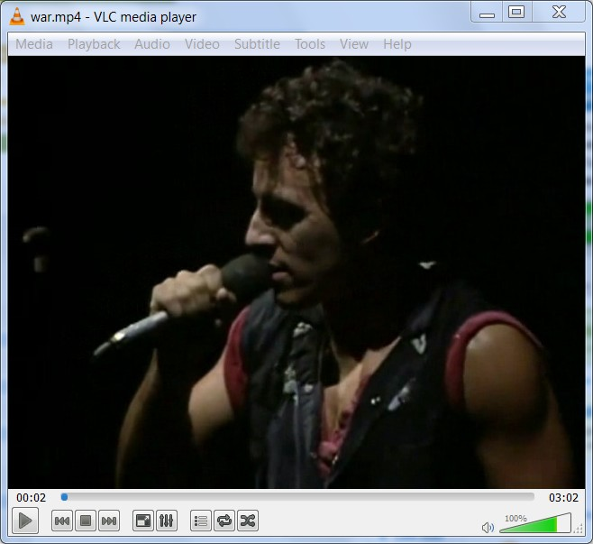

# 1.1 Reproducir vídeos

## Importante

**Necesitamos un reproductor de vídeo digital. En la actualidad todos los Sistemas Operativos vienen con su reproductor de vídeo configurado y con los últimos codecs instalados. No obstante como el mundo de la imagen avanza tan deprisa y cada marca tiene su formato, siempre es necesario tener nuestro equipo actualizado.**

**En esta unidad te vamos a presentar un reproductor universal VLC y un pack de codecs que te sacarán de más de un apuro. No obstante puedes utilizar el reproductor que desees.**

**Mas adelante vas a conocer también conversores de vídeo y aprenderás a pasar de un formato a otro según tus conveniencias.**

**CONOCIMIENTOS PREVIOS**

*   Para aprender de forma eficiente este apartado, el alumno deberá tener un dominio de la informática a nivel usuario.
*   El alumno deberá saber descargar programas de la red, descomprimir archivos e instalar y desintalar programas.
*   El alumno deberá tener nociones básicas de uso de un reproductor de vídeo digital: abrir un vídeo, y botones de play, rebobinar... 

**1\. Reproducir vídeo con VLC Media Player**

VLC media player es un reproductor de vídeo y sonido inmejorable. Su **compatibilidad con todo tipo de formatos, su potencia, facilidad de uso, versatilidad y funciones avanzadas no tienen comparación dentro de su categoría**. Además es gratuito y multiplataforma (Windows, Ubuntu, OS...). Sus características más destacadas son:

*   Soporta un **gran número de formatos de audio y vídeo** sin necesidad de instalar códecs adicionales: MPEG-1, MPEG-2, MPEG-4, DivX, MP3,OGG, MOV, RAM, AVI, FLV, etc.
*   Es una **opción muy interesante frente a otros programas comerciales** para reproducir CDs de música, películas en soporte DVD o VídeoCD, etc.

VLC Media Player es una aplicación local para reproducir archivos multimedia del disco duro o en soporte CD/DVD. No se trata de un plugin para el navegador web. Se ha incluido en este curso por su facilidad para visualizar todo tipo de formatos y en especial DivX, FLV y películas en DVD.

**1\. Descargar e instalar VLC**

1.  Descarga el archivo de instalación de esta página. [http://www.videolan.org/vlc/](http://www.videolan.org/vlc/)
2.  Doble clic en el archivo: vlc-2.1.0-win32.exe
3.  Seguir instrucciones hasta instala.

**2\. Visualizar un vídeo**

*   Haciendo doble Clic en el vídeo o a través de **Media>Open File (Ctrl+O)**

Imagen 1: Captura de pantalla propia 

**2\. Instalar codecs de vídeo en tu ordenador.**

Es fácil que vayamos a reproducir un vídeo que nos han pasado y que a la hora de ponerlo no lo podemos ver en nuestro equipo. El problema que podemos tener es que no tengamos instalado el [codec](http://es.wikipedia.org/wiki/C%C3%B3dec) de ese vídeo en nuestro ordenador.

Los archivos de vídeo o música suelen estar comprimidos (codificados) de una cierta forma dependiendo de su tipo. Hace falta descomprimirlos (decodificarlos) para poder verlos o escucharlos.  
  
Un [codec](http://es.wikipedia.org/wiki/C%C3%B3dec) es el software que se encarga de codificar esos archivos, por ejemplo para almacenarlos sin que ocupen demasiado. Y de decodificarlos para que puedan reproducirse. Su nombre viene de la contracción de COdificador-DECodificador.  
  
Están integrados en programas como el [reproductor de Windows Media](http://windowsespanol.about.com/od/WindowsLiveYMultimedia/ss/Reproductor-Windows-Media.htm) u otros similares. En función de los codecs que incluyan podrán abrir más o menos tipos de archivos. Un mismo tipo de vídeo o música puede estar comprimido con codecs de vídeo o audio distintos. Por ejemplo en un archivo de vídeo AVI han podido usarse codecs DivX, XviD u otros.

La solución más normal para resolver este problema es descargar e instalar un paquete de codesc. Te vamos a presentar los dos más conocidos y tu eliges:

*   La mejor solución es el programa **VCL Media Player**... que antes hemos analizado.
*   [XP Codec Packs](http://aularagon.catedu.es/materialesaularagon2013/imagen/XP-Codec-Pack-2.5.8.rar): recopila un más que **interesante conjunto de códecs** que te ayudarán a visualizar y escuchar un gran número de formatos de audio y vídeo. Es fácil de instalar e incluye un reproductor. (**ARCHIVO COMPRIMIDO**). Te recomendamos éste por ser más fácil.
*   [K-Lite\_Codec\_Pack\_1015\_Full](http://aularagon.catedu.es/materialesaularagon2013/imagen/K-Lite_Codec_Pack_1015_Full.rar): Es mucho más completo que el anterior, pero es más difícil de instalar ya que no da muchas explicaciones de los parámetros avanzados (**ARCHIVO COMPRIMIDO**). Recomendamos para usuarios avanzados.

## ParaSaberMas

A través de este curso te recomendamos usar como reproductor de vídeo el que traiga instalado el Sistema Operativo que utilices. Pero también te recomendamos VLC por ser gratuito, bastante completo y multiplataforma. No obstante si quieres conocer más reproductores de vídeo digital puedes leer estos artículos:

*   **GEMBETA:** "**Elige el mejor reproductor de vídeo en Windows**": [http://www.genbeta.com](http://www.genbeta.com/multimedia/elige-el-mejor-reproductor-de-video-en-windows). [Condiciones de uso](http://www.weblogssl.com/contenidos). Marzo 2010.
*   **EMZETABLOG: 20 reproductores de vídeo gratuitos**. [http://www.emezeta.com](http://www.emezeta.com/articulos/20-reproductores-de-video-gratuitos). José Román Hernández Martín ([Manz](https://twitter.com/Manz)). Licencia CC by-nc-sa 3.0.
*   **About.Com: Qué es un codec y descargar codecs**: [http://windowsespanol.about.com/](http://windowsespanol.about.com/od/WindowsLiveYMultimedia/ss/Que-Es-Un-Codec_2.htm). Ángel Gutiérrez. [Términos de uso](http://www.about.com/gi/pages/uagree.htm).

