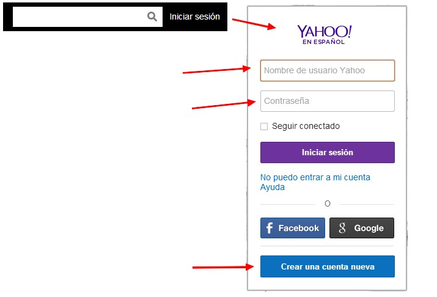
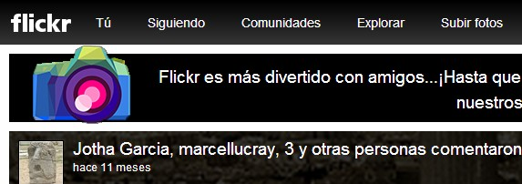
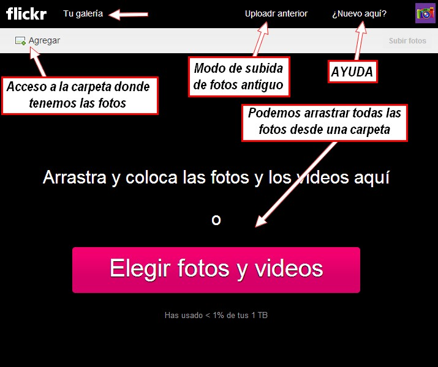
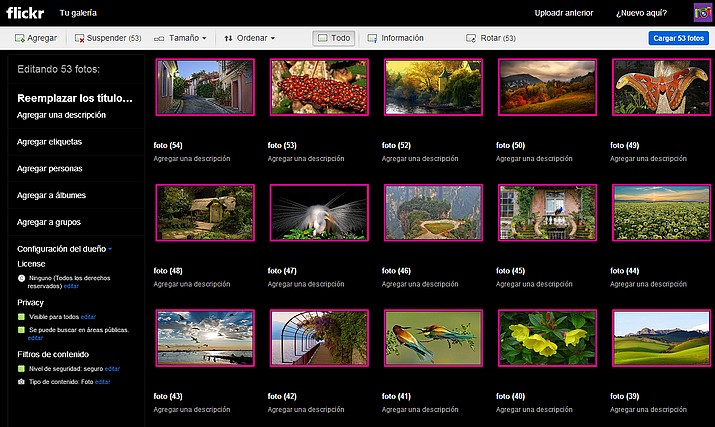
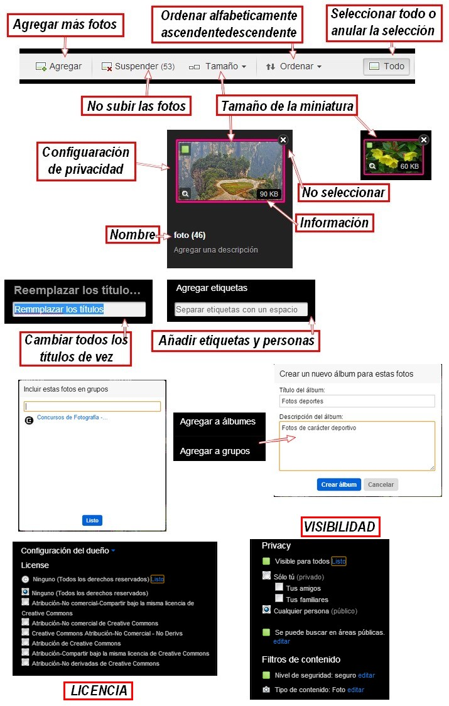
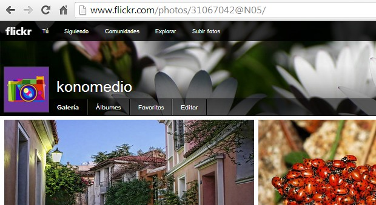
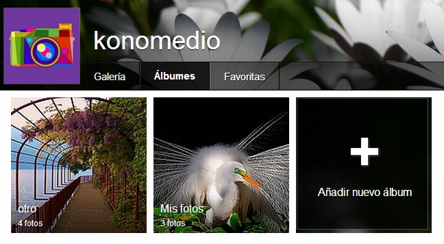
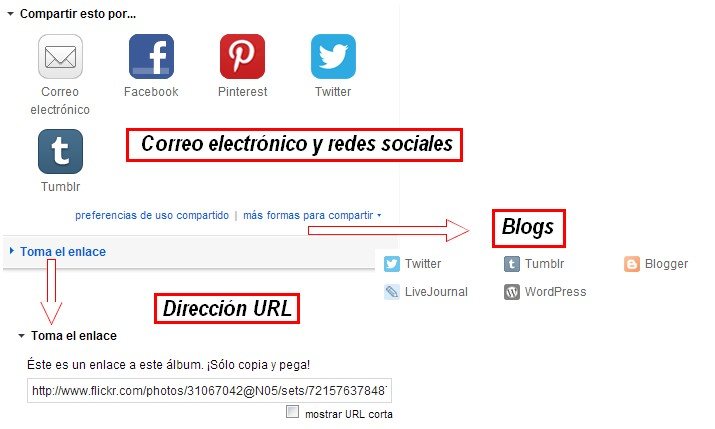

# 1.2 Flickr

### 1\. ¿Qué es  Flickr?

[**Flickr**](http://www.flickr.com/) (pronunciado Flicker) es un sitio web gratuito que permite almacenar, ordenar, buscar y **compartir fotografías y vídeos en línea**.

Actualmente Flickr cuenta con una importante comunidad de usuarios que comparte las fotografías y vídeos creados por ellos mismos. Esta comunidad se rige por [normas de comportamiento](http://www.flickr.com/guidelines.gne) y [condiciones de uso](http://es.docs.yahoo.com/info/utos.html) que favorecen la buena gestión de los contenidos.

La popularidad de Flickr se debe fundamentalmente a su capacidad para administrar imágenes mediante herramientas que permiten al autor [etiquetar](http://es.wikipedia.org/wiki/Etiqueta_(metadato) "Etiqueta (metadato)") sus fotografías y explorar y comentar las imágenes de otros usuarios.

Flickr cuenta con una **versión gratuita y con otra de pago, llamada pro**. Actualmente, los suscriptores de cuentas gratuitas pueden subir videos en calidad normal y 100 MB en fotos al mes, con un máximo de 200 imágenes como tope por cada cuenta gratuita. Luego de alcanzado ese límite de 200 imágenes, sólo permanecen visibles las últimas 200 imágenes subidas, es decir, las primeras cargas pasan a estar ocultas, pero no son eliminadas. Esto se remedia actualizando la cuenta a una Pro. De igual manera, un usuario con cuenta gratuita sólo puede cargar imágenes con una resolución máxima de 1024 x 768 píxeles. Es decir, si el usuario carga una imagen de mayor resolución, el sitio la redimensiona a la resolución anteriormente señalada.

### 2\. Alta en Yahoo

Para poder utilizar [**FLICKR**](http://www.flickr.com/) has de tener una cuenta [**Yahoo**](http://es.yahoo.com/?s=https). Al igual que la cuenta de Gmail te permite entrar al correo Gmail y el acceso a los servicios Google, la de Yahoo te permite entrar al correo Yahoo y a sus servicios.

Una vez registrados en **Yahoo**, entramos a [http://www.flickr.com](http://www.flickr.com/), hacemos en "**Iniciar sesión"**, y colocamos el usuario y contraseña de nuestra cuenta **Yahoo**.

### 3\. Primeros pasos

Una vez dados de alta y dentro de FLICKR, entramos a la interfaz principal. Muy sencilla de partida, pocos elementos.

 

**1\. Subir nuestras primeras fotos**

1º Haz clic en **Subir Fotos**. Nos aparece esta página. Haremos clic en **Agrega**r. También podemos hacer clic en **Uploader anterio**r para ir a modo antiguo de subir fotos. Nosotros elegimos el de la última versión.

2º Elegiremos en nuestro navegador todas las fotos que queremos subir luego nos aparece esta página:

3º Ya están las fotos preparadas para subirlas. Veamos las opciones:

4º Hacemos **clic en Cargar fotos** se subirán a nuestra galería:

5º Ya hemos subido las fotos a nuestra galería.

**2\. Crear un álbum**

1º Para crear tu primer álbum **haz clic en Álbumes**.

2º En la siguiente página haz clic en Crea tu primer álbum ahora. Mira el tutorial:

<object type="application/x-shockwave-flash" data="http://aularagon.catedu.es/materialesaularagon2013/imagen/flickr.swf" width="715" height="497"><param name="src" value="http://aularagon.catedu.es/materialesaularagon2013/imagen/flickr.swf"></object>

**2\. Compartir un álbum**

1º Hacemos **clic en el álbum** que queremos compartir

2º En un **icono que aparece a la derecha** hacemos clic. 

3º Nos aparecerán varias opciones de compartir:

**3\. Compartir una foto**

<object type="application/x-shockwave-flash" data="http://aularagon.catedu.es/materialesaularagon2013/imagen/flickr2.swf" style="display: block; margin-left: auto; margin-right: auto;" width="715" height="492"><param name="src" value="http://aularagon.catedu.es/materialesaularagon2013/imagen/flickr2.swf"></object>

## Tarea

*   Si Tienes una cuenta el flickr, crea un ábum de fotos y compártelo con los demás miembros del grupo.

## Para saber más

Este ha sido un pequeño tutorial de las cosas más importante que nos ofrece este servicio. No hemos profundizado mucho, así es que si tienes más interés, te remitimos al manual oficial de Flickr:

*   [Ayuda del Flickr](http://www.flickr.com/help/). [Términos de uso](http://info.yahoo.com/legal/es/yahoo/utos/es-es/).

