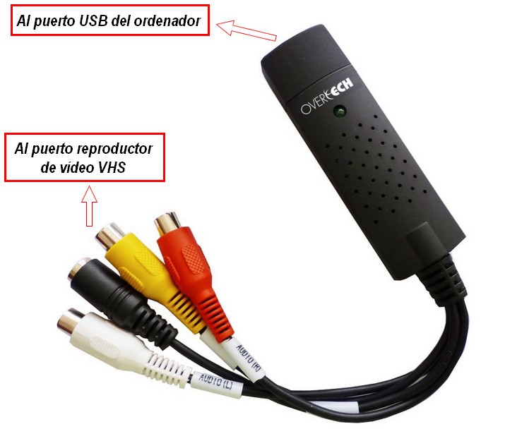
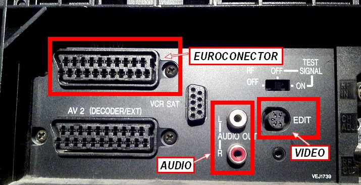
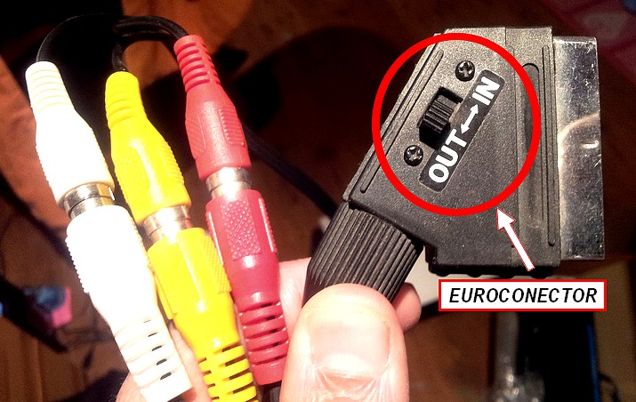

# 1.2 Obtener vídeos

**CONOCIMIENTOS PREVIOS**

*   Para el aprendizaje de esta unidad el alumno deberá tener conocimientos elementales sobre el manejo de aparatos de captura y reproducción de vídeo.
*   Saber realizar las conexiones de los aparatos periféricos al ordenador.

**1\. Dispositivos de captura de vídeo**

Los dispositivos de captura de vídeo permiten transferir al disco duro del ordenador un vídeo ya grabado o una emisión en directo. Los más frecuentes son:

*   Una **cámara DV** (Video Digital). Se pasa la información a ordenador a través de puerto USB o al puerto al puerto IEEE 1394 del equipo. Ahora van equipadas con Disco duro interno o bien tarjetas de memoria. 
*   Una **cámara web. **Integrada en el ordenador o bien conectada al puerto USB.
*   Teléfono **móvil o tablet**.
*   **Cámaras fotográficas** con función e grabar vídeo.
*   Cámaras de vídeo **panorámicas** (deportivas).
*   Una **cámara** o **reproductor VHS** conectado a una tarjeta de captura analógica. Este proceso supone la conversión de video analógico a video digital.

**2\. Extraer vídeo de un DVD**

La forma más fácil de convertir un DVD a vídeo es utilizando la herramienta "Format Factory", que es una herramienta utilizada preferentemente para convertir formatos. Como en la unidad 3 de este mismo módulo analizamos más extensivamente esta utilidad, hemos creado un apartado que explica como extraer vídeo d un DVD.

**3\. Cómo digitalizar tus viejas cintas VHS**

Las viejas cintas de VHS han pasado a la historia. Si queremos conservar todas esas películas memorables y grabaciones familiares, se impone convertir la señal analógica a formato digital. Este proceso tiene muchas ventajas:

*   Las copias digitales que obtendremos son más resistentes al paso del tiempo que las viejas cintas magnéticas.
*   Podremos ver nuestras películas en ordenadores y reproductores DVD.
*   El formato digital es más fácil de manipular: pueden realizarse copias idénticas sin el deterioro que sufrían las VHS, es posible comprimirlas en archivos de menor tamaño y también almacenarlas en MP3, DVD, CD, disco duro…

Para transformar nuestras cintas VHS en grabaciones digitales necesitamos un conversor analógico digital (CAD en sus siglas en español; ADC en inglés). Ha varios en el mercado, que por poco precio nos pueden ayudar a solucionar esta tarea. Entre ellos te recomendamos: 

*   [Convertidor Analógico Digital de Overtech](http://www.pcbox.com/promociones-especiales/018_20minutos_conversor/default.aspx?ch=0000020511000307051203120802127edfbe36301643c7816e4d64208a30a60#.UoeopvlWzTo). 

Imagen 2: Convertidor de vídeo digital. Captura de pantalla propia

El proceso en todos ellos es similar:

**Paso 1: Conectar el conversor al vídeo**

*   El conversor tiene 3 conectores RCA hembra (blanco, rojo y amarillo) y un conector S-video (negro y de mayor diámetro).

Imagen 3: Autor Julián Trullenque. Licencia CC by-nc

*   Es frecuente encontrarnos con el problema de que nuestro videograbador no disponga de conector S-video y/o que tenga una entrada RCA hembra (incompatible). Existen dos sencillas soluciones:
    *   **Solución A**: Adquirir cables con conectores macho-macho.
    *   **Solución B**: Adquirir un adaptador para conectar el conversor a través del euroconector de nuestro videograbador. Al realizar esta compra hay que tener cuidado, ya que en el mercado existen adaptadores IN que permiten introducir información en el videograbador y adaptadores OUT, que permiten sacar información del videograbador. En nuestro caso necesitamos uno OUT, ya que lo que queremos es llevar las imágenes de la cinta VHS al conversor.

 

 Imagen 4: Autor Julián Trullenque. Licencia CC by-nc

**Paso 2: Conectar puertos USB**

*   Conectar el extremo USB del convertidor al puerto USB del ordenador. Es recomendable disponer de un puerto USB 2.0

**Paso 3: Instalar software**

*   Instalar en el ordenador el software (CD-Rom) que se adjunta con el conversor.

**Paso 4: Capturar el vídeo**

*   Ponemos a reproducir la cinta VHS en el videograbador. En ese momento, las imágenes de la cinta aparecerán en la pantalla del ordenador (en la ventana de visualización del software). En cuanto queramos podemos pulsar la opción “Capturar vídeo” y dará inicio el proceso de digitalización, generándose un fichero en formato digital que podremos reproducir en ordenadores y DVD.

**Conclusiones**

*   Proceso sencillo.
*   Dispositivo barato (el conversor cuesta 24,90 euros)
*   Es muy importante revisar las conexiones con las que cuenta su aparato de vídeo VHS, ya que es probable que sea necesario adquirir cables adicionales o adaptadores.
*   La calidad que se obtiene no es comparable a la de un DVD, ya que partimos de una grabación de calidad inferior.

