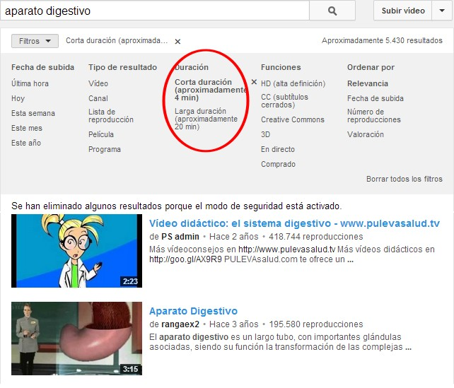
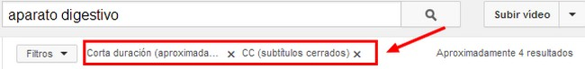

# 1.3 Buscar vídeos

**1\. Sitios web para descargar vídeos**

Actualmente **Youtube** es el líder en portales con servicio de vídeo en línea. Sin embargo cada vez proliferan más los sitios web de este tipo donde es posible subir y visualizar contenidos de vídeo. En algunos de ellos también se pueden descargar vídeos al disco duro local para visualizarlo con los alumnos en aulas sin conexión a Internet y también asegurando la actividad frente a las limitaciones de una conexión modesta.

En algunos casos se puede aplicar un [**plugin al navegador**](http://es.wikipedia.org/wiki/Complemento_(inform%C3%A1tica)), otras veces el volcado de red con **aTubeCacher** y en otros casos en el mismo sitio se ofrece como alternativa la descarga directa del archivo de vídeo.

A continuación se citan algunos de los **servicios de vídeos más conocidos:**

1.  **[YouTube](http://www.youtube.com).**
2.  **[TeacherTube](http://www.teachertube.com/):** Lo mismo que youTube pero solo contenidos educativos. En inglés. 
3.  [**Banco de recursos del INTEF**](http://recursostic.educacion.es/bancoimagenes/web/): Recursos educativos del portal del MEC. 
4.  [**Librosvivos.org**](http://www.librosvivos.org/videos/): De la editorial SM, dispone de una colección de vídeos pedagógicos realizados por un equipo multidisciplinar de profesores, ilustradores, animadores y profesionales del ámbito audiovisual.
5.  [Proyecto biosfera](http://recursos.cnice.mec.es/biosfera/profesor/videos/videos_actividades.htm). Recoge una relación de vídeos de Biología y Geología, recopilados por el Taller de Informática Educativa del IES Arencibia, como un complemento didáctico para el aula. Los vídeos se completan con ejercicios para valorar el aprendizaje del estudiante tras su visionado. En la misma página web del proyecto se recogen múltiples enlaces a otros vídeos relacionados con estas áreas curriculares.
6.  [Vídeo digital educativo](http://www.videodigitaleducativo.com/). Una colección de vídeos sobre distintos contenidos tratados en clase, realizados por los alumnos del colegio Erain Ikastetxea School de Gipuzkoa. Están clasificados por categorías como antropología, expresión oral, música, geología o educación en valores.
7.  [Educatube](http://www.educatube.es/). Recopila un buen número de vídeos educativos para primaria, secundaria y bachillerato organizados por materias curriculares. Como complemento, cada vídeo cuenta con una descripción de su contenido.
8.  [Arte](http://www.artehistoria.jcyl.es/index.html)[H](http://www.artehistoria.jcyl.es/index.html)[istoria](http://www.artehistoria.jcyl.es/index.html). La Junta de Castilla y León reúne un buen numero de vídeos relacionados con estas materias curiculares. El material está clasificado por temática, como genios de la pintura, historia de España, la segunda guerra mundial, grandes batallas u obras maestras del arte.
9.  [Videoteca educativa](http://www.educarm.es/admin/webForm.php?ar=339&mode=visualizaAplicacionWeb&aplicacion=VIDEOTECA_EDUCATIVA&web=38&zona=PROFESORES&menuSeleccionado=). Este recurso de la consejería de Educación de Murcia recopila un amplio grupo de vídeos didácticos clasificados por niveles educativos y materias. En cada vídeo, se hace referencia al contenido y a su duración.
10.  [**Vimeo**](https://vimeo.com/): Es una red social de Internet basada en vídeos. El sitio permite compartir y almacenar vídeos digitales para que los usuarios comenten en la página de cada uno de ellos. Los usuarios deben estar registrados para subir vídeos, crear su perfil, comentar ... Vimeo no admite comerciales de televisión, demostraciones de videojuegos, pornografía o cualquier contenido que no haya sido creado por el usuario. El sitio, además, ha ganado reputación como «proveedor de imágenes» para diversos artistas, debido a la alta tasa de bits y resolución de sus vídeos. Desde octubre de 2007, Vimeo ofrece una opción para vídeos de alta definición.

## Importante

**Hemos visto muchos portales donde hay recursos de vídeo, cada uno tiene sus características. Nosotros nos vamos a centrar únicamente en YoyTube y Vimeo, ya que son dos servicios que ofrecen muchos recursos y crecen cada día.**

**2\. Buscar y encontrar vídeos**

**1\. En youtube**

Gracias a la unión de **Google y Youtube**, la búsqueda de videos en la web se falicitó de tal manera que si ponemos una palabra en la barra de **búsqueda de Google**, en los resultados se nos **indexan videos de Youtube** que podemos visualizar directamente en el mismo buscador sin necesidad de ingresar en la página de Youtube.

Pero si quieres ver algo muy específico, lo mejor será ir directamente a la fuente. En este caso buscar videos en Youtube puede ser una tarea un poco tediosa y complicada si no sabes cómo hacerlo para llegar a lo que buscas.

1\. Buscar aplicando filtros

1º Imagina que quieres ver una película sobre el "aparato digestivo", pero cuando colocas su nombre en Youtube te salen muchos videos menos el que quieres ver. **Con el uso de los filtros de búsqueda, será más fácil llegar a ese resultado** que tanto deseas. Veamos como los podemos utilizar.

2º Una vez que escribimos un nombre en Youtube y le damos a buscar nos aparecerán los resultados arrojados organizados de la manera que Youtube considera más relevantes, sin tener en cuenta las visitas ni exactamente lo que hemos puesto en su buscador. Es aquí cuando **para buscar videos en Youtube específicos debemos hacer uso de los filtros**.

 Imagen 5: Captura de pantalla propia

3º Haciendo clic en la pestaña **Filtros** encontraremos las **distintas opciones disponibles**. Los filtros se dividen por **categorías**. Dentro de la categoría de "Fecha de subida" podemos determinar si queremos un vídeo que ha sido subido en la última hora, hoy, esta semana, este mes o este año.

Imagen 6: Captura de pantalla propia

4º Posteriormente otra clasificación es la de "**Tipo de resultado**". Los tipos de resultados pueden darse por video individual, canal, lista de reproducción, película o programa.

5º Es importante que sepas que puedes escoger más de un filtro para tu búsqueda, pero en ese caso, tienes que abrir la opción filtro cada vez que quieras modificarlo.

Imagen 7: Captura de pantalla propia

6º Como veras **en la parte superior al lado de "****Filtros" ****indica cuales hemos escogido**. De allí mismo podemos eliminarlos si no nos dan los resultados esperados, igual que pasa con cualquier otro buscador de internet.

Imagen 5: Captura de pantalla propia

7º Sin duda s**e trata de una herramienta muy interesante que si la aplicamos de manera correcta** nos llevará a los **resultados esperados**. Muchas veces los videos, al igual que sucede en Google, tardan en tener relevancia por lo que no aparecen en los primeros puestos de búsqueda.

2\. Búsqueda avanzada

*   Si quieres buscar una **frase exacta**, **introdúcela entre comillas** (""). Ejemplo: BUSCAR: "cursos aularagon".
*   Para encontrar páginas que** incluyan determinadas palabras** (Gasol), **pero no otras** (Marc), deberemos incluir el signo "-" delante de las que no queremos buscar. Por ejemplo, para descubrir webs que incluyan la palabra "gasol", pero no la palabra "marc": BUSCAR: gasol -marc.
*   Si pretendemos **encontrar una determinada palabra u otra**, usaremos el símbolo "|" (AltGr+1). Por ejemplo, para buscar webs en las que aparezca "tienda" y "zapatos", o bien "tienda" y "pantalones": BUSCAR: tienda (zapatos | pantalones).
*   Si queremos que Google nos **busque una determinada palabra sin que haga interpretaciones**, escribiremos el signo "+" delante. Por ejemplo: si buscamos "OT" nos devolverá imágenes de Operación Triunfo, si buscamos "+OT" será otra cosa.**El asterisco ("*") funciona como un comodín**. Cuando lo pones delante de una palabra y dentro de una frase le estás diciendo a Google que busque la frase exacta que le pides pero que puede intercambiar la palabra del asterisco por otra. 
*   **No es necesario distinguir las mayúsculas de las minúsculas**. Estas dos búsquedas generan los mismos resultados: BUSCAR: AulaRagOn. BUSCAR: aularagon.

**2\. En Vimeo**

En Vimeo la búsqueda es similar, ofrece prácticamente las mismas opciones.

Imagen 8: Captura de pantalla propia

## Importante

**Estos son los 2 portales de vídeo que más nos gustan. Ahora bien, para buscar y descargar vídeos te vamos a recomendar "YouTube" ya que vas a encontrar muchos más y para publicarlos "Vimeo", ya que da mejor calidad de imagen.**

