# 1.3 Manejo de archivos

**En esta unidad vamos a aprender a crear, abrir, cerrar, guardar e imprimir archivos de imagen digital.**

**1\. Crear archivo nuevo.**

**1\. en GIMP**

1º Elige **Archivo > Nuevo**. (Ctrl+N)

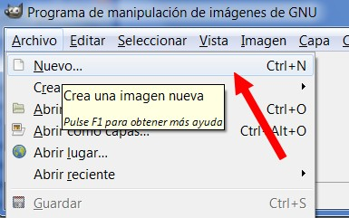

2º Se muestra el cuadro de diálogo **Crear una imagen nueva**. Por defecto GIMP define unas dimensiones de la nueva imagen de 640 x 4000 píxeles. Se pueden modificar estos valores o bien elegir unas dimensiones predefinidas en la lista desplegable **Plantilla**. A continuación pulsa en **Aceptar**.

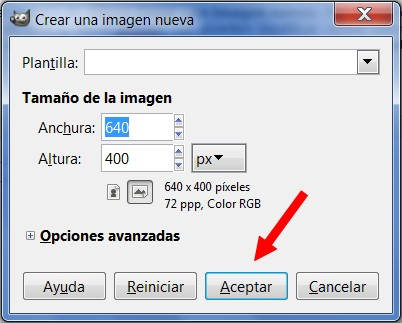

3º En la ventana de la nueva imagen se podrán aplicar las distintas herramientas para **crear y editar la imagen deseada**.

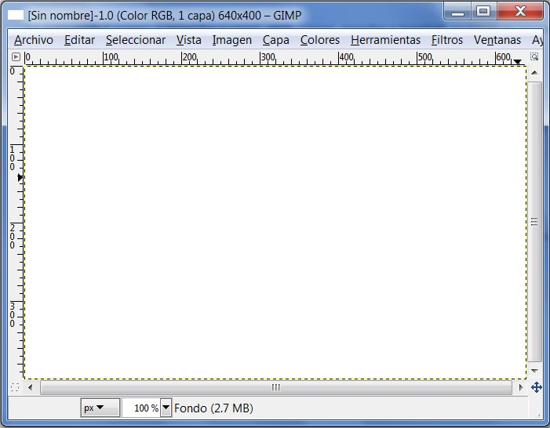

**2\. en FHOTOFILTRE**

1º Elige **Archivo > Nuevo**. (Ctrl+N)

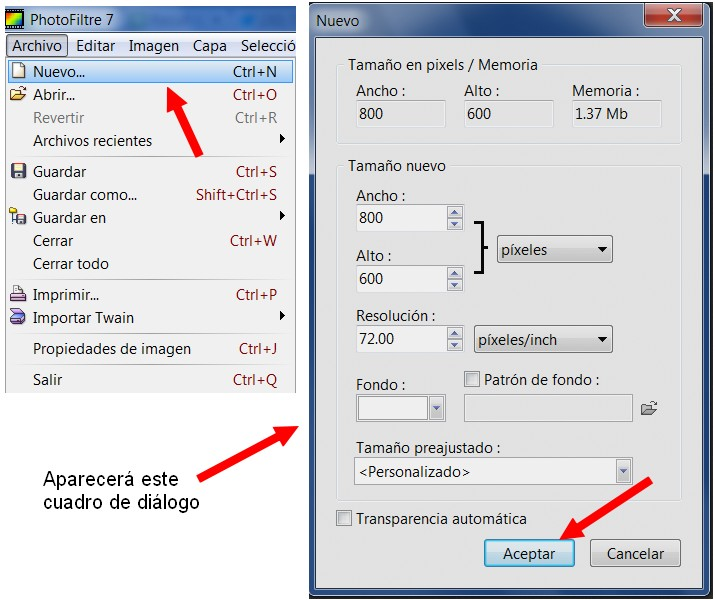

2º Se abrirá un cuadro de diálogo "Nuevo".  Por defecto Phorofiltre define unas dimensiones de la nueva imagen de 800 x 600 píxeles. Se pueden modificar estos valores también la resolución y el fondo de la imagen. A continuación pulsa en **Aceptar**.

*   Se puede definir como color de fondo transparente, muy útil para diseño web.

3º Aparecerá esta **ventana** (ventana de trabajo).

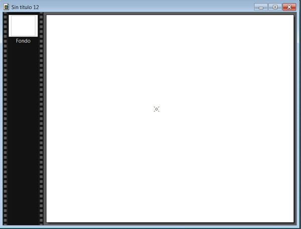

**3\. en [http://pixlr.com](http://pixlr.com)**

Observa que para crear un documento nuevo es diferente. Una vez que has entrado en el editor de imágenes, el proceso de crear nuevas imágenes es simiilar. Hacer clic en **Archivo > Nueva imagen** (Ctrl+N).

**2\. Guardar una imagen**

**1\. En GIMP**

1º Para guardar una imagen selecciona **Archivo > Guardar como** (Mayús+Ctrl+S) **… **  

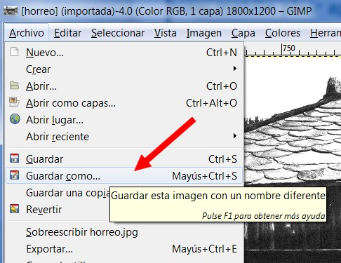

2º En el cuadro de diálogo Guardar imagen **teclea un nombre de archivo en la casilla Nombre**. 

3º Busca la **carpeta** en la que quieras guardar la imagen y pulsa en el botón **aceptar**. Para situar el archivo de imagen en la carpeta navega por los discos y carpetas hasta que la encuentres. Por ejemplo para guardar la imagen horreo.xcf en la carpeta PASO de mi disco duro.... Observa la siguiente presentación:

4º Si queremos guardar **una imagen con otra extensión** (JPG por ejemplo). Solo tenemos que **cambiar la extensión xcf por jpg.**

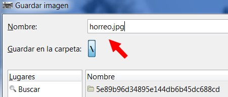

5º Un cuadro de diálogo nos avisará que **la extensión no concuerda**. Hacemos clic en "**Guardar**".

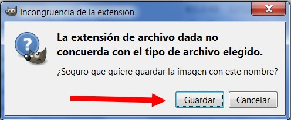

6º En el siguiente cuadro de diálogo nos preguntará si queremos exportar en JPG. Hacemos clic en **"Aceptar"**. ¡Ya está guardada en el formato que queramos!

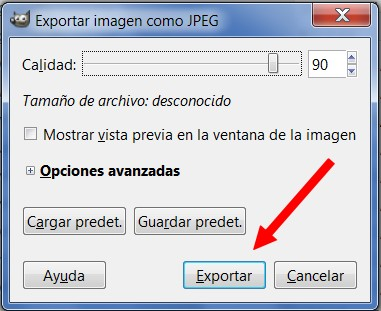

**Esto mismo se haría directamente con el comando Archivo>exportar. Y luego seguir los mismos pasos.**

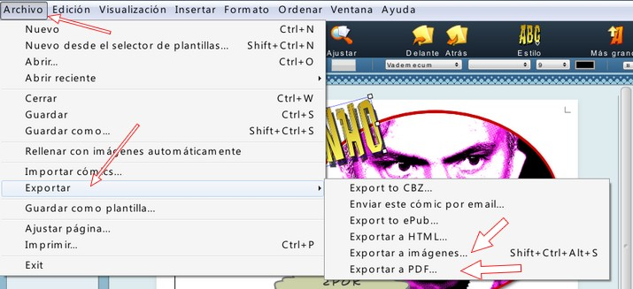

**Habría que seleccionar el formato JPG**

## Importante

**Es conveniente QUE AL GUARDAR CUALQUIER DOCUMENTO nombre contenga todos los caracteres en minúsculas, sin espacios en blanco ni caracteres especiales: ñ, signos de puntuación, etc.**

**2\. En PHOTOFILTRE**

1º Para guardar una imagen selecciona **Archivo > Guardar como** (Mayús+Ctrl+S) **… **

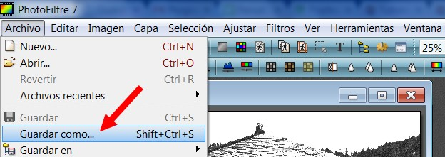

2º Aparecerá este **cuadro de diálogo. Observa** la animación para que veas como se guarda en la carpeta que quieras y con el formato que quieras:

3º El archivo **hórreo.jpg** se habráguardado en la carpeta **k://paso.**

**3\. En [http://pixlr.com](http://pixlr.com)**

1º Para guardar una imagen selecciona **Archivo > Guardar** (Ctrl+S) **… **

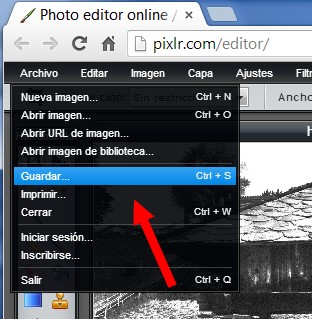

2º Aparecerá el siguiente **cuadro de diálogo**: podemos guardar nuestra imagen en el disco duro, en facebook, en Flickr, en Piscasa... (debemos estar registrados).

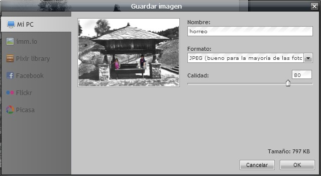

3º Hacemos clic en **MiPc** y buscamos la **carpeta** donde queremos guardar la imagen.

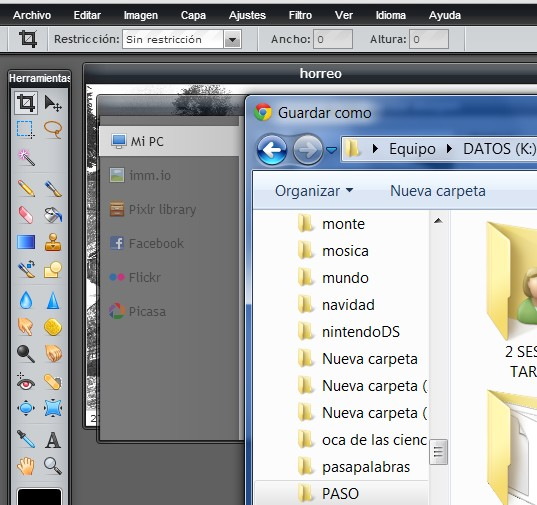

4º Solo tenemos que hacer clic en **"Guardar"**.

**3\. Abrir una imagen**

1º Es muy similar en los tres progrmas... hacer clic en **Archivo>Abrir.**

2º Buscaremos donde tenemos guardado el archivo, y haremos clic en **Abrir**. La siguiente animación muestra como abrir un archivo en pixrl.

 

**El comando "cerrar", cerraría la imagen y nos preguntaría si queremos guardarla antes de cerrar. Es similar en los tres programas.**

