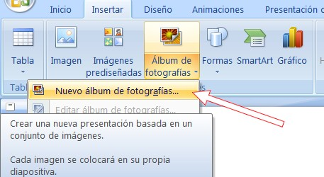
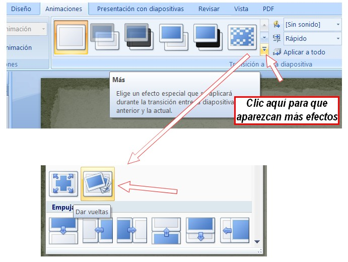
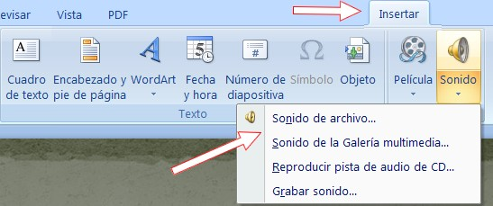

# 2.1.1 Power Point

**1\. Crear un álbum de fotos con Power Point**

Podemos crear un álbum de fotos con PowerPoint de forma rápida y sencilla. El álbum contendrá fotos de nuestra elección, título, créditos finales y una música que acompañará a la presentación de las imágenes. Para ello seguiremos los siguientes pasos:

1º Prepara una **carpeta con las fotos y la música que deseamos utilizar**. Ya hablamos de esto en el módulo de vídeo. Si no tienes, puedes descargar (carpeta comprimida) éstas: mister.rar.

2º Abre el programa **Power Point 2003**. En otras versiones es parecido.

3º Seguir la ruta **Insertar>Imagen>Nuevo>Nuevo álbum de fotografías...**

 

 Imagen 21: Captura de pantalla propia

4º  Aparecerá una nueva ventana llamada álbum de fotos. En ella seleccionaremos la opción de **insertar las imágenes** desde archivo o disco y buscaremos la carpeta en la que tengamos las fotos que deseamos incluir en el álbum. 

5º Una vez en ellas **seleccionaremos todas las imágenes** (clic la primera imagen, pulsando la tecla mayúscula y, sin soltar esta última, clic en la última imagen). Una vez hecho esto, hacer **clic en el botón "insertar"**. Veamos como se hace:

*   Elige **dos imágenes** por diapositiva.
*   Elige como tema "**paper**".

6º Guarda el trabajo como **album.ppt** en tu carpeta de prácticas.

Ahora vamos a crear una **transición entre diapositiva y diapositiva**.

1º Haz clic en la pestaña **Animaciones**. Aparecerá debajo un menú en el que harás clic en el icono más  Se desplegará un menú con muchas animaciones que son transiciones entre diapositivas. Elige la que más te guste... en nuestro ejemplo hemos elegido "**dar vueltas**".

Imagen 22: Captura de pantalla propia 

2º Hacemos clic en **Aplicar a todo** y así serán todas las transiciones iguales.

3º **Guarda** la presentación.

**Nota:** en cualquier presentación no es bueno poner muchos tipos de transiciones diferentes. Utilizamos siempre el mismo tipo de transición y cuando queramos llamar la atención por algo o hacer algún cambio brusco, utilizamos alguna transición llamativa. 

Vamos a añadir una **música al proyecto**:

1º En la pestaña Insertar, elegimos **Insertar>Sonido de archivo**.

Imagen 23: Captura de pantalla propia 

2º Iremos a la carpeta de prácticas y elegimos un **archivo de sonido** (en la unidad 4 te proporcionamos uno).

3º Aparece un cuadro de diálogo en el que nos pregunta si queremos que la música se inicie automáticamente o al hacer clic en el icono de música. Elegiremos la **primera opción**.

Ahora vamos a poner los **créditos**:

1º Insertamos una nueva **diapositiva al final del proyecto**. Escribimos los títulos de crédito.

2º **Guarda el archivo**. Dos opciones:

*   **PPT**: es el que nos ofrece Power Point por defecto. Lo podremos modificar más tarde.
*   **PPS**: proyector de diapositivas de Power Point.. Para compartirlo. Se podra ver en todos los equipos con S.O. Windows.

