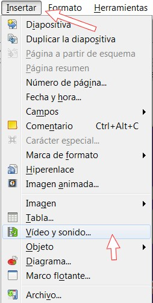

# 2.1.2 Impress

**3\. Crear un álbum de fotos con Impress**

Podemos crear un álbum de fotos con Impress de forma rápida y sencilla. El álbum contendrá fotos de nuestra elección, título, créditos finales y una música que acompañará a la presentación de las imágenes. Para ello seguiremos los siguientes pasos:

1º Prepara una **carpeta con las fotos y la música que deseamos utilizar**. Ya hablamos de esto en el módulo de vídeo. Si no tienes, puedes descargar (carpeta comprimida) éstas: mister.rar.

2º Abre el programa **Impress (LibreOffice 4.1)**.

3º Seguir la ruta **Insertar>Imagen>Álbum fotográfico...**

 

Imagen 24: Captura de pantalla propia

4º  Aparecerá una nueva ventana llamada Crear álbum fotográfico. En ella seleccionaremos la opción de **Añadir** par agregar imágenes y buscaremos la carpeta en la que tengamos las fotos que deseamos incluir en el álbum. 

5º Una vez en ellas **seleccionaremos todas las imágenes** (clic la primera imagen, pulsando la tecla mayúscula y, sin soltar esta última, clic en la última imagen). Una vez hecho esto, hacer **clic en el botón "Insertar Diapositivas"**. Veamos como se hace:

*   Elige **dos imágenes** por diapositiva.
*   Mantener las proporciones.

6º Guarda el trabajo como **album.odp** en tu carpeta de prácticas.

Ahora vamos a crear una **transición entre diapositiva y diapositiva**.

1º Haz clic en la pestaña **Presentación>Transición de diapositivas**. Elegimos **Desvanecer suavemente**.

Imagen 25: Captura de pantalla propia 

2º Hacemos clic en **Aplicar a todas la diapositivas** y así serán todas las transiciones iguales.

3º **Guarda** la presentación.

**Nota:** en cualquier presentación no es bueno poner muchos tipos de transiciones diferentes. Utilizamos siempre el mismo tipo de transición y cuando queramos llamar la atención por algo o hacer algún cambio brusco, utilizamos alguna transición llamativa. 

Vamos a añadir una** música al proyecto**:

1º En la pestaña Insertar, elegimos **Insertar>Sonido de archivo**.

Imagen 26: Captura de pantalla propia 

2º Iremos a la carpeta de prácticas y elegimos un **archivo de sonido** (en la unidad 4 te proporcionamos uno).

3º Aparece un cuadro de diálogo en el que nos pregunta si queremos que la música se inicie automáticamente o al hacer clic en el icono de música. Elegiremos la **primera opción**.

Ahora vamos a poner los **créditos**:

1º Insertamos una nueva **diapositiva al final del proyecto**. Escribimos los títulos de crédito.

2º **Guarda el archivo**. Opciones:

*   *   **ODP**: formato que ofrece Impress por defecto. Lo podemos modificar más tarde.
    *   Puedes guardar tu presentacion en formato **OpenDocument**, el nuevo estándar internacional para documentos. Este formato basado en XML significa que los archivos pueden ser abiertos por los destinatarios que no son usuarios LibreOffice: sus presentaciones serán accesible con cualquier software compatible con OpenDocument.
    *   También puede abrir archivos de **Microsoft PowerPoint** y guardar su trabajo en formato de PowerPoint.
    *   Alternativamente, se puede utilizar el exportador integrado para crear **versiones Flash (.swf)** de sus presentaciones.

## ParaSaberMas

Presentación realizada con Impress por Julián Trullenque. Licencia CC by-nc

Impress permite exportar tus **presentaciones en formato SWF** de flash. Aunque son presentaciones muy rudimentarias en una buena opción para subirlas a internet. Las presentaciones no guardan animaciones ni sonidos. Para saber como embeber (insertar) una presentación flash en un blog, ve al módulo 4 que trata sobre flash y al final tenemos un artículo de como se hace. Para ver ésta haz clic con el ratón en las pantallas.

