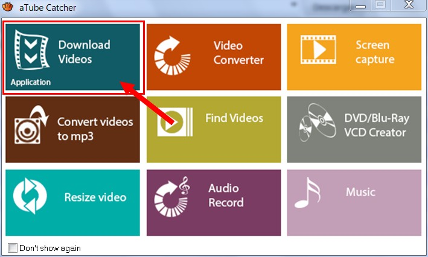
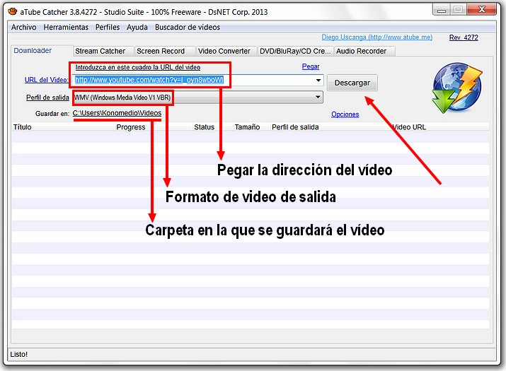
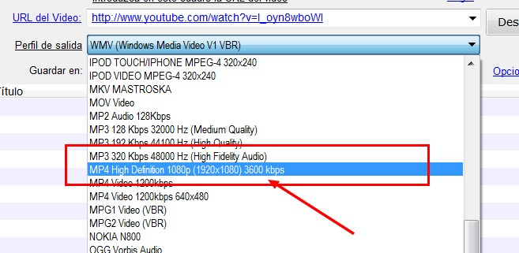
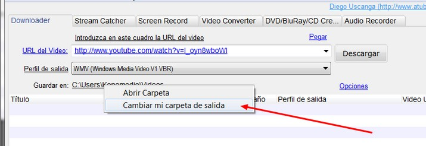
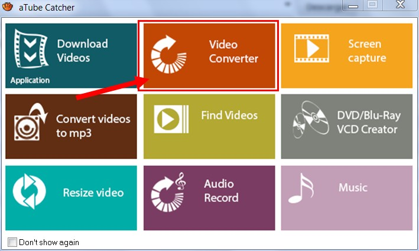
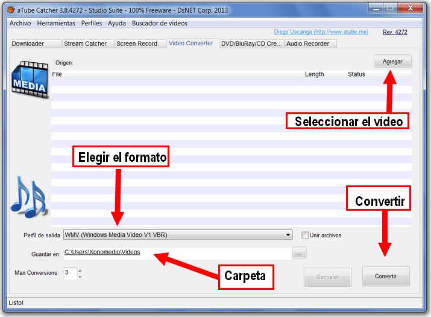

# 2.1 Descarga con AtubeCatcher

**"aTube Catcher"** es un programa gratuito; una excelente opción con la que podremos **descargar vídeos** de nuestras páginas webs favoritas (YouTube, Dailymotion, MySpace, Stage6,Google, etc.) y **convertirlos a otros formatos**…

La cosa es **sumamente sencilla**… solo hay que pegar la dirección web URL del video en el campo "Origen" y seleccionar el formato de video a utilizar (FLV, MPG, WMV, MP4, 3GP, 3G2, AVI, XVID, MP3, MP2, WMA, WMV, GIF, FLAC, WAV, PSP, VOB, OGG, MOV, etc…)… y de esta forma descargar y exportar el contenido multimedia a tu ordenador, tus dispositivos móviles, IPOD, PSP, Teléfono Celular, DVD, VCD, MP3, etc…  
También posee **opciones más avanzadas para personalizar la conversión**, como calidad, resolución, codecs, aspecto, Video BitRate, audio y video codec, frame rate, canales de audio, etc… También permite convertir los videos ya bajados en FLV en otros formatos de video…   
Esta **disponible en varios lenguajes** (Ingles, Español, Portugués, Italiano).

### 1\. Descargar e instalar el programa

1.  Ir a [http://atube-catcher.dsnetwb.com/video/](http://atube-catcher.dsnetwb.com/video/)
2.  Hacer clic en "[Descargar gratis](http://get.atube.me/aTubeCatcher.exe)"
3.  Una vez descargado, hacer doble clic en **aTubeCatcher.exe**
4.  Seguir las instrucciones hasta instalar el programa.

### 2\. Descargar un vídeo de la red

1º Buscar el vídeo que queremos encontrar. Por ejemplo: [http://www.youtube.com/watch?v=l_oyn8wboWI](http://www.youtube.com/watch?v=l_oyn8wboWI)

2º Abrir el programa.

3º Una vez abierto el programa, **copiamos la dirección** del vídeo y al pegamos en el campo de formulario **"URL del vídeo".**

4º Podemos **elegir el formato** de vídeo.

5º Podemos **elegir la carpet**a en la que lo vamos a guardar.

6º Cuando esté todo listo, hacemos **clic en  descargar**. El vídeo comenzará a descargarse.

<object type="application/x-shockwave-flash" data="http://aularagon.catedu.es/materialesaularagon2013/imagen/descargar%20video.swf" width="715" height="519"><param name="src" value="http://aularagon.catedu.es/materialesaularagon2013/imagen/descargar%20video.swf"><param name="wmode" value="transparent"></object>

### 3\. Convertir un vídeo a otro formato

Otra de las opciones con las que cuenta aTubeCatcher es la de **convertir vídeos de un formato a otro**. Para convertir un vídeo seguir las instrucciones:

1º Abre el programa. Te aparecerá este menú. Selecciona **"Video Converter"**.

2º Iniciado el programa, aparece esta pantalla.

3º Solo hay que elegir el vídeo, el formato de salida, la carpeta en la que lo vamos a alojar y hacer clic en **Convertir**. Se pueden convertir varios vídeos a la vez.

<object type="application/x-shockwave-flash" data="http://aularagon.catedu.es/materialesaularagon2013/imagen/formato%20video.swf" width="715" height="519"><param name="src" value="http://aularagon.catedu.es/materialesaularagon2013/imagen/formato%20video.swf"><param name="wmode" value="transparent"></object>

## Para saber más

Este programa tiene algunas **posibilidades más** (descargar música, grabar DVD...), pero no hemos querido profundizar ya que alargaría considerablemente el contenidos del curso. Si quieres **aprender otras funcionalidades**, visita lá página oficial del programa:

*   [http://atube-catcher.dsnetwb.com/video/](http://atube-catcher.dsnetwb.com/video/)

