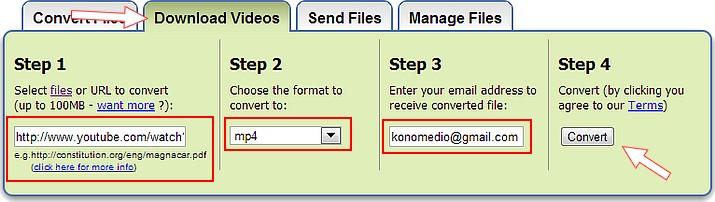

# 2.2 Descarga a través de utilidades on-line

Hemos visto una manera de descarga nuestros vídeos desde un utilidad instalable en nuestro ordenador. Hay muchas más utilidades gratuitas que nos podemos descargar y que nos cumplirán esta misma función. Así mismo es posible que en el ordenador que queremos descargar el vídeo no tengamos ningún programa y no podamos intalarlo. Pare ésto existen algunas alternativas a través de páginas en Internet. Veamos alguna.

**1\. Force Download**

*   [**Force Download**](http://www.force-download.es/) es un programa online que te permitirá descargar vídeos de Youtube, Dailymotion, Metacafe, Myspace, Wideo, ListenGo, Kewego, Abrutis.com, tetesaclaques.tv e Ifilm.
*   Esta aplicación es muy útil para aquellos usuarios que realicen descargas de vídeos puntuales y tiene la ventaja de ahorrarte una descarga más en tu ordenador, es decir, gastar menos recursos. El funcionamiento de Force Download es muy sencillo. Solo debes entrar en Youtube y encontrar el vídeo que quieras descargar. Una vez estés en la página, copia la URL, pégala en el campo pertinente de Force Download y haz clic en "Go". Una vez realizado este paso podrás **elegir en qué formato quieres descargar** el vídeo: MP3, MP4, AVI, MPEG, MOV, 3GP, FLV o WAV. 
*   Lo peor de esta página es que hay mucha publicidad y a veces despista un poco. Si te registras en la página (no te lo recomiendo) el vídeo se descarga más rápido.

**2\. Zamzar**

*   [Zamzar](http://www.zamzar.com/url/) es otra página que además de poder descargar vídeos d ela rd nos permite convertir archivos de otros formatos (pdf, doc,...) Es muy fácil e intuitivo y no es necesario registrarse. Le peor de que no hace ua descarga directa sino que te envía un enlace al correo electronico, con lo que hay que realizar un paso más. Pero es una buena alternativa.

 Imagen 15: Captura de pantalla propia

**3\. Keepvid**

*   [**Keepvid**](http://keepvid.com/) es una aplicación on-line sencilla, directa y funciona que es lo más importante. Podemos ir a cualquier página que contenga vídeos de **streaming** en **.flv** y probar. El resultado obtenido es óptimo. Solo tenemos que ingresar en una web que contenga vídeos en **.flv**. Luego copiaremos la **URL** completa. A partir de aquí solo tenemos que entrar en **Keepvid** pegar la **URL **que hemos copiado anteriormente y presionar**Download**. Por último, nos aparecerán los enlaces para descargar el vídeo en baja, media o alta calidad.

**4\. Chrome YouTube Downloader**

*   Existe una forma sencilla de bajar video de YouTube para aquellos que utilizan **Google Chrome** como navegador Web. 
*   Lo único que hay que hacer es bajar la extensión [Chrome YouTube Downloader](http://www.chromeextensions.org/music-videos-photos/chrome-youtube-downloader-2/) e instalarla en el PC. Esta extensión insertará una barra de descarga en la página de YouTube que te permitirá fácilmente descargar tus videos favoritos.

