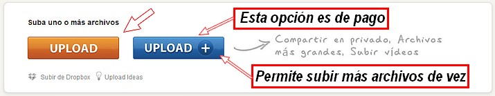

# 2.2 Slideshare (presentaciones en 1 minuto)

### 1\. ¿Qué es Slideshare?

[**Slideshare**](http://www.slideshare.net/) es una herramienta muy utilizada en educación para subir presentaciones a internet y poder compartirlas en redes sociales o incrustarlas en blogs, webs, wikis, etc. Slideshare soporta gran variedad de archivos y diferentes formatos de vídeo. También ofrece la opción de comentar, seguir a otros usuarios, crear [Slidecast](http://es.wikipedia.org/wiki/Slidecast) e incrustar vídeos de Youtube. Con Slideshare tus presentaciones educativas, los trabajos de tus alumnos, tus tutoriales, etc. estarán siempre disponibles en la red.

<iframe src="//www.slideshare.net/slideshow/embed_code/key/JjyhF03BLeYsQa" width="595" height="485" frameborder="0" marginwidth="0" marginheight="0" scrolling="no" style="border:1px solid #CCC; border-width:1px; margin-bottom:5px; max-width: 100%;" allowfullscreen> </iframe> 
 <strong> <a href="//www.slideshare.net/Konomedio/album-28468478" title="Album de Instagram" target="_blank">Album de Instagram</a> </strong> from <strong><a href="https://www.slideshare.net/Konomedio" target="_blank">Luperzio Latrás</a></strong> 

### 2\. ¿Cómo se usa?

Slideshare tiene **acceso libre sin límite de presentaciones por usuario**, sólo es necesario **registrarse en la página** rellenando los datos que se solicitan. Una vez creada la cuenta es sencillo subir una presentación o documento desde la pestaña **"upload"**. Después de subirla se configuran los datos: título, tags y categorías con la función de facilitar la búsqueda a otros usuarios. Podemos compartir nuestra presentación  en facebook, twitter, Google plus y Linkedin. Además, podemos enviar las presentaciones por correo electrónico, descargarlas a nuestro ordenador, marcarlas como favoritas e incrustarlas en nuestros blogs.

1º Entramos en [Slideshare.net](http://www.slideshare.net/). Hacemos **clic en Subir**. 

2º Hacemos **clic en Upload** para subir nuestra presentación. Para este ejemplo vamos a utilizar la que hemos creado con las fotografías de Instagram.

  

 3º Aparecerá un cuadro con **varias opciones**. Rellenamos el formulario y guardamos la presentación.

 

### 3\. Embeber (insertar) una presentación de Slideshare en un blog

Para ello Slideshare proporciona un embed, un código html que permite ver la presentación directamente en nuestro blog. Accedemos al embed, lo copiamos y pegamos en nuestro blog (utilizando vista html). También podemos acceder a diferentes medidas de la presentación en el apartado "customize". Ahí mismo está el código especial para incrustar las presentaciones Slideshare en un blog de wordpress.com.

<object type="application/x-shockwave-flash" data="http://aularagon.catedu.es/materialesaularagon2013/imagen/slide.swf" width="513" height="420"><param name="src" value="http://aularagon.catedu.es/materialesaularagon2013/imagen/slide.swf"></object>

### 4\. Posibilidades educativas

*   Presentaciones de trabajos sobre contenidos de las diferentes materias realizados con Power Point o Impress.
*   Soporte y apoyo para exposiciones en clase.
*   Compartir apuntes, resúmenes, esquemas, artículos, etc. elaborados con Word o similar.
*   Trabajos de alumnos.

## Para saber más

**Slideshare** es una buena herramienta pero no la única. La hemos elegido por su facilidad y porque se publican muchos trabajos en esa web. Si quieres conocer otras te recomendamos este artículo:

*   EDUCACONTIC: Cómo crear presentaciones de forma fácil y rápida. [http://www.educacontic.es/blog/como-crear-presentaciones-online-de-forma-facil-y-rapida](http://www.educacontic.es/blog/como-crear-presentaciones-online-de-forma-facil-y-rapida). Licencia (CC BY-SA 3.0 ES).
    

