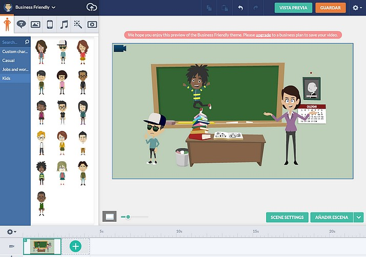

# 2.4 Crear vídeos y presentaciones animadas

**1\. POWTOON**

**1\. ¿Qué es Powtoon?**

[PowToon](http://www.powtoon.com/) es una **aplicación online para crear vídeos animados de presentaciones en pocos minutos**. Su uso es muy sencillo, lo primero que tenemos que hacer es registrarnos, pudiendo hacerlo a través de nuestra cuenta de Google, Facebook o Linkedin, posteriormente podremos comenzar a crear nuestro vídeo, para ello seleccionaremos una categoría (dependiendo para lo que deseemos), posteriormente seleccionar una plantilla entre séis disponibles y deberemos ponerle un nombre a nuestro proyecto. A partir de aquí ya estaremos en el editor.

**2\. ¿Cómo se usa?**

*   **Nuestra cuenta nos ofrece** una serie de botones para: Crear el vídeo, ver un listado de los vídeos creados, exportarlos, subirlos a Youtube o compartirlos a través de las redes sociales. Para ello es necesario registro pudiendo hacerlo a través de nuestra cuenta de Google, Facebook o Linkedin.
*   La versión gratuita añade una marca de agua y nos limita el vídeo a 5 minutos, con posibilidad de 10 canciones para usar y 8 estilos de vídeo.
*   Podremos crear tantos vídeos como deseemos y compartirlos en las distintas redes sociales pero, a Youtube sólo podemos subir como mucho 30.

**3\. Manual de Powtoon**

Tenemos un tutorial en Youtube de **Jesús Ruiz**, establecido en dos partes.

**PARTE 1ª**

**PARTE 2ª**

**2\. MOOVLY**

**1\. ¿Qué es Moovly?**

**[Moovly](http://www.moovly.com/)** es una herramienta 2.0 que nos permite a los docentes **crear animaciones y vídeos**. Es muy fácil de utilizar y el resultado es excelente. Esta herramienta fue creada para el uso en el aula ya que va a ayudar a desarrollar la creatividad de los alumnos a la hora de presentar sus trabajos de clase. Las animaciones creadas con **[Moovly](http://www.moovly.com/)** se comparten en la red en formato vídeo exportándolas a Youtube y Facebook. La aplicación es gratuita pero también tiene un servicio de pago.

**2\. ¿Cómo usarla?**

Video elaborado por [blog.princippia.com](http://blog.princippia.com/).

**3\. Usos didácticos**

*   Los docentes podemos crear vídeos animados con texto sobre personajes célebres relacionados con nuestra materia: personajes históricos, escritores, etc.
*   Crear vídeos para explicar lecciones, pequeños tutoriales, etc.
*   Crear vídeos sobre presentaciones de temas o los contenidos de clase.
*   Anuncios y presentaciones de diferentes temas en nuestras clases: buenas prácticas en Internet, Cuidado del Medioambiente, etc.

**3\. GO! ANIMATE**

**1\. ¿Qué es Go! Animate?**

[Go! Animate](http://goanimate.com/) es una herramienta 2.0 muy útil para crear vídeos animados. Tiene un gran potencial educativo, con un poco de imaginación podremos crear fantásticos vídeos. Go! Animate cuenta con gran [cantidad de vídeos](http://goanimate.com/videos) realizados por otros usuarios que nos pueden ayudar a conocer las posibilidades de la aplicación. Los vídeos creados se comparten fácilmente en la red y podemos incrustarlos en nuestros blogs. Podemos ampliar las ventajas de Go! Animate contratando la **versión Plus** o la [cuenta para escuelas](http://goanimate4schools.com/public_index).

**2\. ¿Cómo utilizarlo?**

Entramos en la web [Go! Animate](http://goanimate.com/) y nos registramos como usuarios completando los datos de correo electrónico, usuario y contraseña.  Una vez dentro, comenzamos a crear un vídeo animado haciendo clic en el botón "**Crea tu vídeo**" situado en la parte superior derecha de la web. Después hacemos clic en "**Crea un vídeo corto**" o en "**Crear una película**" y seleccionamos una de las opciones gratuitas (hay más opciones en la versión de pago). A partir de ahí tendremos que elegir escenario, personajes, escribir o grabar el diálogo y previsualizar el vídeo. En la opción película contamos con un tutorial que nos indica los pasos ya que podemos poner varias escenas. La herramienta pone música ambiental al vídeo y cuenta también con un creador de personajes.

Imagen 29: Captura de pantalla propia 

**3\. Usos didácticos**

*   Crear cómics animados sobre temas de clase, inventar historias y situaciones para ilustrar temas de educación en valores: contaminación, alimentación, respeto y tolerancia, paz, etc.
*   Crear animaciones que hablen sobre personajes importantes relacionados con los contenidos de clase: escritores, inventores, compositores, pintores, poetas, premios nobel, etc.
*   Elaborar vídeos para presentar proyectos colaborativos y diversas actividades de clase o del centro educativo. Proponer actividades creativas a nuestros alumnos relacionadas con nuestra materia.

**Vídeo subido a YouTube por Go! Animate**

