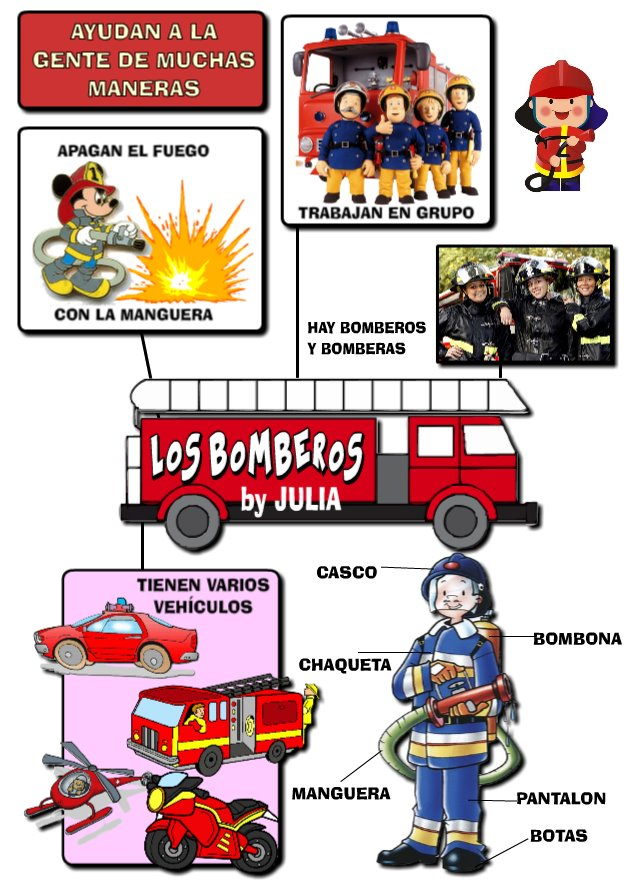

# 3.1 ¿Qué es una infografía?

**1\. ¿Qué es una infografía?**

**Una infografía es una mezcla de imagen y texto para comunicar información de una manera fácil y practica**. Ofrece **componentes visuales** que ayudan a la compresión de las cifras que se exponen en ella. El objetivo de realizar una Infografía es **maximizar la compresión** de un tema exponiendo cifras y conceptos. Las imágenes o gráficos deben ser precisos y de alto impacto para captar la atención de los usuarios.

 Imagen 29: Autores Julián Trullenque y Julia Trullenque (5 años), para un proyecto de Educación Infantil. Licencia CC by-nc 

**2\. ¿Cómo debe ser una Infografía?**

Para tener éxito una infografía se debe tener en cuenta la **claridad con que exponemos el tema** que no confundamos, centrarnos en la temática que vamos a explicar. Los mensajes y las explicaciones deben ser directos y no redundar ser preciso en los datos que exponemos.  La infografía debe ser fácil de entender ya que solo tenemos una imagen para poder comunicar nuestra infografía así que tiene que ser clara.

Las infografías han cobrado mucha popularidad para exponer diferentes temas y aportar cifras de temas importantes. En el caso de las Redes Sociales funcionan para hacer comparaciones de canales de Social Media o un tema especial.

**3\. Tipos de Infografías**

Existen diferentes **tipos de Infografía**: lineal, de tabla, de gráficas o mezclar las cuatro formas. También se pueden ocupar diagramas para explicar cómo se desarrolla un proceso o una línea del tiempo exponiendo como va pasando un tema a lo largo del tiempo.

**4\. ¿Para qué sirven las infografías?**

Las infografías son una opción para **exponer un tema complejo** y con muchos datos, además es útil para resumir e impactar visualmente al público de manera que siga la secuencia de toda la infografía.

Así que si tienes un tema complicado y que necesitas explicar de forma rápida, sencilla e impactante puedes utilizar una infografía para que tus usuarios queden debidamente informados sobre un tema específico y puedes ocupar los gráficos y conceptos que creas convenientes para brindar la información.

**¿Para qué temas crees que podrías usar una infografía?**

**5\. Proceso de creación de una infografía**

**6\. ¿Con qué hacer una infografía?**

Las **herramientas que podemos utilizar para hacer infografías** son muchas y variadas; desde un simple procesador de textos hasta las herramientas más sofisticadas. En el apartado siguiente vas a ver algunas, dividiéndolas en dos grupos: las que tenemos instaladas en el ordenador y las herramientas on-line.

