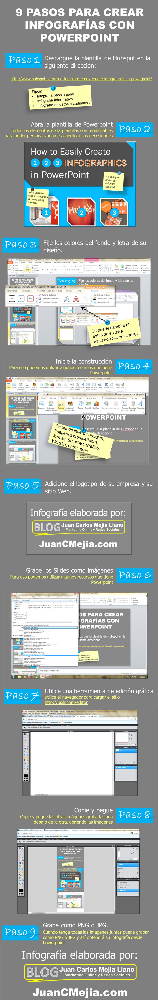
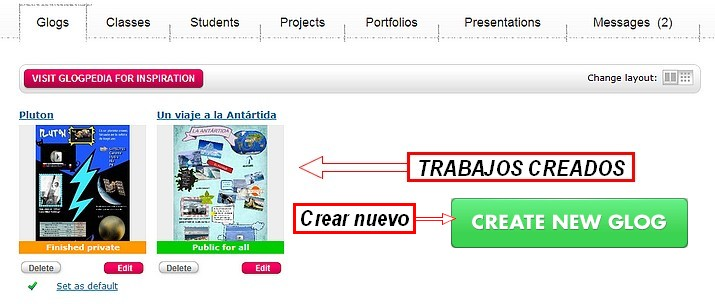
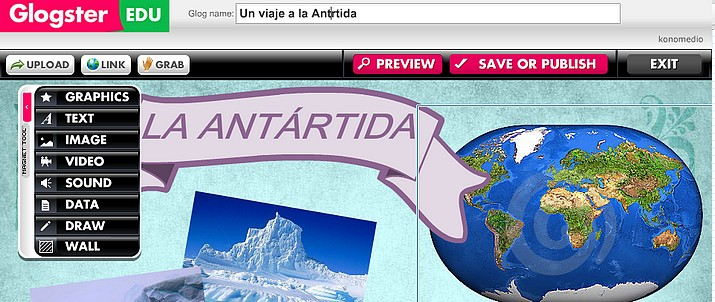
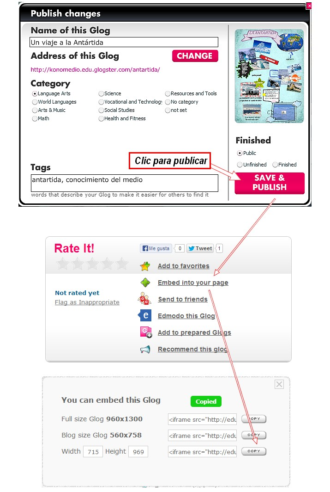
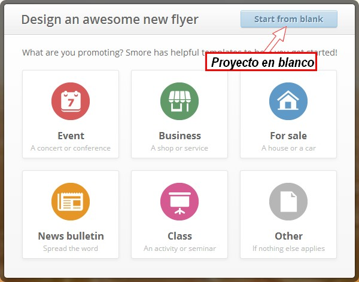
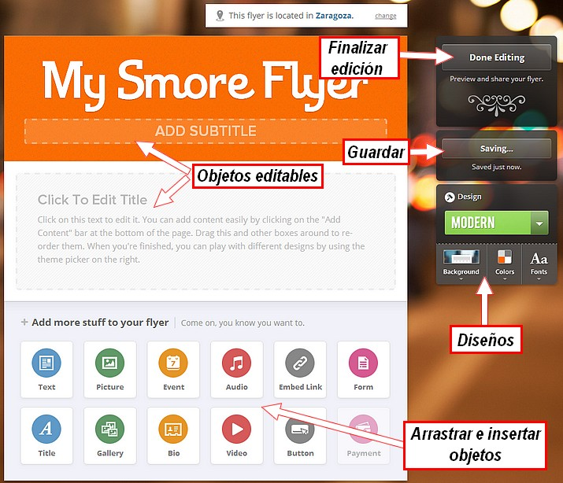
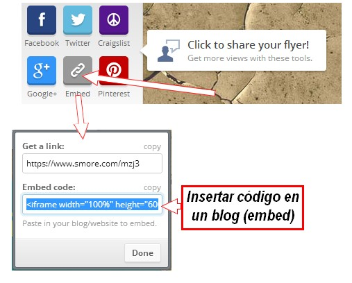

# 3.2 Crear infografías

## Importante

**Cualquier aplicación que combine textos con imágenes nos puede servir para crear nuestras infografías. Vamos a indicar algunos programas instalables para realizar infografías y también otras utilidades on-line.**

**1\. Software para crear infografías**

Existen muchas opciones para elaborar el póster. Os recomendamos las siguientes:

*   Usar **Microsoft PowerPoint** o programas similares, como Impress de la serie OpenOffice. En estos programas puedes seleccionar el tamaño que te interese y dar el formato a una imprenta para que lo imprima directamente.
*   Una opción más interesante consiste en el programa Microsoft Publisher, que te permite dividir el póster en páginas A-4 que puedes imprimir tú mismo y superponer luego en el soporte definitivo.
*   También puedes crear gráficas en **Microsoft Excel** y exportarlas para PowerPoint o Publisher.

Veamos un ejemplo:

Imagen 30: Autor Juan Carlos Mejía

Podemos descargar estas plantillas para hacer infografías: [plantilla Power Point](https://dl.dropboxusercontent.com/u/46039577/curso/plantilla.ppt) o [plantilla Impress](https://dl.dropboxusercontent.com/u/46039577/curso/plantilla.odp).

**2\. Utilidades para crear infografías on-line**

En la actualidad existen múltiples programas informáticos con los que se pueden hacer este tipo de carteles para su utilización online que no dejan de ser la versión actualizada y digital del pliego de cartulina o tira de papel continuo, que fijado a la pared del aula, presenta una serie de contenidos didácticos que todos hemos  creado o mandado realizar alguna vez. 

A este respecto, si nos decidimos a crear o mandar  nuestos alumnos que realicen uno,  recomendamos el programa_Gloster,_ que se puede visitar en la dirección: [http://www.glogster.com/](http://www.glogster.com/) por su sencillez, facilidad de uso, y unos resultados inmejorables en cuanto a diseño y elementos multimedia. Estos murales, pueden ser imprimidos, insertados en páginas web o proyectados.

**1\. GLOGSTER**

_1\. ¿Qué es?_

[Glogster](http://edu.glogster.com/) es una herramienta web 2.0 que nos permite crear murales digitales multimedia. Los murales realizados con Glogster pueden ser impresos, insertados en una web (blog de aula, personal, etc.), proyectados y utilizados en clase mediante una PDI o pizarra digital normal como apoyo a la presentación de unos determinados contenidos.

_2\. ¿Cómo funciona?_

1º Nos vamos a centrar en la plataforma [Glogster Edu](http://edu.glogster.com/), para acceder a ella y comenzar a crear los pósters interactivos debemos registrarnos.

2º Una vez dentro podemos crear un nuevo glog desde **"Creat new Glog"**, se abrirá una nueva página con el glog para editar.

Imagen 30: Captura de pantalla propia

3º Este editor es muy sencillo, consta de ocho secciones, seis de las cuales están disponibles en la versión gratuita:

*   **Grafics**, para insertar todo tipo de diseños decorativos.
*   **Texts**, para insertar texto simple o insertado en diferentes marcos. 
*   **Image**, para añadir fotos e imágenes.
*   **Vídeo**, para incluir vídeos desde nuestro ordenador o desde Youtube.
*   **Sound**, para añadir audios.
*   **Wall**, para diseñar el fondo del póster y de la página.

Imagen 31: Captura de pantalla propia

4º Una vez terminado, **guardamos el Glogster** desde el botón "**save & publish**", le ponemos el título, le asignamos una categoría, activamos la opción "finished" y terminamos dando al botón "save". Podremos compartirlo a través del link o incrustando el código embebido en nuestro blog.

Imagen 32: Captura de pantalla propia

En la imagen anterior se muestra una secuencia de cómo hacer para guardar y publicar un trabajo insertado en un blolg... Este mismo GLOG es el que aparece al principio de este aparado.

_2\. Posibilidades didácticas_

**Glogster es fácil, divertido, creativo y con grandes posibilidades didácticas**. ¿Qué pueden aportar este tipo de recursos a nuestros procesos de enseñanza-aprendizaje? Fundamentalmente, podemos encontrar tres tipos de valores distintos:  

*   La elaboración del mural es un elemento fundamental en el proceso de construcción de nuestros aprendizajes, tanto de forma individual como colectiva
*   Los murales posters, etc. nos permiten realizar una representación multimedia de contenidos con el fin de presentar más fácilmente los mismos.
*   Favorece el desarrollo de distintas competencias, especialmente la creatividad.

Vídeo realizado por Marisa de Dios de la Escuela de Idiomas de Valencia

**2\. SMORE**

[Smore](https://www.smore.com/) es una aplicación está pensada para poder crear **posters o folletos en línea**, en la que podemos destacar su sencillez, ya que todo está prediseñado, pudiendo crear y publicar en pocos pasos y sin ningún conocimiento de programación.

_1\. ¿Cómo funciona?_

1º Una vez registrados, lo primero que vemos es que nos invita a crear nuestra primera infografía.

Imagen 33: Captura de pantalla propia

2º Se nos abre un menú en que podemos empezar a definir nuestra publicación. Nosotros elegiremos una platilla en blanco

Imagen 33: Captura de pantalla propia

3º Podemos, desde crear un póster para convocar una reunión a hacer una página personal, una vez seleccionada la plantilla nos aparecerá el escritorio de trabajo. 

Imagen 34: Captura de pantalla propia

4º Esta plantilla solo necesita que selecciones el apartado a editar y empieces a escribir o arrastrar y soltar imágenes, en el caso que no te interese como está configurada todos los apartados son suprimibles y puedes empezar a crearla desde el principio con la barra de herramientas básica seleccionando el botón de "add content".

5º Una vez hemos acabado sólo nos hace falta acabar la edición, el trabajo se va autosalvando, y compartir en las redes.

6º Otra posibilidad sería insertarlo en tu blog o página web.

 Imagen 35: Captura de pantalla propia

Es una aplicación con varias ventajas:

*   Su sencillez permite el uso a cualquier tipo de usuario, no hace falta ser experto, con unos resultados muy buenos a nivel de diseño. 
*   Permite varias maneras de publicar, como web individual o incrustada en otra plataforma. 
*   Adaptada a todos los aparatos tecnológicos, desde ordenadores a cualquier dispositivo movil.

Para finalizar os dejo algún ejemplo, yo lo utilizo con mi alumnado de 5º:

## ParaSaberMas

**LAS MEJORES HERRAMIENTAS ON-LINE PARA HACER INFOGRAFÍAS**

Las infografías permiten que los estudiantes reflejen su proceso de construcción de conocimiento e interrelación de ideas cuando plasman en alguno de estos organizadores un tema que están estudiando. Elaborar infografías demanda de los estudiantes identificar las variables que intervienen en un tema particular y establecer las relaciones estructurales existentes en el contenido que se estudia.

1-**[Infogr.am](http://infogr.am/)** es una herramienta a la que puedes acceder usando tu cuenta de Facebook, ofrece seis diseños diferentes de infografías. Nos permite añadir mapas, una extensa variedad de gráficos, videos (desde Vimeo o Youtube), texto e imágenes desde nuestra PC.

2- **[Piktochart](http://piktochart.com/)** es una herramienta gratuita que incluye siete de las 115 que hay disponibles. Todas lucen profesionales, atractivas y tiene la opción de ser modificadas por el usuario. Las herramientas de edición permiten agregar más gráficos al material, además de formas, textos e imágenes. Puedes exportar la infografía en JPG o PNG.

3-**[Easel.ly](http://www.easel.ly/)** es una herramienta gratuita que nos permite a los docentes además de editar colores y texto, permite añadir y modificar fácilmente las formas que se incluyen dentro de la infografía, lo que permite una mayor versatilidad a la hora de conseguir un trabajo más completo. Las infografías se pueden descargar en PDF o bien en otros formatos fotográficos como .jpg o .png. Aquí les dejamos un tutorial para que puedan analizarla.

4-**[Visual.ly](http://visual.ly/)** tiene una gran cantidad de plantillas para crear gráficos para presentar estadísticas. Visual.ly presentó recientemente una nueva herramienta para transformar la información de Google Analytics en infografías. Aquí les dejo una pequeña introducción de esta herramienta.

5-**[InfoActive](https://infoactive.co/)** es una plataforma en línea que proporciona herramientas para crear infografías interactivas, móviles amigables con datos en tiempo real.

6-[Presenter](http://www.ewcpresenter.com/):  se trata de una herramienta web con la que cualquiera puede crear fácilmente, sin necesidad de escribir código,puedes crear presentaciones, demos online, animaciones, infografías y banners. Para aprovechar esta herramienta únicamente debes crear una cuenta gratuita, registrándote con tu correo electrónico o usando las credenciales de Facebook. Luego podrás crear todo tipo de material multimedia, con la ventaja de que HTML5 se adapta perfectamente a la web y a los navegadores móviles.

