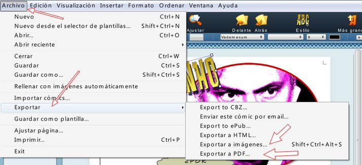

# 4.1 ComicLife

## Importante

El comic que he insertado en la página de introducción fue realizado en el año 2008 por mis alumnos de 6º de Villamayor. Lo hicieron con la herramienta Comic Life 1.3. Crearon una revista donde contaban sus experiencias en un viaje que hicieron a Castilla La Mancha. Este revista se imprimió y se difundió entre las familias. Ahora te vamos a presentar al versión 2 de este programa. Las razones por las cuales te animamos a utilizar esta aplicación son las siguientes:

*   Está en Castellano
*   Es muy fácil. Tiene varias plantillas predefinidas. Para colocar los objetos, solamente hay que arrastrar y soltar. Es muy intuitivo.
*   Es versátil. No solamente sirve para hacer cómics sino también para usarlo como herramienta de autoedición y hacer infografías, carteles, periódicos, ...
*   Es barato. Aunque es un programa de pago, obtener una licencia solo cuesta 13,99 €, además hay una versión para iPad que cuesta 4,69 € que es muy fácil de usar muy divertida. Haces las fotos con el tablet y puedes montar un cómic en poco tiempo.
*   De todas formas, tienes una versión de prueba por 1 mes con todas las funcionalidades. Te animamos a que la descargues y pruebes este maravilloso programa.

**1\. Descargar Comic Life (Versión de prueba)**

*   En esta página tienes un enlace de descarga de la última versión. Tienes opciones para Windows, Mac e iOs.
    *   Descargar [versión para Mac](http://plasq.com/downloads/mac).
    *   Descargar [versión para Windows](http://plasq.com/downloads/win).
    *   Ver la [versión para iPad](http://plasq.com/downloads/appstore).
*   Descargas la versión que te interese y la instalas en tu equipo. Tienes también otra aplicación descargable para actualizar.

 Imagen 36: Captura de pantalla propia

**2\. ¿Qué es Comic Life?**

**Comic Life**, como indica su nombre, es una aplicación de Plasq con la que se pueden crear fácilmente cómics a partir de fotografías y dibujos digitalizados. A pesar de su orientación a la maquetación de cómics, en realidad lo podemos utilizar para crear muchos tipos de materiales y para los alumnos puede ser una herramienta mucho más cómoda y divertida con la que elaborar sus trabajos.

El programa es realmente sencillo de usar y está lleno de detalles graciosos que ayudan a que el trabajo con él sea muy agradable.

Presentación realizada por Julián Trullenque. Licencia CC by-nc

La ventana del programa se divide en cinco zonas.

1.  La zona principal de trabajo nos muestra la página actual del proyecto.
2.  A la izquierda tenemos una columna en la que podemos ir añadiendo páginas y modificando su posición.
3.  A la derecha, un panel nos permite acceder a las librerías de fotos, al sistema de archivos o incluso capturar imagen mediante una cámara conectada al Mac.
4.  Bajo la zona de trabajo tenemos un espacio para seleccionar el tipo de globos o bocadillos en los que introducir los textos y los diálogos de los personajes. También tiene una herramienta para crear títulos vistosos.
5.  Finalmente, la barra de herramientas nos da acceso a algunas otras opciones del programa.

**3\. ¿Cómo usar Comic Life?**

1º **Ejecutamos el programa**. Nos aparece una pantalla de gestión de archivos. Podemos abrir un archivo existente, crear uno nuevo en blanco o desde una plantilla.

 Imagen 37: Captura de pantalla propia

2º La pantalla de Comic Life nos presenta una **página en blanco** en la que podemos empezar añadiendo una plantilla de viñetas que la organicen.

*   La aplicación incluye un gran número de plantillas pero podemos modificarlas y crear otras nuevas con gran facilidad.

3º Una vez que tenemos las viñetas de la página no tenemos más que arrastrar las imágenes a las viñetas, ya sean dibujos o fotografías. Podemos aplicar efectos visuales a las fotos de las viñetas.

4º Para colocar un bocadillo a un personaje basta con arrastrar el globo del tipo adecuado, ajustar su posición y la del vértice en la pantalla y añadirle texto.

5º Accediendo al panel "Detalles" podemos controlar el color del texto, relleno, sombra y otras características de los objetos. Para poder aplicarlo a varios bocadillos podemos almacenar el conjunto de ajustes como un estilo y utilizarlo cuantas veces necesitemos.

6º Para añadir onomatopeyas y títulos arrastraremos el objeto Lettering y añadiremos el texto deseado. Una vez colocado podremos utilizar los manejadores y el panel de detalles para dejarlo a nuestro gusto.

7º Si lo que queremos es editar la imagen contenida en una viñeta haremos doble clic sobre ella, de este modo podremos realizar los ajustes necesarios.

A continuación, veremos algunas **prestaciones más avanzadas** del programa.

*   Muchas plantillas de Cómic Life están formadas por las típicas viñetas rectangulares, pero también podemos modificarlas accediendo al panel de detalles.
*   Así podemos **aplicarles efectos visuales**, rellenos o sombreados o cambiar la forma y características de los bordes.
*   Tampoco tenemos que limitarnos a un formato de página, ya que el programa nos ofrece una gran número de tamaños predefinidos para diversos usos, a través del **menú Archivo, opción Formato de Página**.
*   El panel Detalles, proporciona controles para dar color de fondo a las páginas y añadir la numeración.
*   Todos los ajustes que hayamos definido se pueden **guardar como Hoja de Estilos**, con lo cual podemos mantener una línea coherente entre distintos trabajos.

El **funcionamiento de Cómic Life se basa en las técnicas de arrastrar y soltar y en el uso del panel Detalles**. La mejor forma de aprender a usarlo es explorando. La mayor parte de su manejo es idéntico al de otras aplicaciones. En un par de sesiones lo dominarás a fondo.

**4\. Guardar y exportar.**

Es muy **IMPORTANTE guardar bien nuestro proyecto** en el formato de Comic Life y si queremos exportarlo para poder verlo en otros ordenadores que NO tengan Comic Life, debemos exportar en formato JPEG o PDF. Nosotros recomendamos PDF.

Imagen 38: Captura de pantalla propia

