# 4.1 Dibujar objetos

**2\. Herramientas de dibujo**

**1\. Herramienta lápiz**

La herramienta Lápiz tiene un comportamiento muy especial en Vectorian. Se puede usar para dibujar líneas, siluetas y formas a mano alzada.

1º Clic en la herramienta **lápiz**.

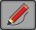

Herramienta lápiz

2º Trata de **dibujar una línea quebrada**. Observa que el programa suaviza la línea.

Presentación realizada por Julián Trullenque. Licencia CC by-nc

3º Para dibujar con la herramienta **Lápiz **una línea perfectamente horizontal o vertical, debes mantener pulsada la tecla **<Mayús> **mientras pinchas y arrastras sobre el escenario.

_Propiedades de la herramienta lápiz_

1º Asegúrate de que la herramienta **Lápiz  **está activada en la caja de herramientas.

2º Fíjate en el panel de **control de lápiz (pen)** las características que en estos momentos tiene:

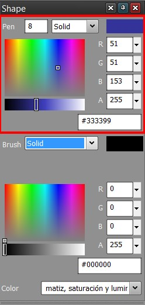

Imagen 14: autor Julián Trullenque. Licencia CC by-nc

3º Puedes **modificar** el grosor, el color y la forma del lápiz.

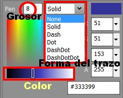

Imagen 15: autor Julián Trullenque. Licencia CC by-nc

4º **Experimenta con todas estas variables** y verás los diferentes resultados.

Presentación realizada por Julián Trullenque. Licencia CC by-nc

**2\. Dibujar formas geométricas**

Las herramientas** Línea**, **Rectángulo** y **Óvalo** funcionan de una forma similar a otros programas de diseño gráfico.

_1\. Herramienta línea_

1º Clic en la herramienta línea.

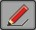

Herramienta línea

2º **Clic en el área de trabajo** donde quieres que empiece la línea y **arrastra al ratón** donde quieres que teremine. Habrás dibujado una línea recta. Por ejemplo una diagonal de color morado.

Presentación realizada por Julián Trullenque. Licencia by-nc

3º Las **propiedades** de esta herramienta funcionan igual que la herramienta lápiz.

_2\. Herramienta óvalo_

1º Clic en la herramienta **Óvalo **del cuadro de herramientas para seleccionar ésta.

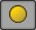

Herramienta óvalo

2º Usa los controles **Color de Trazo** y **Color de Relleno** en la caja de herramientas para definir el color de trazo como negro y el color de relleno como amarillo. Sitúa el puntero sobre cada cuadro de color, pincha y se despliega la paleta de colores. Haz clic sobre un color para seleccionarlo.

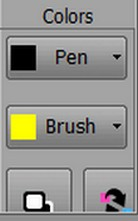

Imagen 15: Captura de pantalla propia

3º **Al pinchar, arrastrar y soltar sobre el escenario** se dibujará un **óvalo** con estas características de color de trazo y relleno.

Presentación realizada por Julián Trullenque. Licencia by-nc

También se puede utilizar el **Inspector de propiedades ** cuando la herramienta **Óvalo **esté seleccionada para elegir los colores de trazo y de relleno:

4º En los paneles de control, se pueden definir las **propiedades de óvalo**.

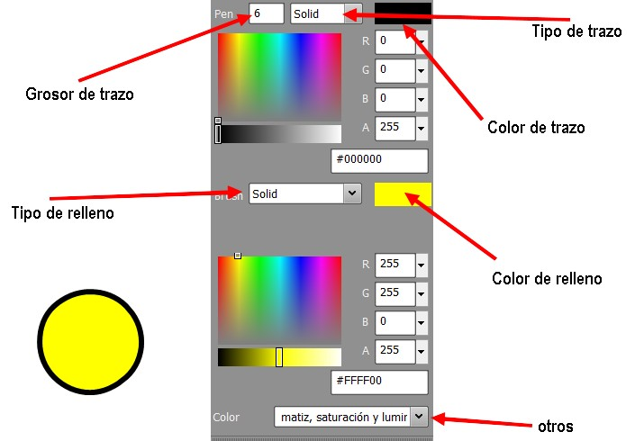

Imagen 16: autor Julián Trullenque. Licencia CC by-nc

5º Si a la vez que dibujas el óvalo mantienes presionada la tecla **<Mayus> (mayúsculas)** harás un círculo perfecto. Practica a dibujar óvalos con cambiando las propiedades.

Presentación realizada por Julián Trullenque. Licencia by-nc

_3\. Herramienta polígono_

1º Clic en la herramienta **Rectángulo**  del cuadro de herramientas para seleccionar ésta.  

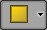

Herramienta cuadrado

2º Haciendo clic en la pestaña de la derecha puede elegir entre un cuadrado, cuadrado redondeado, polígono y estrella.

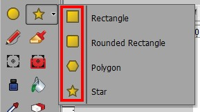

Imagen 16: Captura de pantalla propia

3º La **configuración de propiedades** del cuadrado son las mismas que las del círculo. Ver punto anterior. Puedes cambiar todos los parámetros e ir haciendo pruebas.

Presentación realizada por Julián Trullenque. Licencia by-nc

**3\. El pincel**

Con la herramienta **Pincel** puedes crear trazos similares a los de un pincel.

1º Selecciona la herramienta **Pincel.**

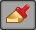

Herramienta pincel

2º Fíjate en el panel de **control de lápiz (brush)** las características que en estos momentos tiene:

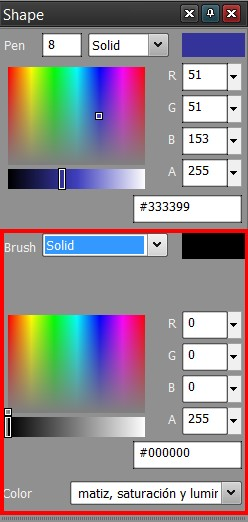

Imagen 17: Captura de pantalla propia

3º Puedes **modificar** el tipo de relleno y el color.

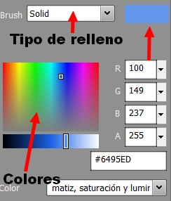

Imagen 18: Captura de pantalla propia

4º **Experimenta con todas estas variables** y verás los diferentes resultados.

Presentación realizada por Julián Trullenque. Licencia CC by-nc

**4\. El bote de pintura**

El **Cubo de pintura **permite rellenar con color áreas cerradas. Se pueden utilizar colores sólidos, rellenos degradados, etc.

1º Clic en el **bote de pintura**.

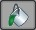

Bote de pintura

2º Dibuja un **círculo**.

3º Selecciona el **Color  del relleno. **Por ejemplo: naranja. Las propiedades del bote de pintura son las mismas que las del **pincel**.

4º Hacer clic **dentro del objeto** dibujado.

5º **Practica** con otros objetos, diferentes colores y diferentes tipos de relleno.

Presentación realizada por Julián Trullenque. Licencia CC by-nc

**5\. Bote de tinta**

El bote de tinta crea un **contorno alrededor de un objeto de color**. Las propiedades se modifican igual que en el lápiz.

1º Clic en el **bote de tinta**.

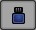

Herramienta tinta

2º Dibuja con un **cuadrado**.

3º Selecciona el **Color  del trazo y groso.**

4º Hacer clic **dentro del objeto** dibujado.

5º **Practica** con otros objetos, diferentes colores y diferentes tipos de relleno.

Presentación realizada por Julián Trullenque. Licencia by-nc

**6\. El cuentagotas**

El **cuentagotas** sirve **seleccionar un color y colocarlo como color frontal**. El color se selecciona, una vez tenemos activa la herramienta, haciendo clic en cualquier parte de una imagen, que puede ser la propia imagen con la que estamos trabajando o cualquier otra que tengamos abierta.

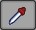

Herramienta cuentagotas

**7\. La goma de borrar**

Herramienta **Borrador**: Su funcionamiento es análogo a la Herramienta Pincel. Pero su función es la de eliminar todo aquello que se "dibuje o pinte".

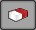

Herramienta borrador

**3\. Otras herramientas**

**1\. Insertar texto**

La **Herramienta****Texto**: Crea un texto en el lugar en el que hagamos clic. Podemos modificar las propiedades.

Herramienta texto

**2\. Insertar imagen**

La **herramienta imagen**, abrirá un cuadro de diálogo para buscar una imagen y colocarla en el escenario.

Herramienta imagen

**3\. Mover objetos**

**Herramienta Selección** (flecha): Es la herramienta más usada de todas. Su uso principal es para seleccionar objetos. Su uso adecuado puede ahorrarnos tiempo en el trabajo.

Herramienta flecha

## Tarea

Con las herramientas de Vectorian Giotto hacer un dibujo similar a éste.

Imagen 17: autor Julián Trullenque. Licencia by-nc

**1\. El cuadro de herramientas**

Se pueden diseñar ilustraciones para las películas Flash utilizando las **herramientas de dibujar y pintar**. En este capítulo explicamos sus **técnicas básicas de uso**.

 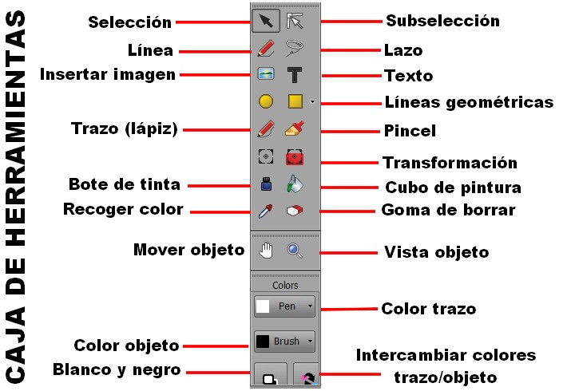

Imagen 13: autor Julián Trullenque. Licencia CC by-nc

