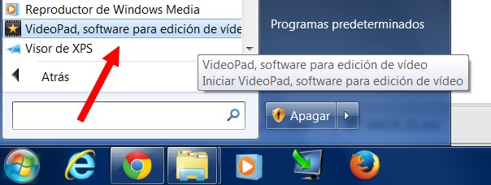
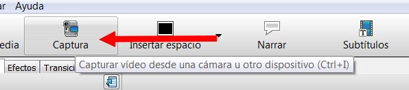
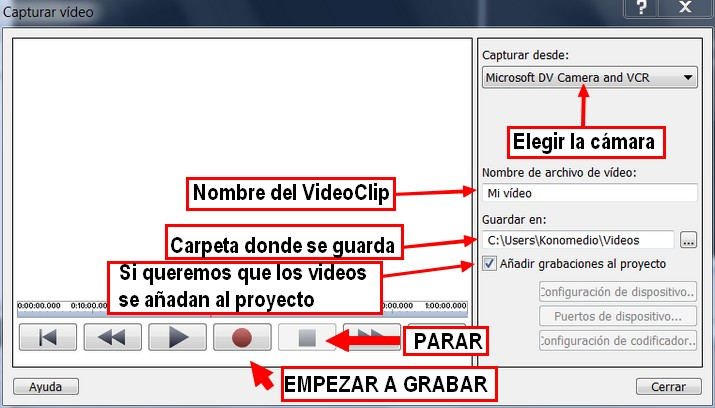
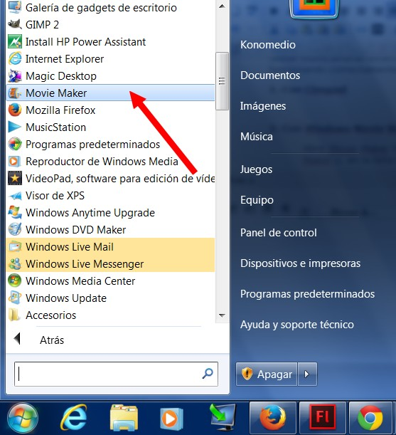
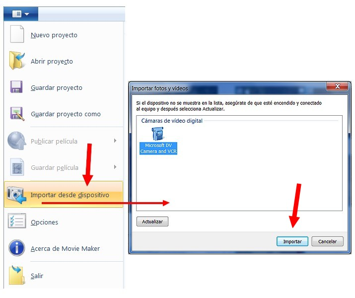
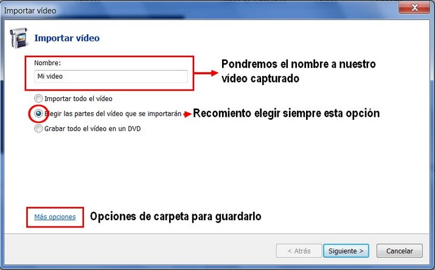
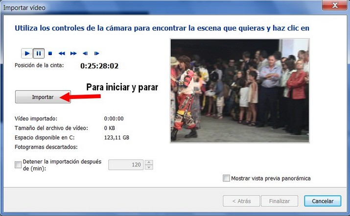

# 4.2.1 Captura de un dispositivo externo

En este tema trataremos, básicamente, como podemos capturar las imágenes de nuestra webcam o capturar videos desde videocámaras externas. Para todo ello suponemos que nuestro sistema (y sus dispositivos) están configurados y funcionando correctamente.

## 1\. Con VideoPad

1º **Conecta la cámara de vídeo digital** (DV) a tu PC utilizando un cable IEEE 1394 y, a continuación, enciende la cámara **en modo Reproducción**/VCR.  

2º Abre **VideoPad** haciendo clic en **Iniciar>Todos los programas>VideoPad...**

 

3º Hacer clic en el icono **Captura**.

4º Aparecerá el cuadro de diálogo "**Capturar Vídeo**". Seleccionamos la cámara, la carpeta en donde lo queremos guardar el vídeo, el nombre que le vamos a poner. Si dejamos seleccionado el botón "Añadir grabaciones al proyecto", aparecerá en la ventana del proyecto los vídeos que grabemos.

 

5º Hacemos clic en el **botón rojo (REC)** y comienza la grabación. Para parar hacemos clic en **STOP**, luego en **cerrar, **y veremos como el clip se añade al proyecto.

<object type="application/x-shockwave-flash" data="http://aularagon.catedu.es/materialesaularagon2013/imagen/capturavideopad.swf" width="761" height="408"><param name="src" value="http://aularagon.catedu.es/materialesaularagon2013/imagen/capturavideopad.swf"></object>

## 2\. Con Windows Movie Maker

1º **Abre Movie Maker** haciendo clic en el botón **Iniciar>Todos los programas>Movie Maker**.

 

2º **Conecta la cámara de vídeo digital** (DV) a tu PC utilizando un cable IEEE 1394 y, a continuación, enciende la cámara **en modo Reproducción**/VCR. 

3º Haz clic en el **botón del menú Movie Maker** y luego en **Importar desde dispositivo**. Si aparece el mensaje Las fotos y los vídeos se importarán en la Galería fotográfica, haz clic en Aceptar.

 

3º En la ventana Importar fotos y vídeos, selecciona la cámara de DV y, a continuación, haz clic en Importar.  

4º (Opcional) En la cámara Importar vídeo, haz clic en **Más opciones**. A continuación, efectúa uno o más de los siguientes procedimientos y, por último, haz clic en Aceptar:

*   *   Selecciona las opciones que desees utilizar, como **la ubicación en la que guardar los archivos y el formato que usarás** para los nombres de las carpetas y los archivos.
    *   Si la cinta de vídeo contiene **varias escenas diferentes**, podrás **importar cada escena como un archivo independiente.** Para ello, activa la casilla de verificación Importar vídeos como varios archivos (no disponible para vídeo HD).  

5º En la página Importar vídeo, **asigna un nombre al vídeo que desees importa**r, efectúa alguno de los siguientes procedimientos y, a continuación, haz clic en Siguiente:

 

6º En la ventana Importar vídeos, utiliza la cámara para encontrar la parte del vídeo que desees importar primero y, a continuación, haz clic en **Importar**.

7º Haz clic en Detener para detener la importación de vídeo.

 

8º Una vez que hayas importado todo el material de vídeo que desees, haz clic en Finalizar. El vídeo se importará y guardará como archivo DV‑AVI.

9º En la Galería fotográfica de , activa la casilla de verificación de la esquina superior izquierda correspondiente al vídeo que desees utilizar en la película.

10º En la pestaña Crear, en el grupo Compartir, haz clic en Película.

11ºLas fotos y vídeos seleccionados se agregarán al guión gráfico de Movie Maker.

<object type="application/x-shockwave-flash" data="http://aularagon.catedu.es/materialesaularagon2013/imagen/capturamovie.swf" width="715" height="520"><param name="src" value="http://aularagon.catedu.es/materialesaularagon2013/imagen/capturamovie.swf"></object>