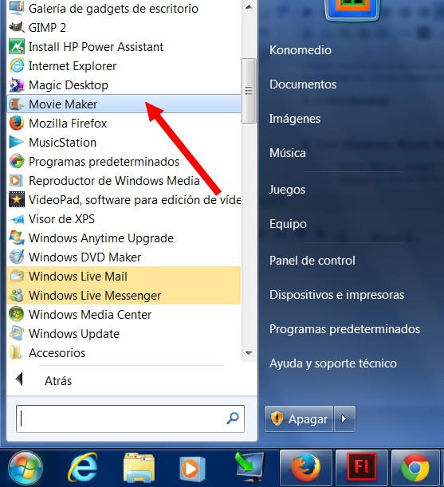

# 4.2.2 Insertar archivos de vídeo

En este apartado trataremos la forma de importar vídeos, imágenes y sonidos a nuestro proyecto para poder colocarlos en la línea de tiempo y organizarlos a nuestro antojo.

## 1\. Con VideoPad

1º Abre **VideoPad** haciendo clic en** Iniciar>Todos los programas>VideoPad...**

 

2º Hacer clic en el icono **Añadir multimedia**.

3º Aparecerá una **ventana** donde deberemos **buscar los archivos** que queramos importar. Los seleccionamos y hacemos clic en **Abrir**.

4º Los archivos que hemos seleccionado aparecerán en la **ventana del proyecto**, aunque todavía no están en la línea de tiempo.

## 2\. Con Windows Movie Maker

1º **Abre Movie Maker** haciendo clic en el botón **Iniciar>Todos los programas>Movie Maker**.

 

2º Haz clic en el **botón del menú **Agregar vídeos y foto.

 

3º Aparecerá este ventana, donde tendrás que seleccionar los archivos que desees y hacer clic en **Abrir.** 

 

4º Los archivos aparecerán ya colocados en la **línea de tiempo**. Ahora solo falta **insertar la música**.

5º La **línea de tiempo** ahora tendrá este aspecto:

