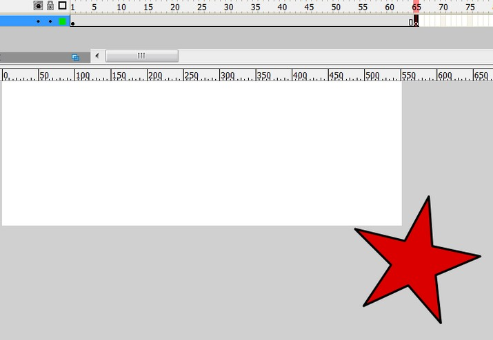
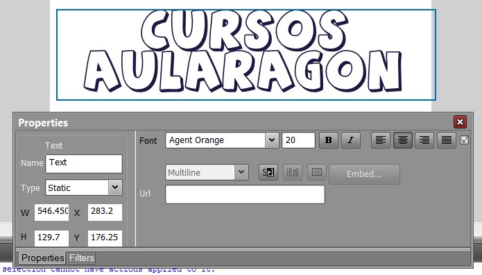

# 4.2 Crear animaciones

**1\. ¿Qué es una capa?**

Las capas son como hojas de acetato transparentes apiladas una sobre otra. Cuando una capa está vacía permite que puedan verse a través de ésta las capas situadas debajo. Las capas ayudan a organizar las películas. Los objetos contenidos en una capa se pueden dibujar y editar sin que afecten a objetos de otras.

*   **Descarga** el archivos [capas.rar](http://aularagon.catedu.es/materialesaularagon2013/imagen/capas2.rar).
*   **Descomprímelo** en tu carpeta de prácticas.

**1\. Insertar una capa**

1º **Crea un documento** en blanco con Vectorian Giotto. **File>New Movie**.

Imagen 18: Captura de pantalla propia

2º **Observa** que solo tienes una capa. **Layer1** 

 Imagen 19: Captura de pantalla propia

3º Sigue insertando capas hasta que tengas 4. Guarda el documento. **File>Save As...**

**2\. Trabajar con capas**

1º Descomprime las imágenes de capas rar en tu capeta de prácticas. Te creará una carpeta "capas".

2º **Inserta en cada capa una imagen**. Sitúa el cursor en el fotograma de cada capa e inserta una imagen en cada capa. De forma que quede así:

*   *   En layer1: inserta "**capa1.png**".
    *   En Layer2: inserta "**capa2.png**".
    *   En Layer3: inserta "**capa2.png**".
    *   En Layer4: inserta "**capa4.png**".

 

3º Observa que los fotogramas que tienen objetos se ven oscurecidos.

 Imagen 20: Captura de pantalla propia

4º Con el trabajo resultante. juega a **ocultar y visualizar capas** y observa como cambia el escenario.

**2\. Los fotogramas**

**1\. La línea de tiempo**

La Línea de tiempo organiza y controla el contenido de una película a través del tiempo, en **capas y fotogramas**. Los componentes principales de la Línea de tiempo son las capas, los fotogramas y la cabeza lectora.

Vamos a abrir la película [**vectorian.vgd**](vectorian.vgd)para observar detalles de su línea de tiempo.

1º Mediante **File>Open... **busca y selecciona el archivo **vectorian.vgd.**

2º Haciendo clic sobre los extremos de la **barra de desplazamiento** horizontal de la Línea temporal podrás observar todos los **fotogramas de sus respectivas capas**.

3º Los nombres de las capas de la película aparecen en una columna situada a la izquierda de la línea de tiempo. Los fotogramas contenidos en cada capa se organizan secuencialmente en una fila a la derecha del nombre de la capa. El encabezado de la Línea de tiempo indica el número de fotograma. La cabeza lectora apunta al fotograma actual que se muestra en el Escenario.

Imagen 21: Captura de pantalla propia

4º Para visualizar la película sin perder de vista la línea de tiempo, elige **Control>Play. **Observa que la cabeza lectora lee en cada instante simultáneamente el fotograma de todas y cada una de las capas. 

** Un FOTOGRAMA CLAVE es el espacio en el que el diseñador dibuja cada objeto.**

**3\. Símbolos**

**1\. ¿Qué es un símbolo?**

Un **símbolo es un objeto** (botón o un clip de película) que se crea una vez y que se puede volver a utilizar a lo largo de la película. Al crear un símbolo, éste pasa automáticamente a la **biblioteca** de la película.

Una **instancia es una copia de un símbolo** que se sitúa en el escenario.

El uso de símbolos reduce considerablemente el tamaño del archivo de la película y simplifica su edición. La edición del símbolo actualiza todas sus instancias mientras que cuando se cambia el color, tamaño o comportamiento de una instancia, estos cambios sólo afectan a ésta.

**2\. Tipos de símbolos**

*   **Clip de película**:elemento animado reutilizable. Tiene su propia línea de tiempo de varios fotogramas que se reproducen independientemente de la línea de tiempo de la película principal. Son como minipelículas dentro de la película principal que pueden contener a su vez botones, gráficos, sonidos, etc.
*   **Botones**: elemento interactivo en la película para responder a la pulsación y desplazamiento del ratón. Cuando pulsamos en el botón, pasa algo.

Imagen 22: Captura de pantalla propia

**3\. Crear un símbolo**

1º Crea una película nueva. **File>New**.

2º **Dibuja un objeto** en el escenario (cuadrado, elipse...).

3º Selecciona el objeto con la herramienta flecha. Ya estás preparado.

4º Clic en **Modify>Convert to Symbol** o bien hacer clic en F8.

Imagen 23: Captura de pantalla propia

5º Aparecerá el **cuadro de diálogo "insert into library"**. Seleccionamos **Movie Clip** y en el cuadro ponemos un **nombre**, por ejemplo "mi símbolo". Pusamos **OK** y habremos crEado un símbolo que aparecerá en la librería (library).

6º Guarda la película **File>Save as... **Elimina el símbolo del escenario. ¿Ha desaparecido de la biblioteca? Arrastra el símbolo desde la biblioteca hasta el escenario. Ya está allí otra vez.

## Importante

Llegados a este punto vemos que tenemos un escenario, sabemos crear los **actores (símbolos)** y colocarlos en el **escenario (capas)**, pues solamente nos falta darles un papel a cada uno y que realicen una acción en un **tiempo determinado (fotogramas que componen la línea de tiempo)**. Con todo esto unido ya podemos hacer nuestra primera película.

**Luces..., cámara... ¡ACCIÓN!**

**4\. Crear una animación**

Para crear animación en Vectorian Giotto, se modifica el contenido de fotogramas sucesivos. Podemos ver dos maneras de crear secuencias de animación: fotograma a fotograma y por interpolación. 

*   En la **animación fotograma a fotograma,** el diseñador crea la imagen de cada fotograma.
*   En la **animación por interpolación**, el diseñador crea los fotogramas inicial y final, y Flash genera automáticamente los fotogramas intermedios. La animación interpolada es una forma eficaz de crear movimiento y cambios a lo largo del tiempo y de reducir el tamaño del archivo.

**1\. Animación fotograma a fotograma**

**En la animación fotograma a fotograma se cambia el contenido del escenario en cada fotograma**. Es idóneo para las animaciones complejas en las que la imagen cambia en cada fotograma además de moverse. Este tipo de animación **genera archivos más grandes** que por interpolación.

1º Abre el archivo [baile.vgd](baile.vgd). **File>Open**

2º **Observarás**: que solo hay una capa (Layer1), que solo hay un fotograma y está vacío, que la cabeza lectora está en el fotograma 1, que en el escenario no hay ningún objeto (está vacío) y que en la biblioteca hay 11 símbolos.

Imagen 24: Captura de pantalla propia

3º **Crea 11 fotogramas nuevos donde colocarás los 11 símbolos**. Para hacer ésto colocas el puntero del ratón en el fotograma 1 e insertas un fotograma, después te colocas en el dos e insertas el tercero, después el cuarto... y así hasta el 11. ¿Cómo se hace? Lo puedes hacer de 3 maneras diferentes, elige la que más te guste:

1.  1.  Pulsando la **tecla F6**.
    2.  Clic en **Insert>Timelime>Keyframe** (fotograma clave).
    3.  Pulsa el **botón derecho** del ratón y te aparecerá un menú. Elige **Insert Keframe**. Mira el siguiente tutorial en el que inserto fotogramas de las tres maneras.

Imagen 25: Captura de pantalla propia

4º **La línea de tiempo** te quedará de la siguiente manera: (Observa que los fotogramas están vacíos).

5º Ahora debes **colocar un símbolo en cada uno de los fotogramas**. Para ello sitúate en el fotograma 1 y arrastra el símbolo 01 de la biblioteca al escenario. Colócalo lo más centrado posible. Después el 02 en el fotograma 02... y así sucesivamente.

7º Guarda el documento. **File>Save**.6º _"Luces, cámara, ... ¡ACCIÓN!"_. Pulsa la **combinación de teclas Ctrl+INTRO** y observa lo que sucede.

Observarás que va muy deprisa. Para que vaya más despacio vamos a colocar a cada muñeco **(símbolo) en tres fotogramas,** es decir que la acción ocupe tres fotogramas:

1º Con el documento abierto, inserta dos fotogramas en cada uno de los fotogramas que tienes ahora. De forma que cada símbolo estará en tres fotogramas. Mira el tutorial (lo hago con ratón). **Insert>Timelime>Frame**. Observa que no es KeyFrame (esto sería fotograma clave individual) sino que es Frame.

¿Qué te parece si le añadimos un escenario a nuestro bailarín? Para hacerlo deberemos crear una escena que ocupe toda la película.2º **Guarda** el documento. **File>Save**.

1º **Crea una capa** nueva. Insert>Timeline>Layer.

Imagen 26: Captura de pantalla propia

2º La capa solo tiene un fotograma y está vacío. En ese fotograma dibuja un marco con el pincel... no importa que te salgas del escenario: 

Clic en Insert>Timeline>Frame. Insertar fotograma.3º El marco solo está en el primer fotograma, pero tienes que hacer que aparezca delante de todos. Para eso sitúa el ratón en la capa segunda (Layer2) encíma del último fotograma ocupado y entonces inserta un fotograma (Frame). Tres formas de hacerlo.

1.  Pulsando la tecla F5
2.  Pulsa el **botón derecho** del ratón y te aparecerá un menú. Elige **Insert Frame**. Mira el siguiente tutorial en el que inserto fotogramas de las tres maneras (deshago cada una con Edit>Undo...).

 4º **Guarda** el documento. **File>Save**. Puedes [descargarlo aquí](baile_resuelto.vgd).

**2\. Animación por interpolación de movimiento**

En la **interpolación de movimiento, el diseñador define la posición, el tamaño y la rotación de un objeto sobre el escenario en un fotograma clave inicial**. **Estas  propiedades las modifica en el fotograma clave final**. Vectorian Giotto generará sobre el escenario la secuencia de transición de un estado a otro.

1º **Crea un documento** nuevo. **File>New**.

2º En el fotograma 1, en la parte superior izquierda **dibuja un objeto pequeño**. Por ejemplo una estrella:

Imagen 26: Captura de pantalla propia

3º Colócate con el ratón en el fotograma 65 en la línea de tiempo. **Inserta un fotograma clave**. **F6 o ****Insert>Timeline>Keyframe. **Quedará la vista así:

Imagen 27: Captura de pantalla propia

4º En todos los fotogramas la estrella está en la misma posición (Prueba con play). La estrella no se mueve. **Vas a modificar la posición, el tamaño, la rotación y el color de la estrella** que hay en el fotograma 65 (fotograma calve-Keyframe). Posición: Saca la estrella del escenario. Color: Rojo. Rotación: 180º (por ejemplo). Quedaría algo así:

Imagen 28: Captura de pantalla propia

5º Ahora haz clic entre el fotograma 1 y el 64 y crea una **interpolación de movimiento** (Create Motion Tween). Para hacer esto haz clic con el botón derecho del ratón, se desplegará un menú y eliges (**Create Motion Tween**). Para quitar el movimiento, lo mismo pero seleccionas (**Remove Motion Tween**).

Imagen 29: Captura de pantalla propia

6º Prueba el resultado (Ctrl+INTRO) pulsando en el play. **Guarda** el documento.

7º Al concluir estas tareas en la capa actual **los fotogramas clave están indicados por un punto negro** mientras que l**os fotogramas intermedios muestran una flecha negra sobre fondo azul claro**.

Elimina cualquiera de los fotogramas y la línea se verá así

**NOTA**: para hacer estas interpolaciones, en cada fotograma solo puede haber un símbolo.

Vamos a ponerle un escenario a nuestra estrella, lo haremos creando otra capa y desplazándola debajo de la capa 1 (Layer1) ya que de la otra forma no veríamos la estrella. Mira el tutorial.

**5\. Aplicar efectos**

En Vectorian Giotto tienes, a su disposición, unos **30 efectos altamente personalizables que se pueden aplicar a cualquier forma, texto, objeto importado** (bmp, jpg, tif, png, gif, ico.), Película SWF o un clip de película.Puede, también, asignar dos o más efectos al mismo objeto.

1º Crea un documento nuevo y dibuja un objeto en el escenario (óvalo, rectángulo, pentágono...)

2º Para asignar el efecto a un objeto, **Clic en el botón derecho del ratón en el objeto** y en el menú lateral, selecciona Efectos, hacer clic en **Add** (añadir un efecto), **edit** (editar el presente efecto) o eliminar (para eliminar el actual efecto).

Imagen 30: Captura de pantalla propia

3º Puedes elegir entre 30 efectos y personalizarlos a tu gusto:

Animación realizada por Julián Trullenque. Licencia CC by-nc

**6\. Efectos de texto**

En el **texto de Giotto** se puede animar mediante el uso de los filtros y los efectos ya están integrados en el software. Giotto tiene gran biblioteca de efectos altamente personalizable que hace posible la creación de la animación de texto. Cada efecto tiene un conjunto independiente de opciones para que personalizar de acuerdo a tu necesidades.  

1º Crea un **documento nuevo**.

2º **Escribe un texto**: Por ejemplo, el nombre de tu centro. Personaliza las propiedades del testo: tipo de letra, tamaño, color.... a tu gusto. Esto lo puedes hacer desde el panel propiedades (Properties). También pudes añadir filtros al texto.

Imagen 31: Captura de pantalla propia

3º Para asignar el efecto al texto, **Clic en el botón derecho del ratón en el objeto** y en el menú lateral, selecciona **Efectos**, hacer clic en **Add** (añadir un efecto), **edit** (editar el presente efecto) o **remove** (para eliminar el actual efecto).

2º Al final si proyectamos la película (**Ctrl+Mayus+S**), queda así:

Animación realizada por Julián Trullenque. Licencia by-nc

## ParaSaberMas

**Si quieres profundizar más en la creación de efectos y animación realizados con Vectorian Giotto, puedes leer estos dos manuales en la página oficial del programa:**

*   "**Trabajar con efectos de texto**": [http://vectorian.com/help/tutorials/working-with-text-effects/](http://vectorian.com/help/tutorials/working-with-text-effects/)
*   "**Ejemplos de efectos**": [http://vectorian.com/giotto/effects/](http://vectorian.com/giotto/effects/)
*   "**Trabajar con filtro de texto**": [http://vectorian.com/help/tutorials/working-with-text-filters/](http://vectorian.com/help/tutorials/working-with-text-filters/)
*   "**Efectos**": [http://vectorian.com/help/effects/](http://vectorian.com/help/effects/)

