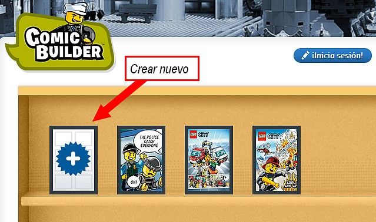
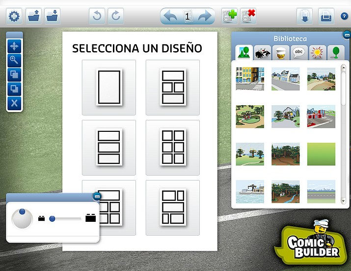

# 4.2 Recursos on-line

<object type="application/x-shockwave-flash" data="http://aularagon.catedu.es/materialesaularagon2013/imagen/comics.swf" width="715" height="536"><param name="src" value="http://aularagon.catedu.es/materialesaularagon2013/imagen/comics.swf"></object>

Presentación realizada por Julián Trullenque. 

**Para conocer mejor los recursos mostrados en el cómic de ejemplo, aquí te dejamos unos enlaces. Échales un vistazo y practica con alguno de ellos. Los tres primeros son muy sencillos y no requieren registro alguno.**

**CREA TU CÓMIC (GENMAGIC)**:

*   Para conocer mejor el [portal de Genmagic](http://www.genmagic.net/educa/mod/resource/view.php?id=5).
*   [Generador de Cómics](https://dl.dropboxusercontent.com/u/46039577/curso/comics.swf): Se trata de una aplicación realizada en flash y que hace posible que los alumno puedan crear sus cómics. De manera muy sencilla  y solamente utilizando unos botones podemos elegir un buen número de escenarios, de personajes, de cuadros de texto o bocadillos para crear las historias y posteriormente imprimirlas. Además los botones también permiten aumentar o disminuir el tamaño de los escenarios y personajes. Si no estamos satisfechos con nuestra elección hay un botón que borra lo realizado.

**PLAYCOMIC:**

*   Playcomic es un recurso que fomenta la creatividad y el desarrollo de la expresión escrita, permitiendo al alumnado inventar sus propias historias y cómic, o bien modificar las ya existentes, con un interfaz que motivará rápidamente a sus destinatarios. Se trata de una aplicación de software abierto, ideada para trabajar tanto desde el área de Lengua Castellana y Literatura como de Inglés (recurso bilingüe). Está pensado para alumnos/as de diferentes niveles y etapas educativas, a partir del tercer ciclo de Educación Primaria y hasta Bachillerato.
*   [Versión 1](http://ntic.educacion.es/w3/eos/MaterialesEducativos/mem2009/playcomic/index_es.html).
*   [Versión 2](http://www.playcomic.es/). Mejorada.
*   [Descarga de la versión 1](http://descargas.pntic.mec.es/contenidos/premios_curriculares/2009/playcomic/playcomic.zip). Para utilizarlo sin conexión.
*   [Tutorial versión 1](http://recursostic.educacion.es/observatorio/version/v2/es/cajon-de-sastre/38-cajon-de-sastre/1041-creamos-el-libro-de-los-comics).

**TOONDOO:** 

*   [Toondoo](http://www.toondoo.com/) es una herramienta para crear cómics **muy fácil de usar**. Podemos usar los personajes, escenarios y objetos que nos ofrece la aplicación o crearlos nosotros mismos, añadir bocadillos de cómic, etc. Podemos también cambiar la expresión de cara y del cuerpo del personaje seleccionado, de modo que se adapte al texto de cada viñeta. Aunque está en inglés, todo es muy intuitivo. Sólo hay que crear una cuenta (no hay reenvío de información vía email por parte de ToonDoo). Elegimos entre una, dos o tres viñetas para nuestra tira de cómic y, después de crearla, la guardamos en nuestro ToonBag. Podemos hacer cuantas tiras queramos y, si queremos, unirlas todas en un único libro, para de esa forma componer historietas completas. Para usarla es necesario registrarse.
*   **EDUCACONTIC**: [Comics con ToonDoo](http://www.educacontic.es/blog/comics-con-toondoo). [Licencia de uso](http://creativecommons.org/licenses/by-sa/3.0/es/). Agosto 2009.
*   **EDUCACONTIC**: [ToonDoo activando la creatividad con los cómics](http://www.educacontic.es/blog/toondoo-activando-la-creatividad-con-comics).  [Licencia de uso](http://creativecommons.org/licenses/by-sa/3.0/es/). Septiembre 2012.

**BISTRIPS**:

*   [Bistrips](http://bitstrips.com/create/comic/): Es una herramienta que permite hacer cómics de una forma rápida y sencilla con un aspecto casi profesional y, como no podía ser de otro modo, permite poder compartilo con el resto de usuarios de Internet. El funcionamiento es muy sencillo, basta elegir el fondo, los personajes, la postura del cuerpo, brazos, piernas y expresión de la cara para, finalmente, escribir el texto en el bocadillo.
*   Tiene dos **inconvenientes**: sólo permite crear ocho viñetas, por lo que si se trata de una historia larga hay que esquematizarla eligiendo aquellas escenas más importantes; y no permite escribir tildes, ni eñes ni otros caracteres especiales del español o francés.

**[Tutorial: Como hacer comics en bitstrips](https://www.slideshare.net/Iluicatl/tutorial-como-hacer-comics-en-bitstrips "Tutorial: Como hacer comics en bitstrips") **from **[Iluicatl](http://www.slideshare.net/Iluicatl)** 

<iframe src="//www.slideshare.net/slideshow/embed_code/key/rEo4QIK1ElSqko" width="595" height="485" frameborder="0" marginwidth="0" marginheight="0" scrolling="no" style="border:1px solid #CCC; border-width:1px; margin-bottom:5px; max-width: 100%;" allowfullscreen> </iframe> 
 <strong> <a href="//www.slideshare.net/Iluicatl/tutorial-como-hacer-comics-en-bitstrips" title="Tutorial: Como hacer comics en bitstrips" target="_blank">Tutorial: Como hacer comics en bitstrips</a> </strong> from <strong><a href="https://www.slideshare.net/Iluicatl" target="_blank">Iluicatl Apellidos</a></strong> 

**PIXTON:**

*   [Pixton](http://www.pixton.com/es/create/): Aplicación en línea con características Web 2.0 para crear cómics. Ofrece una serie de plantillas para seleccionar el número y disposición de los recuadros, varios personajes prefabricados, fondos y artículos decorativos, etc.
*   **EDUCACONTIC**: [Crea divertidos cómics con Pixton](http://www.educacontic.es/blog/crea-divertidos-comics-con-pixton). [Licencia de uso](http://creativecommons.org/licenses/by-sa/3.0/es/). Enero 2012.

**CHOGGER**:

*   [Chogger](http://chogger.com/) es una aplicación web que nos permite desarrollar nuestra imaginación creando tiras de cómics las cuales podremos compartir a través de nuestras redes sociales.
*   La forma de utilizarlo es sencilla, pulsaremos en **Built a comic now**, elegimos cuantas viñetas va a componer mi cómic, después podremos insertar imágenes desde Google,  bocadillos de textos, dibujar, etc.
*   **EDUCACONTIC**: [Crea y comparte cómics facilmente con Chogger](http://www.educacontic.es/blog/crea-y-comparte-comics-facilmente-con-chogger). [Licencia de uso](http://creativecommons.org/licenses/by-sa/3.0/es/). Diciembre 2012.

**STRIPT GENERATOR:**

*   [Stripgenerator](http://stripgenerator.com/) es una interesante herramienta on-line que te permite **generar tiras de comics** aprovechando los personajes, fondos y temas que te ofrece la propia herramienta.
*   **Sencilla, fácil de usar y muy apropiada para usar en el aula.** Es necesario registrase.Podemos proponerla como actividad para todas las áreas curriculares porque además de desarrollar la creatividad, desarrollan el lenguaje, la imaginación, el sentido del humor…

**Crear cómics con LEGO:**

*   Ponemos este ejemplo ya que Lego es un juguete muy popular entre los escolares... seguro que les motiva hacer trabajos con esta herramienta.
*   [LEGO.com city](http://city.lego.com/es-es/comic-builder/my-comics/fire-comic) nos permite crear de forma gratuita cómics con piezas de LEGO, para ello solo tendremos que pinchar donde está marcado con la flecha:

 

*   Y se nos abrirá la **pantalla de edición para crear nuestro cómic**. Como se puede ver, la interfaz es bastante intuitiva y fácil de utilizar.

 

*   Una vez hayamos creado nuestro cómic, podemos guardarlo, descargarlo en nuestro equipo en formato Pdf ,o imprimirlo.

## Importante

Ya has podido ver una pequeña muestra de sitios donde puedes trabajar el cómic de forma fácil y divertida. Hay muchos más, y seguro que irán apareciendo nuevos. Sería bueno que practiques con ellos y que tus alumnos los utilicen en clase. A modo de conclusión y teniendo en cuenta los recursos anteriores, te **recomendamos**:

*   Para empezar, **sin complicarnos la vida** con registros y demás: Crea tu Cómic y Playcomic.
*   Para **trabajar con nuestras fotos y dibujos**: Chogger y Comic Life.
*   Los que **más posibilidades** tienen: Toondoo y Bitstips.
*   Una **estética diferente**: Stript Generator.

