# 4.3.1 Editar con Movie Maker

**1\. Preparación del proyecto**

1º **Descargar los archivos** de vídeo: Van en un archivo comprimido [multimedia.rar](http://aularagon.catedu.es/materialesaularagon2013/imagen/multimedia.rar) y [kid.rar](http://aularagon.catedu.es/materialesaularagon2013/imagen/kid.rar).

2º **Descomprime los archivos** y guárdalos en una carpeta donde realizarás todo el proyecto

3º **Abre Windows Movie Maker** y crea un proyecto nuevo.

4º **Configura el proyecto**: Solamente tienes que elegir el formato de pantalla. En este caso vamos a elegir la pantalla de **4:3** (cuatro tercios). Clic en la pestaña **Proyecto** y elegir **Pantalla Estándar** (4:3).

 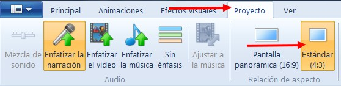

Imagen 36: Captura de pantalla propia 

5º **Guarda el proyecto** como **thekid.wlmp**

**2\. Ponemos un título**

1º Clic en la ventana **Principal**.

2º Clic en el botón **título**. Aparecerá un **cuadro de diálogo** en el que podemos elegir:

*   *   Tipo de **fuente** (tamaño, fuente, negrita...)
    *   Ajustes de **párrafo** (transparencia, justificación).
    *   **Ajustar**: color de fondo, editar texto, duración.
    *   **Efectos**: movimientos del título y efectos del texto (contorno).

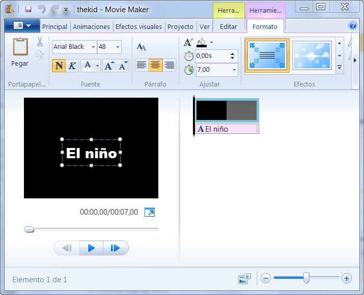

Imagen 37: Captura de pantalla propia

3º Le vas a poner de nombre **"El niño" o "The KId"**. Puedes elegir el tipo de letra, color, efectos... Prueba con diferentes alternativas a ver cuál te gusta más.

4º **Guarda el proyecto.**

**3\. Insertar clip de vídeo**

1º En la ventana principal hacemos clic en "**Agregar fotos o vídeo**".

2ª En la ventana que sale seleccionamos el primer vídeo. Podemos hacerlo de uno en uno o agregando todos a la vez. Para agregar todos a la vea pulsamos la tecla **Mayúsculas a la vez que clic con el ratón** en el **primer vídeo** y sin soltar la tecla clic en el **último vídeo**. Clic en **Añadir**.

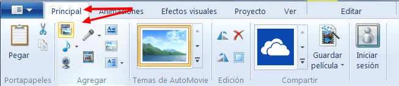

Imagen 38: Captura de pantalla propia

3º **Guarda el proyecto.**

**4\. Agregar un clip de sonido (música)**

1º Tendrás que haber descomprimido previamente el archivo de música que venía en **kid.rar**. Se llama **chaplin.mp3.**

2º En la pestaña principal, clic en **Agregar música**.

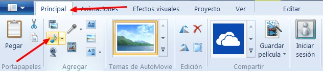

Imagen 39: Captura de pantalla propia

3º Seleccionamos la canción **chaplin.mp3. Clic en Añadir.**

**5\. Títulos de crédito**

Casi tenemos nuestra película terminada, vamos a poner unos **títulos de crédito**.

1º **Clic** en **Créditos**.

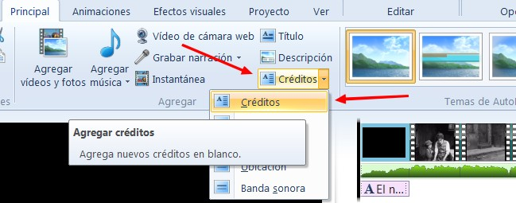

Imagen 40: Captura de pantalla propia

2º **Escribimos los títulos** y seleccionamos las **opciones** que más nos gusten.

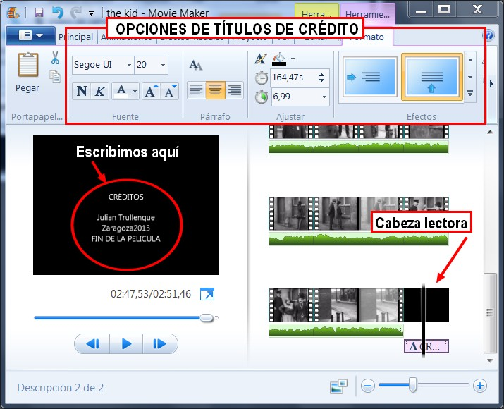

Imagen 41: Captura de pantalla propia

3º Ya tenemos acabada nuestra película, faltarán las narraciones. **Podemos guardarla**. En la siguiente animación podrás ver todo el proceso de creación de la película:

**6\. Narraciones de audio**

1º En la **ventana principal**, colocamos el ratón en el lugar (clip de vídeo) que queremos situar el sonido.

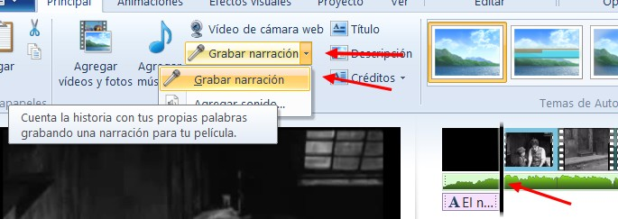

Imagen 42: Captura de pantalla propia

2º Clic en **Grabar Narración**. Aparecerá otro botón para parar la grabación. Cuando paramos, nos pedirá **grabar el sonido en una carpeta**, lo hacemos. Ya tenemos **grabadas las narraciones**.

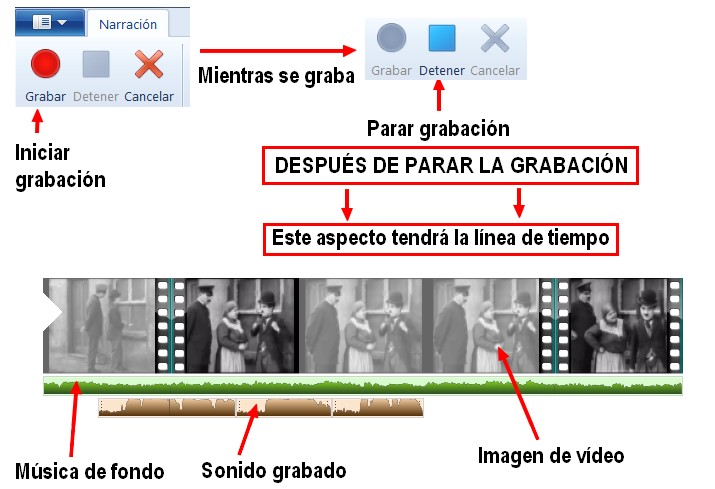

Imagen 43: Captura de pantalla propia

3º **Guarda** la película.

**7\. Subtitular la película**

1º No situamos **con el ratón en el clip que queremos subtitular**.

2º En la ventana Principal hacemos **clic en Descripción**.

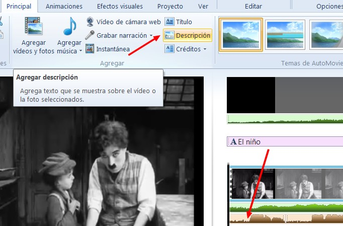

Imagen 44: Captura de pantalla propia

3º Nos aparecerá esta **ventana de edición del título**. Escribimos el título y elegimos las opciones.

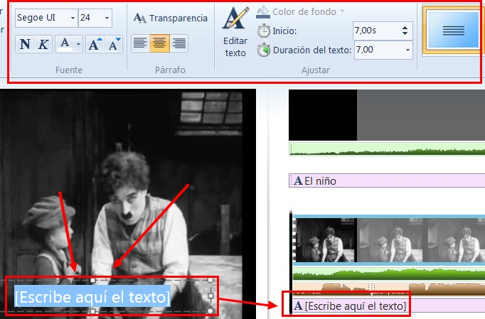

Imagen 45: Captura de pantalla propia

4º **Guarda el Proyecto**.

**8\. Previsualizar el proyecto**

Antes de de exportar nuestro trabajo, lo **podemos ver todas las veces que queramos**. Hay dos procedimientos para hacer ésto:

1.  En la **ventana previsualización** del entorno de trabajo.
2.  En la pestaña **Ve**r: Clic en **Vista previa de pantalla competa**.

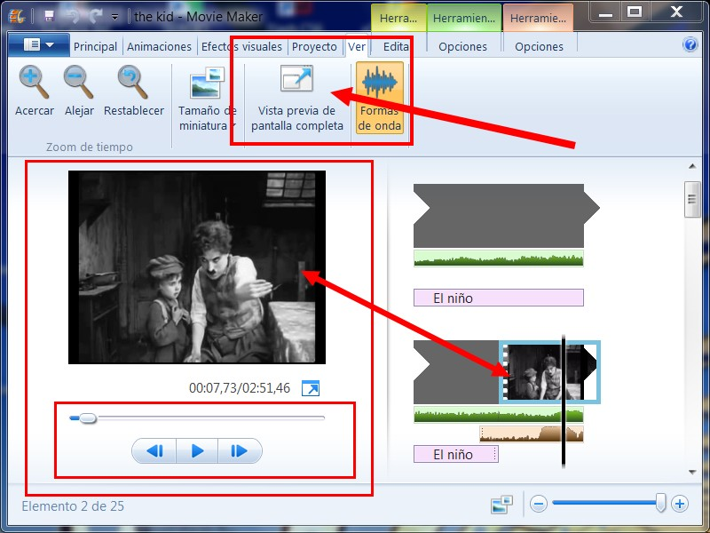

Imagen 46: Captura de pantalla propia

## Para saber más

**MÁS TRUCOS PARA EDITAR CLIPS DE VÍDEO Y SONIDO**

**1\. ¿Cómo cambiar la posición de un objeto en la línea de tiempo?**

1.  **Selecciona el objeto** en la línea de tiempo.
2.  **Clic** con el ratón y **arrástralo al lugar** donde lo quieras colocar.

**2\. ¿cómo recortar un clip?**

*   Te remitimos a la página oficial del programa: **¿Cómo recorto un vídeo en Movie Maker?**
*   [http://windows.microsoft.com/es-es/windows-live/movie-maker-trim-video-how-faq](http://windows.microsoft.com/es-es/windows-live/movie-maker-trim-video-how-faq)
*   © 2012 Microsoft Corporation. Todos los derechos reservados.

**3\. ¿Cómo dividir un clip?**

*   El procedimiento es muy similar al anterior.
*   Colocas el **ratón en el lugar por el que quieres dividir el clip**.
*   **Clic con el botón derecho** del ratón.
*   En el menú que aparece Haces clic en dividir clip.

