# 4.3.2 Editar con VideoPad

**2\. Proyecto con VideoPad**

**1\. Preparación del proyecto**

1º **Descargar los archivos** de vídeo: Van en un archivo comprimido [multimedia.rar](http://aularagon.catedu.es/materialesaularagon2013/imagen/multimedia.rar) y [kid.rar](http://aularagon.catedu.es/materialesaularagon2013/imagen/kid.rar).

2º **Descomprime los archivos** y guárdalos en una carpeta donde realizarás todo el proyecto

3º **Abre VideoPad** y crea un proyecto nuevo.

4º **Configura el proyecto**: Podemos modificar las carpetas en las que guardamos los recursos y el tamaño de pantalla: elegimos 340x240.

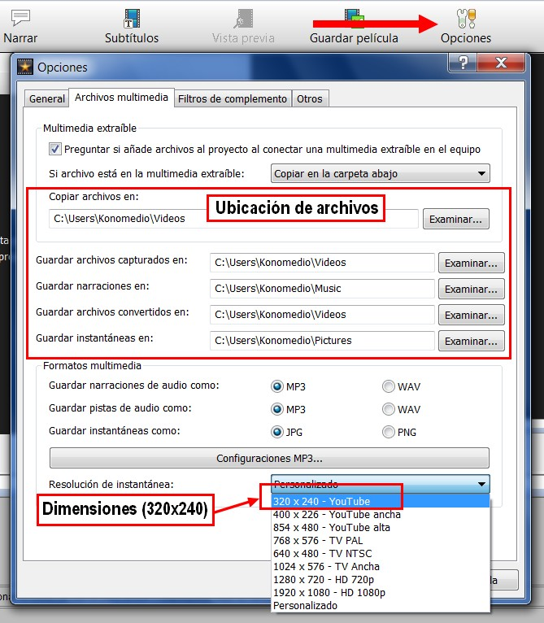

Imagen 47: Captura de pantalla propia

5º **Guarda el proyecto** como **thekid.vpj**

**2\. Importar clips**

Es conveniente para este tipo de proyectos tener siempre **bien organizados en carpetas los archivos que queremos utilizar** para que no andemos buscándolos por todos los sitios y perdiendo el tiempo.

1º **Clic** en el botón **Añadir Multimedia**.

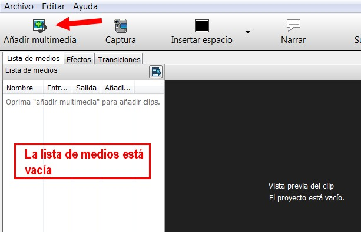

Imagen 48: Captura de pantalla propia

2º Se abrirá una **ventana**, donde localizaremos los clips de **vídeo, música e imagen**. Seleccionamos todos. Para seleccionar todos los archivos a la vez, hacemos clic en el primero, pulsamos la tecla Mayúsculas y sin soltarla hacemos clic en el último. Ya podemos hacer **clic en Abrir** y se insertarán todos los archivos en nuestro proyecto.

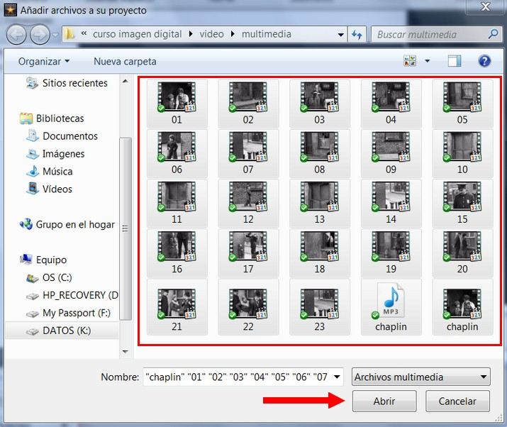

Imagen 49: Captura de pantalla propia

3º Al hacer el clic, veremos que los archivos se han **añadido a nuestro proyecto y aparecen en la lista de medios**. Aunque no los vemos en la ventana secuencia, ya que nos los hemos puesto en la línea de tiempo.

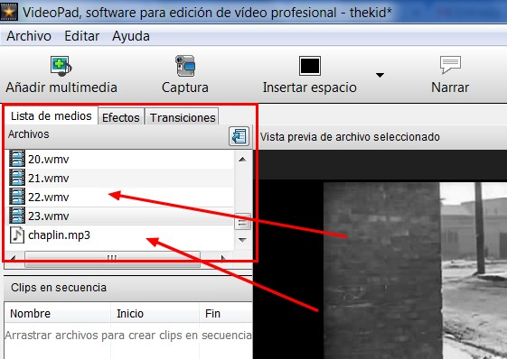

Imagen 50: Captura de pantalla propia

4º **Guarda el proyecto**.

**2\. Arrastrar clips a la línea de tiempo**

1º Seleccionar el primer **clip y arrastrarlo a la línea de tiempo**. También se puede hacer todos a la vez (tecla Mayúsculas).

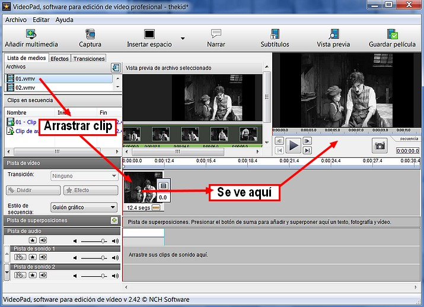

Imagen 51: Captura de pantalla propia

2º Hacemos los mismo con todos los clips consecutivamente (01+02+03... 23).

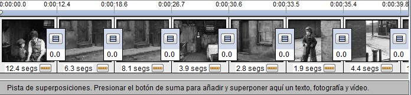

Imagen 52: Captura de pantalla propia

3º **Guarda el proyecto**.

**3\. Colocar un clip de música en la línea de tiempo**

1º Arrastra el clip de música **chaplin** a la **línea de tiempo**.

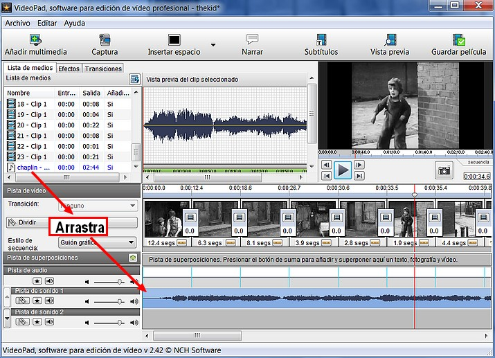

Imagen 53: Captura de pantalla propia

2º **Guarda el proyecto.**

**4\. Crear un título**

Videopad no tienen ninguna función especial para crear títulos. Es un programa limitado en este sentido. Lo que deberemos hacer es crear un cuadro en (negro) u otro color, y luego con la función Narrar, crearemos el título.

1º Clic en **Insertar Espacio**.

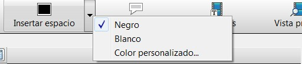

Imagen 54: Captura de pantalla propia

2º Aparecerá un **cuadro de diálogo** que nos pregunta, dónde queremos colocar el cuadro negro. Seleccionamos "**Comienzo de la línea de tiempo**".

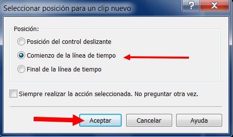

Imagen 55: Captura de pantalla propia

3º El espacio en negro que hemos creado dura 3 segundos. Vamos a **cambiar este valor por 7 segundos**.

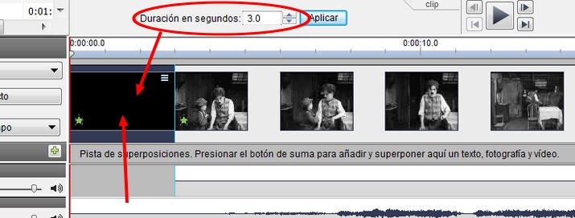

Imagen 56: Captura de pantalla propia

4º Clic en **Aplicar**.

5º Ahora vamos a escribir un título. Hacemos clic en el icono **Subtítulos**.

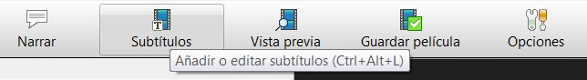

Imagen 57: Captura de pantalla propia

6º Aparecerá una ventana en la que **escribiremos nuestro texto** "El chico", y allí podremos cambiar los atributos del título.

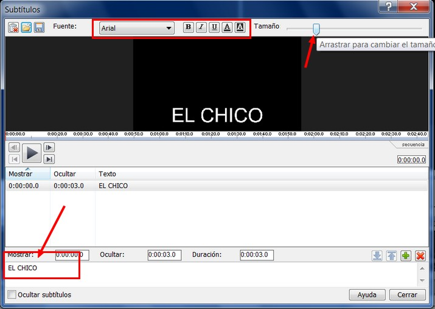

Imagen 58: Captura de pantalla propia

7º Ajustaremos la **duración a 7 segundos** para que sea igual que el cuadro en negro que hemos insertado. Para esto haremos clic en "duración" y nos aparecerá otro cuadro de diálogo en el que escribiremos la **duración a "0:00:07.0"** (7 segundos). Clic en Aceptar.

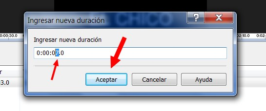

Imagen 59: Captura de pantalla propia

8º **Guarda el proyecto**.

Para hacer los **títulos de créditos finales** haremos lo mismo salvo que **en el paso 2º elegiremos "Final de la línea de tiempo"** para colocarlo al final, y luego escribiremos los títulos finales.

**5\. Subtitular un clip**

Con Video Pad podemos subtitular películas completas o clips; pero dada la complejidad del trabajo, nos centraremos en subtitular clips de corta duración.

1º Para iniciar la inserción de subtítulos pulsaremos el **botón "Subtítulos"** en la barra superior.

Imagen 60: Captura de pantalla propia

2º Aparece la ventana **subtítulos** en la que podemos escribir el texto, elegir la configuración, el lugar dónde lo vamos a colocar...

*   *   **Iniciamos la reproducción del clip**. Cuando empiece el audio nos fijamos en el progreso del clip. Al finalizar la frase, nos fijamos de nuevo en el progreso del clip. y detenemos la reproducción. Los datos de inicio y fin no tiene que ser exactos, luego veremos cómo ajustarlos.
    *   Pulsamos sobre la zona de escritura del subtítulo y escribimos el texto. 

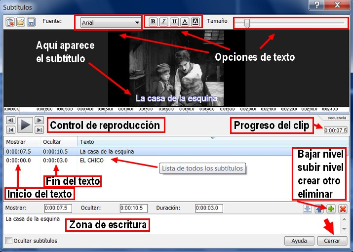

Imagen 61: Captura de pantalla propia

3º Para ajustar el momento en que aparecerá el texto, pulsamos sobre "**Mostrar**". Aparece un cuadro de diálogo en el que podemos ajustar hasta la décima de segundo el momento en que aparecerá el texto. Pulsamos "**Aceptar**" y reproducimos para comprobar el ajuste. Si es correcto vamos al siguiente paso y si no está bien ajustado, volvemos a editar el punto de inicio.

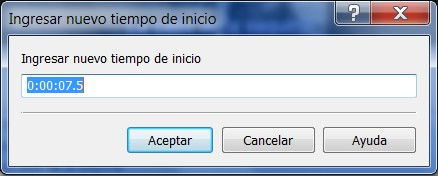

Imagen 62: Captura de pantalla propia

4º Para ajustar el punto en el que se oculta el texto, pulsamos sobre "**Ocultar**" y procedemos de la misma forma que en punto anterior. El proceso hay que repetirlo con cada una de las frases.

5º Escribe la frase "**La casa de la izquierda**" y ajusta el inicio a 8 segundos y el final a 10 segundos. ¿Qué aparece en la posición "**duración**"?

6º Así con todos los subtítulos. **Guarda la película**.

**6\. Doblar el sonido de una película**

_1\. Eliminar sonido_

Aunque la película que hemos puesto para practicar no tiene sonido, otras; las que grabamos nosotros tienen sonido que seguramente no queremos conservar. Así es que antes de doblar el sonido de un clip, debemos aprender a **eliminar el sonido del mismo**.

1º Descarga el archivo de vídeo [practicar.wmv](http://catedu.es/materialesaularagon2013/imagen/practicar.wmv).

2º Crea un **proyecto nuevo** e **inserta este clip** en la línea de tiempo. Quedará algo así.

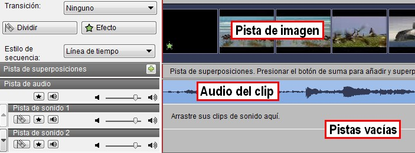

Imagen 63: Captura de pantalla propia

Tenemos dos métodos para eliminar el audio:

1.  Bajar el sonido de la pista.
2.  Eliminar todo el sonido.

1. **Bajar el sonido** de la pista.

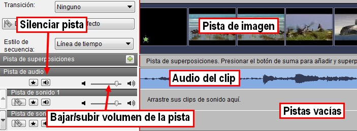

Imagen 64: Captura de pantalla propia

2\. **Eliminar** la pista de sonido:

1º **Separar la pista de vídeo** y sonido. Clic con el ratón encima de la pista. Aparece este menú:

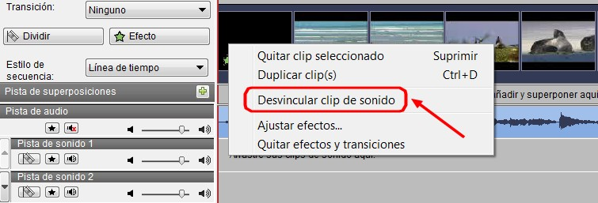

Imagen 65: Captura de pantalla propia

2º Al hacer clic observarás que la canción se ha desplazado a la pista de abajo. Si haces otra vez clic con el botón derecho, saldrá este menú, hacemos clic en "**Quitar video seleccionado**" y se eliminará la música.

_2\. Grabar narración_

1º **Cargar la película "the kid"**.

2º Hacemos **clic en Narrar**. La grabación nos permite ver las imágenes mientras hablamos y esto facilita la coordinación audio-vídeo.

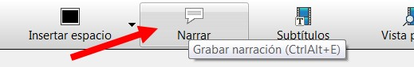

Imagen 66: Captura de pantalla propia

3º Se abre un grabador de sonidos que, simultáneamente, proyecta el vídeo. El mando de esta grabadora es sumamente intuitivo, los tres botones típicos (“Record”, “Pause” y “Stop”) controlan el proceso. 

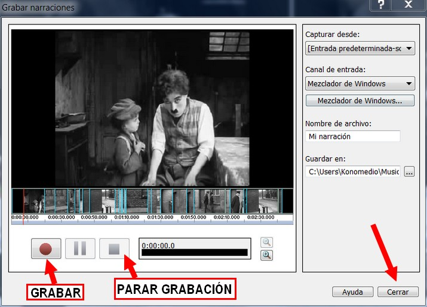

Imagen 67: Captura de pantalla propia

4º Al acabar pulsamos el botón “**Cerrar**” y tendremos un archivo MP3 para incorporar a nuestro vídeo “mudo”.

5º La pista de **audio quedará incorporada directamente** a la lista de medios (también se guarda en la carpeta que hemos indicado en el proceso).

6º **Guarda el proyecto**.

**7\. Previsualizar el proyecto**

Antes de de exportar nuestro trabajo, lo **podemos ver todas las veces que queramos**. Hay dos procedimientos para hacer ésto:

1.  En la **ventana previsualización** del entorno de trabajo (a la derecha).
2.  En la pestaña **Ve**r: Clic en **Vista previa de pantalla competa**.

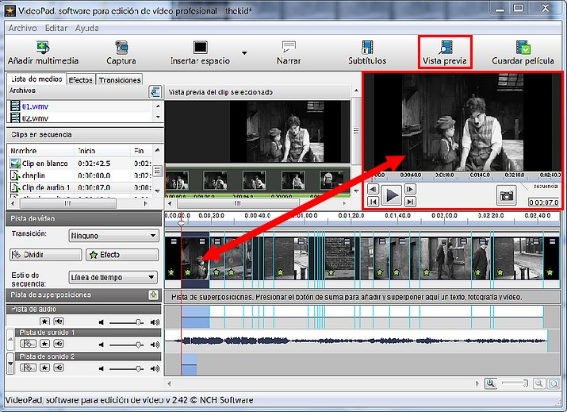

Imagen 68: Captura de pantalla propia

## ParaSaberMas

**MÁS TRUCOS PARA EDITAR CLIPS DE VÍDEO Y SONIDO**

**1\. ¿Cómo cambiar la posición de un objeto en la línea de tiempo?**

1.  **Selecciona el objeto** en la línea de tiempo.
2.  **Clic** con el ratón y **arrástralo al lugar** donde lo quieras colocar.

**2\. ¿cómo dividir un clip?**

1º En la línea de tiempo (vídeo o sonido) **coloco el ratón en el lugar exacto** donde quiero quiero dividirlo.

2º Clic en el icono de la **cuchilla lateral**:  Vamos a dividir este clip justo en la escena en que cambia de los caballos a las aves.

3º Para **mover uno de los clips divididos** hacerlo como en la explicación anterior (cambiar la posición de un objeto) y para elminarlo, pulsar la tecla **Borrar** (supr/del).

**3\. ¿cómo recortar un clip?**

1º Selecciona el objeto en la línea de tiempo.

2º Colócate al inicio del clip y arrastra el ratón hasta donde quieras recortar (inicio). O coloca el final y arrastra el ratón hasta donde quieras recortar (final).

