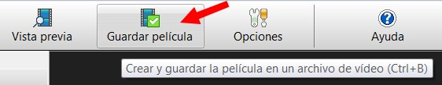
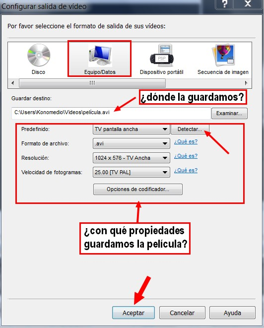
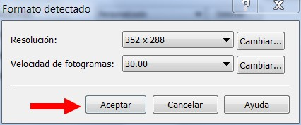
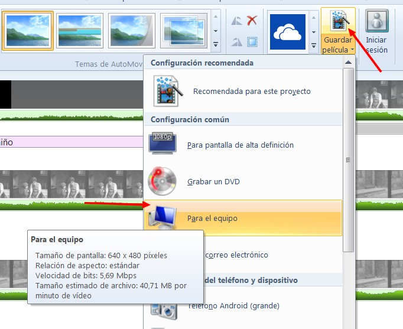

# 4.4 Exportar vídeo

Ya tenemos nuestro proyecto maquetado y preparado, llega el momento de **crear nuestra primera película**. Vamos a ver como se lleva a cabo con los dos programas que estamos trabajando. Luego habrá que enseñarlo, publicarlo, compartirlo.

**CONOCIMIENTOS PREVIOS**

*   Para el aprendizaje de esta unidad el alumno deberá haber aprendido los contenidos anteriores de saber capturar y editar vídeo.

**1\. Crear un clip de vídeo (película)**

**1\. Crear una película con VideoPad**

1º Abrimos el proyecto **thekid.vpj. **Que previamente habremos modificado y guardado.

2º Clic en **Vista Previa**, para saber si nos gusta el resultado final.

3º Hacemos clic en **Guardar Película**.

 Imagen 69: Captura de pantalla propia

4º Aparece un **cuadro de diálogo** en el que se nos presentan **varias opciones para crear la película**. Nosotros elegiremos la opción **Equipo/Datos**.

Imagen 70: Captura de pantalla propia 

5º Elegiremos las **opciones de salida** y la carpeta en la que vamos a guardar la película. Para opciones de salida, lo mejor es guardarla en el mismo formato que está el original. Para eso hacemos **clic en Detectar**.

 Imagen 71: Captura de pantalla propia

6º Se configurará con las **mismas opciones de la película original**. Ya solo tenemos que hacer clip en Aceptar y tendremos nuestra película creada.

**2\. Crear una película con Movie Maker**

1º Abrimos el proyecto **thekid.wlmp****. **Que previamente habremos modificado y guardado.

2º Clic en **Ver>Vista Previa de pantalla competa**, para saber si nos gusta el resultado final.

3º Hacemos clic en la pestaña **Guardar Película**.

Imagen 72: Captura de pantalla propia

4º Este programa solamente guarda películas en formato WMA o MPG4

## Importante

**Una vez creada nuestra película, vamos a ver como la compartimos. Lo podemos hacer de varias maneras:**

1.  **Compartiendo el archivo** de vídeo (pendrive, correo electrónico,...).
2.  **Creando un DVD** (no lo explicamos en este curso).
3.  Publicándolo en Internet. **Vamos a dejar este tema para el módulo siguiente**, donde veremos cómo subir en vídeo a YouTube o Vimeo y luego insertarlo en un blog.

## ParaSaberMas

**ADORNAR TUS PROYECTOS**

Ya hemos aprendido a crear un proyecto de montaje de vídeos. Ahora, el último paso para darle un toque personal es el aplicar e**fectos especiales y transiciones**. Cada programa tiene sus transiciones y efectos, que son muy parecidos. El funcionamiento es el mismo, luego vienen las variaciones y opciones de cada uno.

Vamos a aprender a aplicar transiciones y efectos, aunque **te recomendamos que no abuses mucho de ellos**, ya que también se puede estropear un buen trabajo si no se aplican con cautela.

**1\. Efectos digitales de vídeo**

En este apartado procedemos a explicar como aplicar diversos efectos a nuestros clips, tanto para mejorar su aspecto como para distorsionarlo en otras ocasiones.

La aplicación de los efectos implica trabajar con nuestros Archivos de Proyectos, nuestra línea de tiempo y el uso de las diferentes pistas para lograr un resultado final.

**1\. Efectos con Movie Maker**

1º Iniciamos el programa.

2º Importamos el clip **practicar.wmv**. Si no lo has descargado, lo puedes hacer aquí: [practicar.wmv](http://catedu.es/materialesaularagon2013/imagen/practicar.wmv)

3º **Dividimos el clip en partes**. Cada secuencia de vídeo una parte. Amplia la vista para hacerlo con más precisión.

4º Y ahora a cada una de las secuencias le **aplicamos un filtro** diferente. Observa cómo se hace.

**2\. Crear efectos con VideoPad**

1º Iniciamos el programa.

2º Importamos el clip **practicar.wmv**. Si no lo has descargado, lo puedes hacer aquí: [practicar.wmv](http://catedu.es/materialesaularagon2013/imagen/practicar.wmv)

3º **Dividimos el clip en partes**. Cada secuencia de vídeo una parte. 

4º Y ahora a cada una de las secuencias le **aplicamos un filtro** diferente. **Clic en Efectos**. Observa cómo se hace. 

**2\. Aplicar transiciones a los clips de vídeo**

Las **transiciones** se utilizan en el mundo del vídeo desde el nacimiento del cine mudo. Hablamos de esos **efectos o cortinillas** que nos permiten pasar de un corte a otro, de un vídeo a otro o para mezclar, al mismo tiempo, varios clips en diferentes pistas. Todo ello permite **añadir creatividad y dinamismo** a nuestro vídeo final.

**1\. Transiciones en Movie Maker**

La **pestaña Transiciones** te permite crear una transición entre el clip que tiene seleccionado y el siguiente clip en la secuencia. Las transiciones permitirán que el clip cambie gradualmente al siguiente.

1º Clic en el vídeo que quieres la trasición. Si quieres ponerla entre el primero y el segundo, tendrás que hacer clic en el segundo vídeo.

2º Clic en la pestaña **Transición**. Eliges la que más te guste. Podrás elegir la duración de la transición.

 

**2\. Transiciones en VideoPad**

1º Hay **dos formas** para aplicar una transición a un clip.

1.  Selecciona el clip en la secuencia y aplica la transición usando el menú desplegable localizado a la izquierda de la secuencia.
2.  Oprime el icono de transiciones localizado en la parte superior derecha del clip (un cuadrado azul con dos líneas horizontales negras) para abrir la pestaña de las transiciones.

3º Luego, selecciona el tipo del transición y cambia la duración si lo desea. Para terminar, hacer clic en "aplicar" para aplicar la transición en el clip seleccionado.

