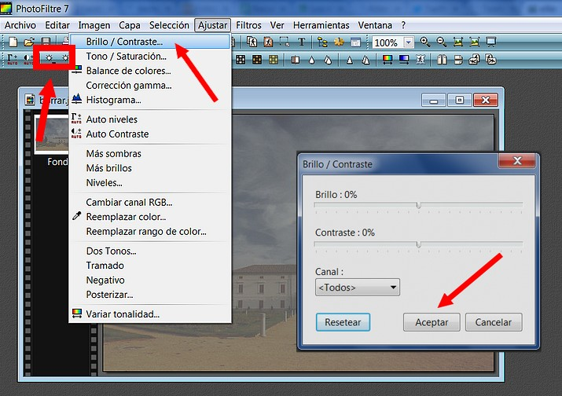
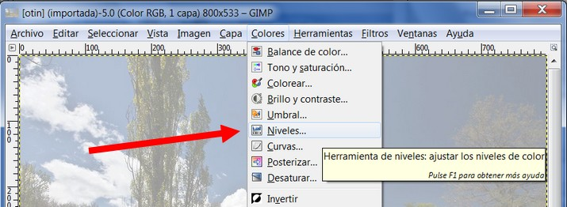
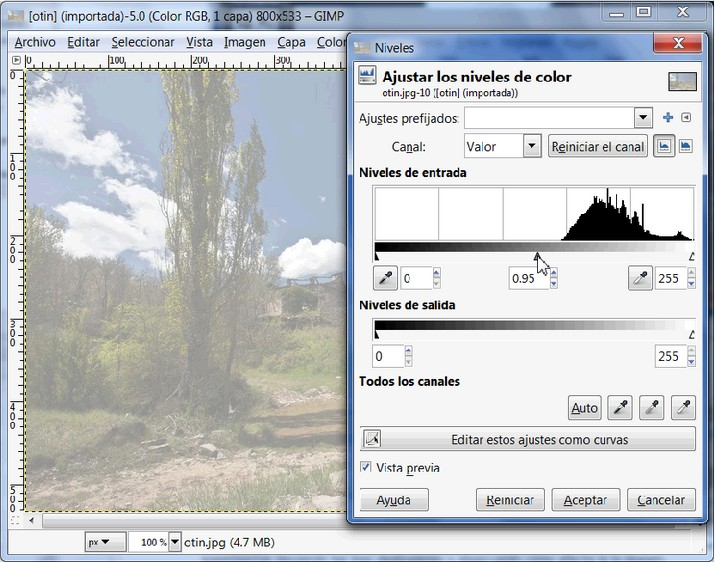
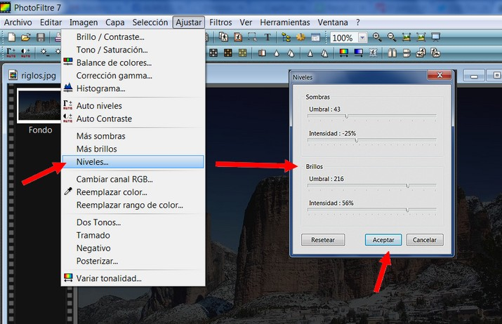

# 5.1 La iluminación

En fotografía, se llama **exposición** a la **cantidad de luz** que recibe el material fotosensible (en fotografía química) o el sensor de imagen (en fotografía digital) para que se forme una imagen. A veces hacemos fotos que por lo que sea tienen una exposición alta (mucha luz) o baja (oscuras). Estos errores se pueden corregir con programas de edición.

### 1\. Brillo y contraste.

**La herramienta más sencilla de usar es la herramienta Brillo/Contraste**.También es la **menos potent**e, pero en muchos casos hace lo que necesita. Esta herramienta es con frecuencia útil para imágenes que están sobreexpuestas o subexpuestas.

**1\. en GIMP**

Cuando queremos hacer un **ajuste rápido sobre una imagen**, ésta es la herramienta ideal para **manejar el brillo y el contraste**, afectando a toda la gama de tonos, sin posibilidad de hacer ninguna limitación. Esta herramienta es fácil de usar. Se van probando los niveles y cuando estemos satisfechos hacemos clic en aceptar.

<object type="application/x-shockwave-flash" data="http://aularagon.catedu.es/materialesaularagon2013/imagen/brilloycontraste.swf" width="715" height="533"><param name="src" value="http://aularagon.catedu.es/materialesaularagon2013/imagen/brilloycontraste.swf"></object>

**2\. En Photofiltre esta herramienta no es tan eficaz**. Se llega al cuadro de diálogo a a través de **Ajustar>Brillo y contraste**:

 

**3\. en** [http://pixlr.com/editor/](http://pixlr.com/editor/)

Seguimos la misma ruta que en Photofiltre **Ajustes>Brillo y contraste**. Observa en la animación como cambian la imagen.

<object type="application/x-shockwave-flash" data="http://aularagon.catedu.es/materialesaularagon2013/imagen/brillo_pxlr.swf" width="644" height="536"><param name="src" value="http://aularagon.catedu.es/materialesaularagon2013/imagen/brillo_pxlr.swf"></object>

### 2\. Herramienta niveles

**1\. en GIMP**

1º Una manera más compleja y ligeramente más difícil de corregir problemas de exposición es **usar la herramienta Colores>Niveles**.

2º El diálogo para esta herramienta parece muy complicado, pero para el uso básico que se tiene en cuenta aquí, con lo único que necesita tratar es el área de "**Niveles de entrada**", específicamente los tres deslizadores triangulares que aparecen bajo el histograma. La manera más fácil de aprender cómo usarla es experimentar moviendo los tres deslizadores y observando cómo afecta la la imagen.

Mira este tutorial para ver cómo se hace.

<object type="application/x-shockwave-flash" data="http://aularagon.catedu.es/materialesaularagon2013/imagen/niveles.swf" width="715" height="562"><param name="src" value="http://aularagon.catedu.es/materialesaularagon2013/imagen/niveles.swf"></object>

**2\. en PHOTOFILTRE**

1º Con la imagen abierta en el área de trabajo hacer clic en **Ajustar>Niveles**. Aparecerá un cuadro de diálogo (complicado) y es cuestión de ir probando hasta que nos guste el resultado.

Imagen 39: Captura de pantalla propia

**3\. En** [http://pixlr.com/editor/](http://pixlr.com/editor/)

<object type="application/x-shockwave-flash" data="http://aularagon.catedu.es/materialesaularagon2013/imagen/nivelespxlr.swf" width="715" height="582"><param name="src" value="http://aularagon.catedu.es/materialesaularagon2013/imagen/nivelespxlr.swf"></object>

## Para saber más

**Si quieres trabajar más en profundidad es tema de la luz en las fotografías te remito a los siguientes documentos:**

*   **Taller de fotograía digital: Manejo de la luz**. Autor: Juan Manuel. para elwebmaster.com, marzo 2008 [http://www.elwebmaster.com/editorial/taller-de-fotografia-digital-manejo-de-la-luz](http://www.elwebmaster.com/editorial/taller-de-fotografia-digital-manejo-de-la-luz)
*   **Manual de Gimp**. En este capítulo podrás profundizar más en estas herramientas que hemos analizado. [http://docs.gimp.org/es/gimp-imaging-photos.html#gimp-using-photography-colors](http://docs.gimp.org/es/gimp-imaging-photos.html#gimp-using-photography-colors)

