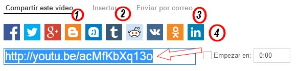

# 5.1 YouTube

### 1\. ¿Qué es YouTube?

**YouTube** es un sitio web en el cual los usuarios pueden **subir y compartir vídeos**. Actualmente es el sitio web de su tipo más utilizado en Internet.

YouTube usa un reproductor en línea basado en Adobe Flash para servir su contenido. Es muy popular gracias a la **posibilidad de alojar vídeos personales de manera sencilla**. Aloja una variedad de clips de películas, programas de televisión y vídeos musicales. A pesar de las reglas de YouTube contra subir vídeos con derechos de autor, este material existe en abundancia, así como contenidos amatéur como videoblogs.

Los enlaces a vídeos de YouTube pueden ser también insertados en blogs y sitios electrónicos personales incrustando cierto código HTML.

### 2\. ¿Cómo subir un vídeo a YouTube?

**1\. Subir un vídeo a YouTube**

1º Inicia la sesión en [YouTube](https://www.youtube.com). Recuerda que debes estar registrado (cuenta Google).

2º Haz clic en el enlace **Subir Vídeo** situado en la parte superior de la página.

3º En la ventana que aparece **selecciona el vídeo que quieras subir en tu ordenador**. También puedes grabar un vídeo con tu cámara web o crear un vídeo con una presentación de diapositivas. Puedes elegir la privacidad.

**2\. Formatos de vídeo admitidos** 

*   MOV, MPEG4, AVI, WMV, MPEGPS, FLV, 3GPP, WebM. Estos son los formato de vídeo más característicos.
*   Si tuvieras un vídeo en otro formato, no hay problema porque los YouTube los convierte.  

**3\. Opciones avanzadas**

*   Haciendo clic en configuración avanzada podemos gestionar los comentarios, la localización del vídeo del vídeo...

**4\. Configurar la privacidad**

La [privacidad](https://support.google.com/youtube/answer/157177?hl=es-ES) está relacionada con la **forma en la que compartes vídeos con tu familia**, con tus amigos o con el público.

*   **Vídeos públicos**: Los pueden ver todo el mundo y aparecen en los motores de búsqueda.
*   **Vídeos Ocultos**: Podrán verlos todos los usuarios que tengan el enlace del vídeo. No parecerán en los espacios de YouTube.
*   **Vídeos privados**: Los únicos usuarios que pueden ver vídeos privados sois tú y los usuarios que elijas. Estos vídeos no aparecerán en tu canal ni en los resultados de las búsquedas. En resumidas cuentas: serán invisibles para el resto de usuarios.

### 3\. Gestión de vídeos

Una vez subido el vídeo podemos cambiar la configuración, añadir subtítulos, eliminarlo, ver las estadísticas de la gente que lo visita, descargarlo...

 

### 4\. Compartir un vídeo de YouTube

Publicar un vídeo en nuestro blog o sitio web es muy sencillo. Cualquier vídeo que encontremos en YouTube (no solo los nuestros) podemos compartirlos. **¿De qué formas?. **

1º En primer lugar, podemos emplear el formulario de búsquedas para encontrar vídeos concretos.

2º Una vez encontrado el vídeo, hacemos doble clic sobre él. Justo debajo del video hacemos clic sobre el botón **"Compartir"** y tenemos varias opciones:

 

1.  **Compartir**: envías el enlace del vídeo a la persona o personas con quien lo quieras compartir.
2.  **Insertar**: para obtener el código de inserción; antes podemos elegir el color y las medidas que más nos convengan.
3.  Enviar por **correo electrónico**.
4.  **Compartir** en redes sociales.

<object type="application/x-shockwave-flash" data="http://aularagon.catedu.es/materialesaularagon2013/imagen/youtube.swf" width="715" height="600"><param name="src" value="http://aularagon.catedu.es/materialesaularagon2013/imagen/youtube.swf"></object>

## Para saber más

*   **Ayuda oficial de Google para YouTube**: [https://support.google.com/youtube/?hl=es#](https://support.google.com/youtube/?hl=es#)

