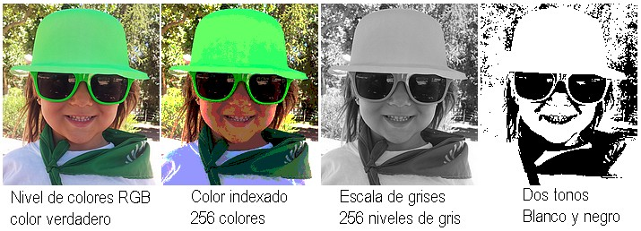
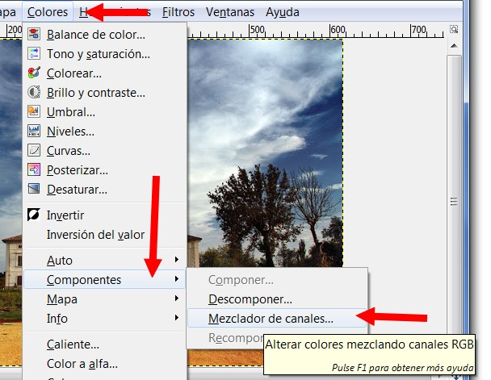
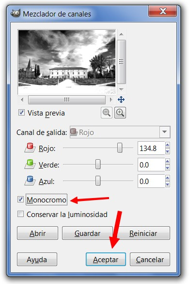
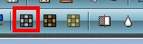
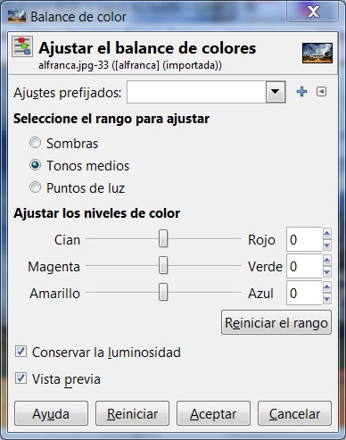
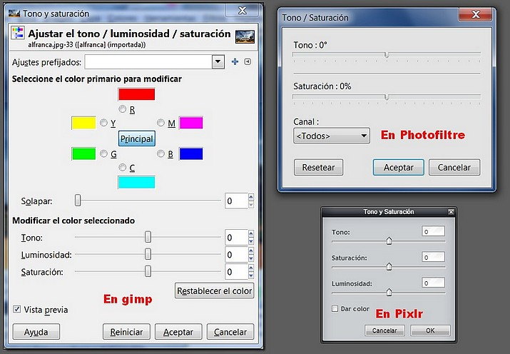
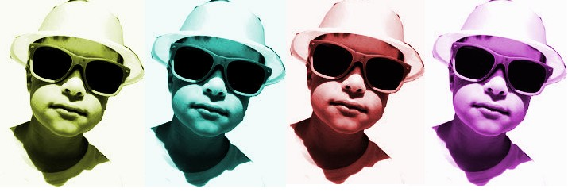
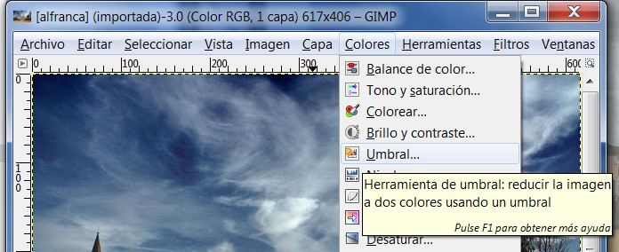
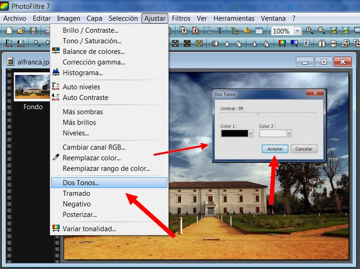

# 5.2 Los colores

**1\. Los colores**

**Modos de color se denomina al sistema que nos sirve para describir los colores**. En GIMP se puede trabajar en los modos:

*   **RGB** (rojo, verde y azul)
*   **Escala de grises** (256 niveles de grises)
*   **Indexado **(podemos especificar los colores con los que vamos a trabajar con un máximo de 256 colores).

Todos estos modos están **indicados para** imágenes cuyo destino sea una **pantalla de ordenador**. Obviamente, cuantos más colores tenga una imagen más ocupará el archivo que la contiene.

Todas las aplicaciones trabajan en modo RGB, si pasamos de este modo a grises o indexado luego no se podrá recuperar la información de la imagen adicional. Pasar de RGB a los otros no es problema. Al contrario sí. Un ejemplo para que veas los niveles de color.

 

**2\. Imagen a blanco y negro (escala de grises)**

**1\. Utilizando GIMP**

1º Tenemos abierta la imagen que queremos convertir a 256 niveles de gris. Hacemos clic en el menú Colores>Componentes.

 

2º Se nos abrirá el cuadro de diálogo **Mezclador de Canales**. Para mejorar la imagen que va a ser convertida a escala de grises podemos utilizar algunas herramientas antes de hacer el cambio En el cuadro de diálogo que se nos muestra marcamos **la casilla de verificación Monocromo**. Posteriormente modificamos los canales (rojo, verde y azul) hasta obtener la imagen que deseemos. Finalizamos haciendo clic en aceptar.

 

**2\. en PHOTOFILTRE**

Es más fácil.... con la imagen abierta solo hay que elegir el botón blanco y negro en el menú de atajos (arriba en el centro).

 

**3\. En** [http://pixlr.com/editor/](http://pixlr.com/editor/)

1º Con la imagen abierta hacemos clic en **Ajustes>Búsqueda** de color. Hacemos clic en el primer cuadrado para blanco y negro. Observa la siguiente presentación:

<object type="application/x-shockwave-flash" data="http://aularagon.catedu.es/materialesaularagon2013/imagen/byn.swf" width="644" height="536"><param name="src" value="http://aularagon.catedu.es/materialesaularagon2013/imagen/byn.swf"></object>

## Para saber más

**Jugando** con estos programas de edición, **cambiando y combinando** los ajustes se pueden conseguir **resultados muy atractivos** visualmente. Mira esta presentación y luego inténtalo tú. Una buena tarea para tus clases de plástica.

<object type="application/x-shockwave-flash" data="http://aularagon.catedu.es/materialesaularagon2013/imagen/jugando.swf" width="715" height="514"><param name="src" value="http://aularagon.catedu.es/materialesaularagon2013/imagen/jugando.swf"></object>

**3\. Balance de colores**

 

**En GIMP**: Cuando elegimos esta opción aparece el **cuadro de diálogo de la derecha**, en el que podemos modificar los colores “luz” (rojo, verde y azul) y los colores “tinta” (cian, magenta y amarillo), en función de lo elegido en Seleccione el rango para ajustar. Seleccionando una de las opciones restringirá el rango de colores que serán modificados con los deslizadores y con los botones Sombras, Tonos medios y Puntos de luz.

Podemos conservar el brillo de la imagen manteniendo marcada la casilla Conservar la luminosidad. Si se mantiene marcada la casilla de Vista previa los cambios hechos en los niveles en la selección o capa activa se ven inmediatamente.

Puedes realizar pruebas con estos parámetros para ver como cambian las imágenes.

A continuación te presentamos una presentación hecha con Photofiltre donde se pueden ver estos cambios. La línea de comandos es **Ajuste<Balance de colores**.

En [http://pixlr.com/editor/](http://pixlr.com/editor/) se hace con **Ajustes>Color Balance.**

<object type="application/x-shockwave-flash" data="http://aularagon.catedu.es/materialesaularagon2013/imagen/balance.swf" width="715" height="713"><param name="src" value="http://aularagon.catedu.es/materialesaularagon2013/imagen/balance.swf"></object>

**4\. Tono y saturación**

Uno de los problemas más frecuentes, que nos solemos encontrar en nuestras fotografías digitales, es que a la hora de verlas, el color vimos a la hora de realizar la imagen, no se corresponde con lo que vemos en el monitor de nuestro ordenador, si no es problema del monitor, se puede solucionar en la mayoría de las ocasiones, con estas herramientas:

*   En **GIMP**: La ruta es **Colores>Tono y Saturación.**
*   En **Photofiltre**: La ruta es **Ajustar>Tono/Saturación**.
*   En **Pixlr.com: La rutas es Ajustes>Tono y Saturación.**  
    

 

**5\. Colorear**

La herramienta **Colorear** hace lo que su nombre indica, colorear la imagen con 256 niveles de color, permitiéndonos elegir el color que queremos aplicar sobre la imagen. La herramienta colorear convierte la capa activa o selección en una imagen en escala de grises vista a través de un cristal coloreado.

 

Se accede desde el menú **Herramientas --> Herramientas de color --> Colorear**.

**6\. Umbral**

Sirve para **reducir los colores de una imagen a dos: blanco y negro**. La herramienta umbral transforma la capa activa o la selección en una imagen blanca y negra, los píxeles blancos representan los píxeles de la imagen cuyo valor está en el rango del umbral, y los negros el valor que está fuera de este rango. Se puede utilizar para realzar una imagen blanca y negra ( por ejemplo, un texto escaneado). 

**1\. En GIMP**

1º **Abre la imagen**. Hacer clic en Colores>Umbral.

 

2º Aparece el cuadro de diálogo **Umbral B/N.** Podemos cambiar los valores a nuestro gusto, hasta que nos convenza el resultado. Hacemos clic en Aceptar. Observa la siguiente animación.

<object type="application/x-shockwave-flash" data="http://aularagon.catedu.es/materialesaularagon2013/imagen/umbral.swf" width="677" height="549"><param name="src" value="http://aularagon.catedu.es/materialesaularagon2013/imagen/umbral.swf"></object>

**2\. En Photofiltre**

Se llega a través de **Ajustar>Dos Tonos**. El cuadro de diálogo es más sencillo.

 

**3\. En **[http://pixlr.com/editor/](http://pixlr.com/editor/) 

Se llega a través de **Ajustes>Umbral.** El proceso es igual que en Photofiltre (ver punto anterior).

## Para saber más

En el apartado del "Color", hemos visto las herramientas más útiles para retocar una foto. Como no se trata de que seamos unos expertos en la materia hemos dejado algunas sin explicar. Cada aplicación tiene más herramientas que no henos visto. Puedes probar y modificar parámetros de distintas herramientas y como todas las aplicaciones tienen la función de "previsualizar", verás cómo van cambiando las imágenes.

Y si quieres saber más y profundizar en cualquier herramienta te remito al [manual de GIMP](http://docs.gimp.org/es/gimp-tools-color.html).

