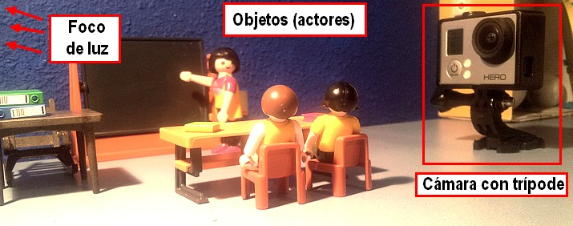
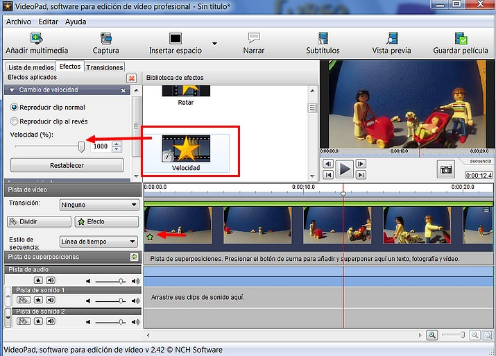

# 5.2 Stop Motion

Si te preguntabas cómo crean películas como Wallace y Grommit o esos cortos divertidos de YouTube con muñecos Lego, ¡ya no tienes que preguntarte más! Aunque crear una animación por "**stop motion**" no es complicado, requiere mucha paciencia y es algo repetitivo, pero si tienes la motivación suficiente puedes llegar a resultados espectaculares.

Stop Motion realizada fedekkano en Youtube.com

**1\. ¿Qué es un Stop Motion?**

El stop-motion es una técnica de animación que consiste en **aparentar el movimiento de objetos estáticos capturando fotografías**. En general se denomina animaciones de stop motion a las que no entran en la categoría de dibujo animado, esto es, que no fueron dibujadas ni pintadas, sino que fueron creadas tomando imágenes de la realidad. Podemos encontrar tres grupos de animaciones:

1.  Imágenes creadas con plastilina o **materiales moldeables**.
2.  Imágenes creadas con **objetos articulados** (lego, playmobil...).
3.  Imágenes creadas con **objetos rígidos**.

**2\. ¿Cómo hacer un Stop Motion?**

1º Consigue **objetos para tu película**: muñecos de barro, de alambre, de bloques Lego o cualquier otro sistema de ensamblaje. Usa tu imaginación.

*   Para los principiantes es más fácil usar un juguete que crear una figura propia: se mueve con mayor facilidad y agiliza la animación.

2º Coloca a tus figuras y personajes en una posición inicial sobre tu** "set" de filmación**.

3º Coloca tu **cámara** enfrente del set, y asegúrate de abarcarlo todo con un encuadre; usa un **trípode** o una superficie completamente estable para apoyarla, o tus tomas no tendrán continuidad.

4º Consigue una **buena fuente de luz**. Puede ser una lámpara o una linterna potente. Si hay una ventana a contraluz que afecte la grabación, cúbrela con una persiana o cortina.

5º Toma una sola **foto** de tu set en la **posición inicial**.

Imagen 73: autor Julián Trullenque. Licencia CC by-nc 

6º Comienza la s**ecuencia de animación haciendo modificaciones mínimas** a los personajes que se vayan a mover: puede ser sólo una parte de su cuerpo o varias si están caminando. Los movimientos deben ser muy pequeños.

7º Continúa con la secuencia de movimiento hasta que termine el desplazamiento.

8º Guarda las fotos en una carpeta de tu ordenador que recuerdes con facilidad.

9º Usa el **programa de edición de vídeo** que tengas. Sin importar qué programa uses, hay varios **pasos a tener en cuenta**:

*   **Importa las fotos** a la interfaz del programa.
*   Encadena las imágenes con **muy poca duración** para cada una de ellas.
*   Si no estás satisfecho con la velocidad a la que tu programa las anima, puedes exportarlas como vídeo (todavía sin audio) y agregar un efecto de doble velocidad al clip resultante.
*   Si la velocidad ya es suficiente, puedes buscar una **pista sonora que acompañe la secuencia**.
*   Añade los **créditos, títulos, transiciones y efectos** que juzgues apropiados.
*   **Guarda** el vídeo.
*   Si tienes planeado incorporar varias secuencias, puedes trabajar con la siguiente y unir todos al final.
*   Agregar el audio y efectos de corte como último punto puede hacer que el trabajo unido al final se vea mucho mejor.

**3\. Montar un Stop Motion con Movie Maker**

1º Prepara tus fotos de secuencia o descarga y descomprime el archivo [stop.rar](http://catedu.es/materialesaularagon2013/imagen/stop.rar).

2º Importa las imágenes a la línea de tiempo.

3º Selecciona todas las fotos.

4º Clic en **Herramientas>Editar. **Seleccionamos duración 0,125.

5º Previsualizamos el proyecto.

6º **Guarda la película**. Si quieres otra secuencia es mejor que crees otro proyecto y luego añadas todas las secuencias y le añadas música, efectos, transiciones...

**4\. Montar un Stop Motion con VideoPad**

1º Prepara tus fotos de secuencia o descarga y descomprime el archivo [stop.rar](http://aularagon.catedu.es/materialesaularagon2013/imagen/stop.rar).

2º Importa las imágenes.

3º Selecciona todas las fotos y añádelas a la línea de tiempo.

4º Por defecto todas las fotos van a tener una duración de 3 segundos. Puedes cambiara la duración de las fotos una por una a 0,1 segundo o crear una película (archivo de vídeo) de la secuencia. 

5º Luego monta en otro proyecto todas las secuencias y ajustalas a una velocidad de 300 %. Así irá mucho más rápida.

*   Para ajustar la velocidad del clip, hacer clic sobre el clip, luego abra la pestaña de "efectos". Elige el efecto de velocidad desde la biblioteca de efectos.
*   Introducea un porcentaje en la casilla (o arrastra la barra de seguimiento) para actualizar el clip con la velocidad nueva.
*   La velocidad original del clip es 100%. Para reducir la velocidad del clip, ingresa un porcentaje menor. Para aumentar la velocidad del clip, ingrese un porcentaje mayor. Algunos valores de ejemplo son:

*   *   *   1000 - El clip se reproducirá 10 veces que la velocidad original.
        *   200 - El clip se reproducirá al doble de la velocidad original.
        *   100 - El clip se reproducirá a la misma velocidad que el clip original.
        *   50 - El clip se reproducirá a la mitad de la velocidad original.
        *   10 - El clip se reproducirá a una décima parte de la velocidad original.

 

Imagen 74: Captura de pantalla propia 

## ParaSaberMas

**ARTÍCULO WEB: La animación como ayuda en el aprendizaje multimedia.**

*   TOTEM GUARD. Recursos TIC para profesores. [http://www.totemguard.com/aulatotem/2012/05/la-animacion-como-ayuda-en-el-aprendizaje-multimedia/](http://www.totemguard.com/aulatotem/2012/05/la-animacion-como-ayuda-en-el-aprendizaje-multimedia/), Mayo, 2012

**VÍDEO: Cómo hacer una animación Stop Motion.**

*   IES as Barxas, Moaña (Pontevedra), Octubre 21012. En YouTube

