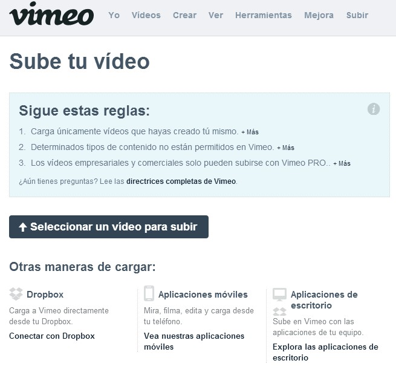
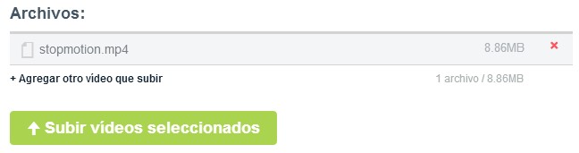
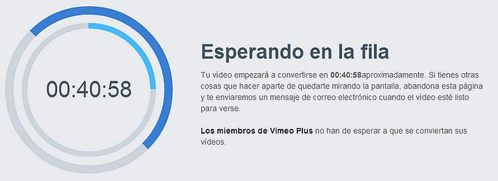
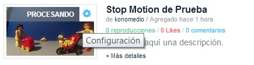
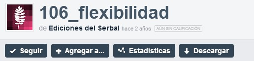
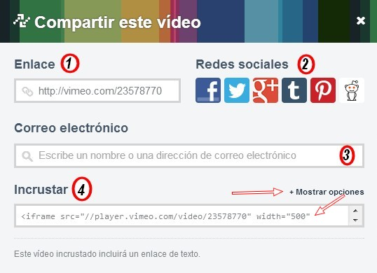
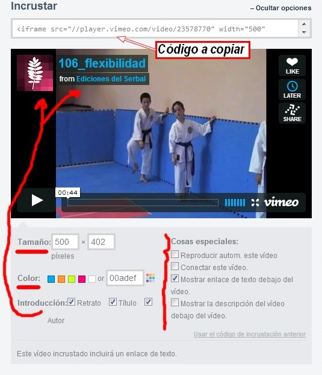

# 5.2 Vimeo

**1\. ¿Qué es Vimeo?**

[Vimeo](https://vimeo.com/) es una **red social de Internet basada en vídeos**. El sitio permite compartir y almacenar vídeos para subir vídeos, crear su perfil, cargar avatares, comentar y armar listas de favoritos.

Vimeo no admite comerciales de televisión, demostraciones de videojuegos, pornografía o cualquier contenido que no haya sido creado por el usuario. El sitio, además, ha ganado reputación como «proveedor de imágenes» para diversos artistas, debido a la alta tasa de bits y resolución de sus vídeos.

Los enlaces a vídeos de Vimeo pueden ser también insertados en blogs y sitios electrónicos personales incrustando cierto código HTML.

**2\. ¿Cómo subir un vídeo a Vimeo?**

**1\. Subir u vídeo a Vimeo**

1º Inicia la sesión en [Vimeo](https://vimeo.com/). Antes te habrás tenido que registrar.

 Imagen 46: Captura de pantalla propia

 2º Haz clic en el enlace **Subir Vídeo** situado en la parte superior de la página.

3º Aparece una **página informativa** donde nos recuerda las condiciones para subir el vídeo. Y nos ofrece otras opciones para subir el vídeo: Dropbox, móviles y aplicaciones de escritorio. Hacemos **clic en Seleccionar un vídeo a subir**.

Imagen 47: Captura de pantalla propia

4º Nos aparece un cuadro informándonos del vídeo que queremos subir: formato, tamaño... y una opción para subir otros. Hacemos clic en **Subir vídeos seleccionados**.

Imagen 48: Captura de pantalla propia

5º Una nueva página nos informa del progreso y ofrece opciones de configuración del vídeo que estamos subiendo.

Presentación realizada por Julián Trullenque. Licencia CC by-nc.

6º Cuando se acaba de subir el vídeo aparece este botón: **"LISTO VE AL VÍDEO"**. Hacemos clic y vemos un nuevo mensaje que nos dice que tardará un tiempo hasta que esté listo para verse.

Imagen 49: Captura de pantalla propia

**2\. Opciones avanzadas**

*   Para ver otras opciones: licencia, privacidad... ir a la presentación anterior.

**3\. Gestión de vídeos**

Una vez subido el vídeo podemos cambiar la configuración, eliminarlo, ver las estadísticas de la gente que lo visita, descargarlo...

1º Hacemos **clic en Vídeos**.

2º Aparecerá una página con todos los vídeos subidos. En la miniatura del vídeo, en su parte superior derecha aparece un botón que nos lleva a la configuración de cada vídeo. Desde allí podemos ver las estadísticas, agregarlo a álbumes, eliminarlo, descargarlo...

Imagen 50: Captura de pantalla propia  

**4\. Compartir un vídeo de Vimeo**

Publicar un vídeo en nuestro blog o sitio web es muy sencillo. Cualquier vídeo que encontremos en **Vimeo** (no solo los nuestros) podemos compartirlos. **¿De qué formas?. **

1º En primer lugar, podemos emplear el formulario de búsquedas para encontrar vídeos concretos.

2º Una vez encontrado el vídeo, hacemos doble clic sobre él. Justo debajo del vídeo apareces estas opciones:

 Imagen 51: Captura de pantalla propia

1.  **Seguir**: seguiremos todos los vídeos de este autor, en este caso Ediciones Serbal.
2.  **Agregar a...**: lo podemos agregar a un canal, álbum o grupo; si los tenemos creados.
3.  **Estadísticas**.
4.  **Descargar:** siempre que estemos registrado y hayamos iniciado sesión.

En la parte derecha del vídeo, nos aparecen tres imágenes para puntuar y compartir el vídeo (esto aunque no estemos registrados):

*   **Like**: para indicar que nos gusta el vídeo. Siempre nos olvidamos de hacer esto.
*   **Later**: para verlo más tarde.
*   **Share**: compartir con un enlace, incrustado en un blog, compartido a través de las redes sociales de más uso.

**¿Cómo compartir el vídeo?**

Imagen 52: Captura de pantalla propia

1.  Compartir **enviando un enlace**.
2.  Compartir en la **redes sociales**.
3.  Compartir por **correo electrónico**.
4.  **Insertarlo en un blog** (opciones).

Imagen 53: Captura de pantalla propia

## ParaSaberMas

*   **Centro de Ayuda de Vimeo**: [https://vimeo.com/help](https://vimeo.com/help)

