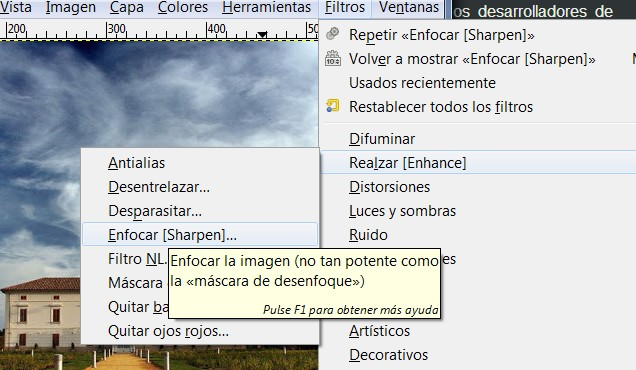
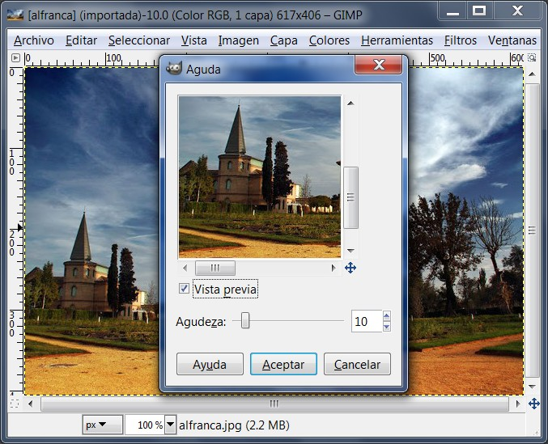
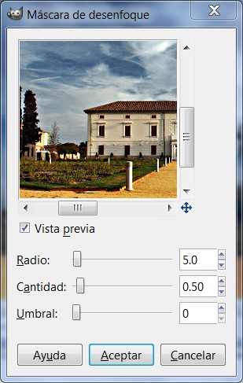
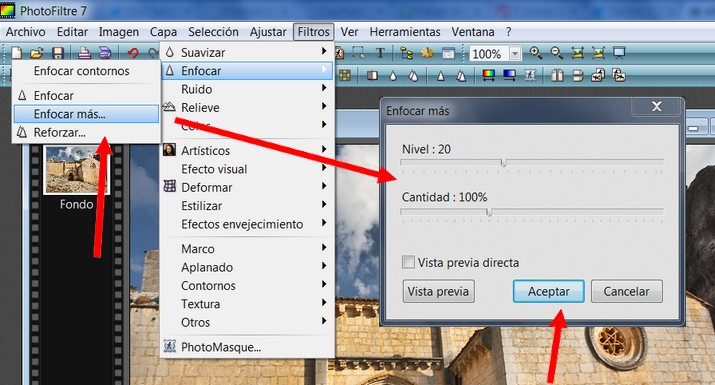
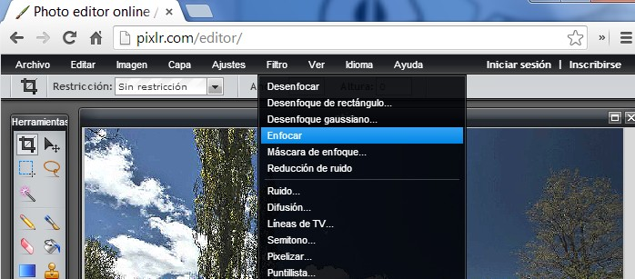
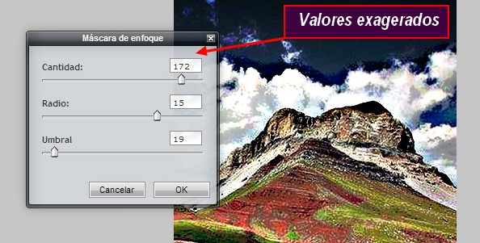
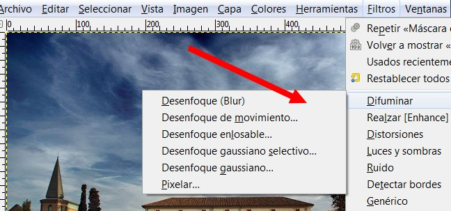
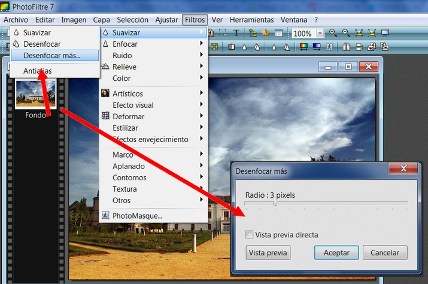
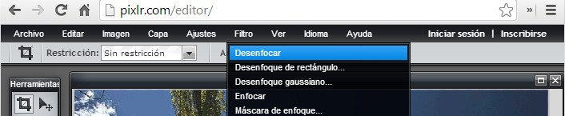
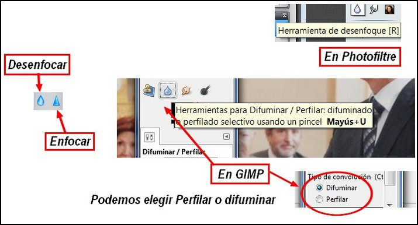

# 5.3 La Nitidez

**1\. Enfoque de fotografías**

Si no se establece el foco perfectamente, o la cámara se mueve cuando se hace la fotografía, el resultado es una imagen desenfocada. Si hay mucho desenfoque, probablemente no podrá hacer mucho con ninguna técnica, pero **si sólo hay una cantidad moderada, podrá mejorar la imagen**.

**1\. En GIMP**

1º Con la imagen que queremos enfocar en nuestro escritorio, abrimos el menú **Filtros>Realzar>Enfocar**.

 

2º Aparecerá el siguiente **cuadro de diálogo**....

 

3º En la barra agudeza, desplazamos el botón hasta que veamos la fotografía lo suficientemente enfocada.

Otra herramienta para enfocar una imagen es la llamada "Máscara de desenfoque". Es más compleja que la anterior ya que se manejan más parámetros. Es más difícil de utilizar. **Filtros>Realzar>Máscara de desenfoque.**

 

A menudo los valores predeterminados funcionan bastante bien, por lo que puedes probarlos primero. Incrementar tanto el radio como la cantidad incrementa la fuerza del efecto. No te dejes llevar: si haces la máscara de desenfoque demasiado fuerte, amplificará el ruido en la imagen y también aumentará los artefactos visibles en los bordes sólidos.

**2\. En Photofiltre**

1º Para enfocar una imagen tenemos dos opciones. La primera es automática (enfocar) y la segunda (enfocar más) abre un cuadro de diálogo en el que se manejan varios parámetros. Accedemos a través del menú **Filtros>Enfocar**.

 Imagen 53: Captura de pantalla propia

**3\. En** [http://pixlr.com/editor/](http://pixlr.com/editor/)

Clic en **Filtros>Enfocar**. Haciendo clic en este comando se enfoca automáticamente la imagen.

 

También tenemos la opción **Filtros>Máscara de Enfoque**...

A menudo los valores predeterminados funcionan bastante bien, por lo que puedes probarlos primero. Incrementar tanto el radio como la cantidad incrementa la fuerza del efecto. No te dejes llevar: si haces la máscara de desenfoque demasiado fuerte, amplificará el ruido en la imagen y también aumentará los artefactos visibles en los bordes sólidos.

**2\. Suavizar**

De vez en cuando tenemos el problema opuesto: **una imagen es ****_demasiado_**** nítida. La solución es desenfocarla un poco**: afortunadamente desenfocar una imagen es más fácil que enfocarla. Ya que probablemente no quieres desenfocarla mucho, el método más sencillo es usar el complemento "Desenfoque", al que se accede a través de **Filtros>Difuminar>Desenfoque** en el menú de la imagen. A menudo suavizará el foco de la imagen un poco. Si quiere smás suavizado, repite hasta conseguir el resultado que quieres. 

**1\. En Gimp**

 

**2\. En Photofiltre**

Tenemos tres opciones: desenfocar, desenfocar más y suavizar. Se llega a través de **Filtro>Suavizar**.

 

**3\. En** [http://pixlr.com/editor/](http://pixlr.com/editor/)

Nos presenta tres opciones: desenfocar, desenfocar en cuadrado y desenfoque gausiano (estas tres últimas más difíciles de controlar). Se llega a través de **Filtros>Desenfocar**.

 

**4\. Enfocar o desenfocar solamente una zona de la imagen**

En algunas situaciones, puede obtener resultados útiles mediante el **enfoque selectivo de partes específicas** de una imagen usando la herramienta **desenfocar o enfocar** de la caja de herramientas, en el modo «enfocar». Esto le permite incrementar la nitidez en áreas pintando sobre ellas con algún pincel.

