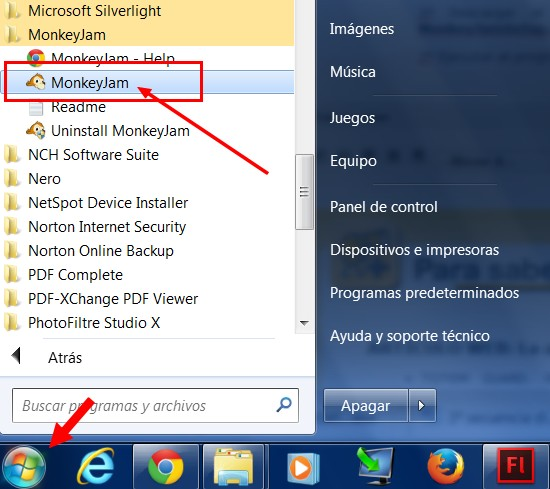
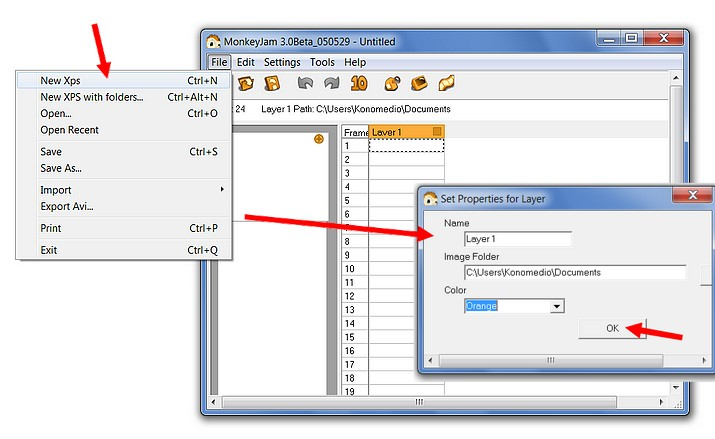
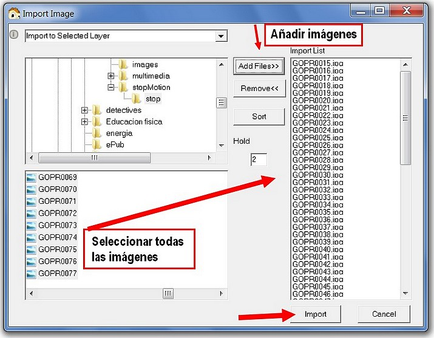
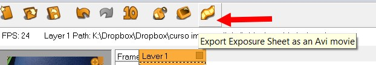
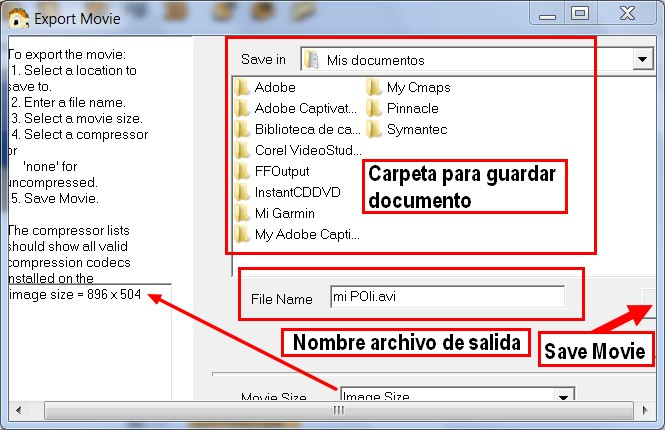

# 5.3 Monkey Jam

**1\. Crear un Stop Motion con el programa MonkeyJam**

**MonkeyJam** es un programa de animación "**Stop Motion**" muy sencillo y gratuito. Está diseñado para capturar imágenes desde una cámara web, cámara de vídeo, o un escáner y montarlos como marcos separados de una animación.También puede importar imágenes y archivos de sonido del ordenador. Aunque ha sido diseñado para el lápiz y el papel, **MonkeyJam** también se puede utilizar para la animación Stop Motion. Las películas creadas en **MonkeyJam** se pueden exportar como archivos **AVI**.

1º Descargar el programa [MonkeyJam](http://monkeyjam.org/download). Instalarlo en el ordenador haciendo doble clic en **MonkeyJamSetup.exe**.

2º Ejecutar el programa. Ir a Inicio>Todos los programas>MonkeyJam>MonkeyJam:

Imagen 75: Captura de pantalla propia

3º Crea una nueva imagen haciendo clic en el menú **File>New Xps**.

Imagen 76: Captura de pantalla propia 

4º Importamos las imágenes desde **File>Import>Images**

Imagen 77: Captura de pantalla propia

5º Aparecerá esta ventana. Buscamos la carpeta donde tenemos las fotos. Seleccionamos todas las imágenes de la ventana izquierda. Hacemos clic en **Add Files** y luego en **Import**.

Imagen 78: Captura de pantalla propia

6º Aparecerá otra vez la ventana principal de esta manera.

7º Clic en **File>Export Avi... **o en el botón Export Exposure...

Imagen 79: Captura de pantalla propia

8º Aparecerá un cuadro de diálogo Export Movie. Hacemos clic en Save Movie... y se guardará nuestra película.

Imagen 80: Captura de pantalla propia 

9º Y ya está creada nuestra secuencia.

