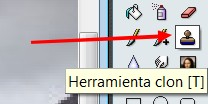

# 5.4 Eliminar objetos

**1\. Quitar los objetos no deseados de una imagen**

Hay dos tipos de objetos que es posible que quieras quitar de una imagen: primero los artefactos provocados por suciedad como polvo o pelos en la lente; segundo, cosas que están realmente presentes pero que perjudican la calidad de la imagen, como un cable de teléfono a lo largo del borde de un bello paisaje de montaña.

El método más útil para quitar el lo que no nos gusta de una imagen es la herramienta clonar, que te permite pintar sobre una parte de una imagen usando datos de píxel cogidos de otra parte (o incluso de una imagen diferente). El truco para usar la herramienta clonar efectivamente es ser capaz de encontrar una parte diferente de la imagen que se pueda usar para "copiar sobre" la parte no deseada: si el área que rodea el objeto no deseado es muy diferente del resto de la imagen, no tendrás demasiada suerte.

Vamos a ver cómo se hace.....

### 1\. En Gimp

1º **Abre** la imagen [carmelo.rar](carmelo.rar). En esta imagen, queremos quitar el excursionista que está en primer plano... ¿imposible?...

2º Elegimos la herramienta clonar: 

3º Con la combinación **Ctrl+botón derecho del ratón** iremos copiando zonas cercanas al excursionista para ir pintando encima de él. Mira el tutorial para ver cómo se hace.

<object type="application/x-shockwave-flash" data="http://aularagon.catedu.es/materialesaularagon2013/imagen/clonar.swf" width="715" height="600"><param name="src" value="http://aularagon.catedu.es/materialesaularagon2013/imagen/clonar.swf"></object>

### 2\. En Photofiltre

1º **Abre** la imagen [carmelo.rar](carmelo.rar). En esta imagen, queremos quitar el excursionista que está en primer plano... ¿imposible?...

2º Elige la herramienta **Clon**. El proceso es el mismo que con GIMP (mira el tutorial). Hacemos **clic+tecla Ctrl **en una parte cercana a lo que queremos eliminar y, vamos pintando... Con poca práctica se hace bien.

### 3\. En [http://pixlr.com/editor/](http://pixlr.com/editor

 1º **Abre** la imagen [carmelo.rar](carmelo.rar). En esta imagen, queremos quitar el excursionista que está en primer plano... ¿imposible?...

2º Elige la herramienta **Clon**. El proceso es el mismo que con GIMP (mira el tutorial). Hacemos **clic+tecla Ctrl **en una parte cercana a lo que queremos eliminar y, vamos pintando... Con poca práctica se hace bien.

## 2\. Corregir el defecto de ojos rojos

**Los ojos rojos son un efecto clásico en la fotografia con flash**. Esto es debido al reflejo del flash en el fondo de ojo, bastante irrigado por la sangre (de allí el color rojo).   
Los dispositivos anti ojos rojos de las cámaras fotográfricas no siempre funcionan a la perfección. Felizmente, existen programas que nos permiten retocar estos defectos.

Vamos a practicar con esta imagen: [ojos.rar](ojos.rar)

### 1\. Con Gimp

1º **Abrir** la imagen en el programa.

2º Clic en **Filtros/Realzar/Quitar ojos rojos.**

3º Aparece este cuadro de diálogo. Normalmente con los parámetros que aparecen por defecto, el resultado ya es bueno, pero podemos ajustar con el manejador del umbral hasta que nos guste el resultado.

### 2\. Con Photofiltre

No hay ninguna herramienta que haga esto automáticamente. lo mejor que podemos hacer es agrandar la pupila y pintarla con negro con mucho cuidado.

### 3\. Con** [http://pixlr.com/editor/](http://pixlr.com/editor/)

1º **Abrir** la imagen en el programa.

2º Elegir la herramienta **Reducción de ojos rojos.**

3º Hacer un clic en cada pupila y ya está.

<object type="application/x-shockwave-flash" data="http://aularagon.catedu.es/materialesaularagon2013/imagen/ojos.swf" width="715" height="500"><param name="src" value="http://aularagon.catedu.es/materialesaularagon2013/imagen/ojos.swf"></object>

