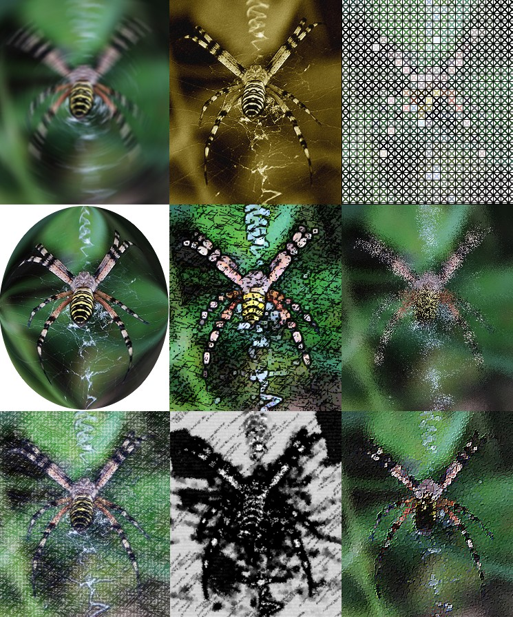
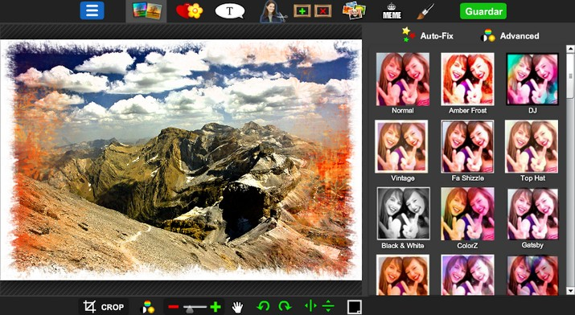

# 5.5 Aplicación de filtros

### 1\. ¿Qué son los filtros?

Los filtros ofrecen **enormes posibilidades de mejorar o alterar las imágenes**. Son plugins creados con este fin y están en continuo desarrollo como todos los plugins utilizados en GIMP. 

*   Mejoran la calidad de la imagen, eliminan imperfecciones, corrigen el enfoque o el color...
*   Modifican el color y la posición de los píxeles en la imagen y por tanto modifican su apariencia.
*   Pueden aplicarse a una zona seleccionada, a una capa, a toda la imagen o a los canales, pero no a zonas transparentes.
*   Sobre una imagen o selección es posible aplicar sucesivamente varios filtros, pero esto hace que aumente su tamaño.
*   Ayudan a nuestra creatividad.

Las tres aplicaciones que estamos manejando ofrecen la **posibilidad de aplicar filtros**. Le mejor manera de aprender es jugando con ellos y aplicándolos a nuestras imágenes. Se accede a través del menú **Filtros**.

La mayoría de los filtros tienen una **vista previa** donde se reflejan los cambios hechos en tiempo real (si la opción“Vista previa” está marcada), antes de ser aplicados a la imagen.

Un ejemplo de los filtros que podemos encontar....

### 2\. Aplicar filtros a una imagen.

En este apartado vamos a ver cómo aplicar filtros a una imagen. No vamos a ver todas las posibilidades ni todos los filtros ya que son innumerables y nos llevaría mucho aprender este apartado. Veremos como se aplican algunos filtros a una imagen y a partir de allí te recomendamos que juegues y practiques para que veas las posibilidades que tienes.

#### 1\. Aplicar filtros con Gimp

*   Vista previa:
    *   La mayoría de los filtros tienen **una vista previa donde se reflejan los cambios** hechos en tiempo real (si la opción“Vista previa” está marcada), antes de ser aplicados a la imagen.

1º **Descarga** la imagen [monte.rar](http://aularagon.catedu.es/materialesaularagon2013/imagen/monte.rar).

2º **Descomprime** el archivo **monte.jpg y guárdalo** en la carpeta de prácticas.

3º **Abre** el archivo **monte.jpg** con el editor.

4º Aplicaremos un **filtro**. En este caso vamos a convertir nuestra foto en un **mosaico**. Clic en **Filtros>Distorsiones>Mosaicos**.

5º Aparece esta ventada desde donde podemos **variar los valores**.

En la siguiente animación verás como mediante un filtro se crea un destello en una foto. Hacemos clic en **Filtros>Luces y sombras>Supernova**. Vamos a colocar un destello de colores.

<object type="application/x-shockwave-flash" data="http://aularagon.catedu.es/materialesaularagon2013/imagen/destello.swf" style="display: block; margin-left: auto; margin-right: auto;" width="715" height="583"><param name="src" value="http://aularagon.catedu.es/materialesaularagon2013/imagen/destello.swf"></object>

Como decimos hay muchos más filtros y te recomendamos que los vayas probando y haciendo experimentos para ver qué resultados producen.

#### 2\. Aplicar filtros con Photofiltre

*   Vista previa:
    *   La mayoría de los filtros tienen **una vista previa donde se reflejan los cambios** hechos en tiempo real (si la opción“Vista previa” está marcada), antes de ser aplicados a la imagen.

1º **Descarga** la imagen [monte.rar](http://aularagon.catedu.es/materialesaularagon2013/imagen/monte.rar).

2º **Descomprime** el archivo **monte.jpg y guárdalo** en la carpeta de prácticas.

3º **Abre** el archivo **monte.jpg** con el editor.

4º Aplicaremos un **filtro**. En este caso vamos a convertir nuestra foto en un **mosaico**. Clic en **Filtros>Estilizar>Mosaico**.

5º Aparece esta ventada desde donde podemos **variar los valores**.

En la siguiente animación verás como mediante un filtro se crea un efecto elipse. Hacemos clic en **Filtros>Deformar>Elipse**. Vamos a colocar un destello de colores.

<object type="application/x-shockwave-flash" data="http://aularagon.catedu.es/materialesaularagon2013/imagen/filtros3.swf" style="display: block; margin-left: auto; margin-right: auto;" width="715" height="542"><param name="src" value="http://aularagon.catedu.es/materialesaularagon2013/imagen/filtros3.swf"></object>

#### 3\. Aplicar filtros con** [http://pixlr.com/editor/](http://pixlr.com/editor/)

1º **Descarga** la imagen [monte.rar](http://aularagon.catedu.es/materialesaularagon2013/imagen/monte.rar).

2º **Descomprime** el archivo **monte.jpg y guárdalo** en la carpeta de prácticas.

3º **Abre** el archivo **monte.jpg** con el editor.

4º Aplicaremos un **filtro**. En este caso vamos a convertir nuestra foto en un **mosaico**. Clic en **Filtros>Coordinadas polares**.

5º Aparecerá una ventana que nos permite modificar opciones de filtro. En este caso vamos viendo cómo se producirán los cambios en la imagen real.

#### 4\. Aplicar filtros desde aplicaciones web 2.0

Si buscamos una solución rápida para integrar efectos y filtros a nuestras fotografías, en la web podemos encontrar muchos editores de fotos muy completos. Nosotros te vamos a presentar alguno de estos editores que cumplen con la condición de no ser instalables, son gratuitos y no hay que registrarse.

*   **Pixlr-o-matic**: A través de **Pixlr-o-matic** podrás **editar fotografías** de una manera veloz y divertida. Con ayuda de este programa, conseguirás la mejor calidad en manipulación de imágenes y obtendrás excelentes resultados en apenas pocos pasos.

1.  **Carga** la imagen.
1.  Aplica un **efecto**.
1.  Aplica una **máscara**.
1.  Crea un **marco** de fotos.
2.  **Guarda** la imagen.

<object type="application/x-shockwave-flash" data="http://aularagon.catedu.es/materialesaularagon2013/imagen/filtros4.swf" width="715" height="715"><param name="src" value="http://aularagon.catedu.es/materialesaularagon2013/imagen/filtros4.swf"></object>

*   [Photoshop Express](http://www.photoshop.com/tools?wf=editor) es una **versión online** del más famoso editor de imágenes del mundo. Pese a ser más limitado en funciones que la aplicación original, sigue prestando **un gran servicio** en cuanto a retoques.

*   [Picfull](http://www.picfull.com/) es un servicio online muy simple para aplicar filtros a tus fotos. Puedes aplicar un buen número de filtros con un clic, y cambiar los ajustes para que la foto quede a tu gusto. Cuando acabes, sólo tienes que pulsar el botón “Save” y la foto se guardará de nuevo a tu ordenador. Así, en pocos pasos puedes aplicar **filtros bastante interesantes** y sin tener que instalar nada ni registrarte.

*   [PiZap](http://www.pizap.com/): Normalmente cuando abres una imagen con un editor suele ser para mejorarla. ¿Pero y si lo que buscas es precisamente lo contrario, es decir, volverla rematadamente absurda? Entonces entra en PiZap y no te arrepentirás. La gracia de PiZap no está en la precisión o utilidad de sus herramientas, sino en todas las pegatinas y adornos graciosos que es capaz de añadirle a tus imágenes. Desde emoticonos a marcos, desde ojos y bocas de pega a complementos de todo tipo.

## Para saber más

*   Como te decimos hay muchos filtros y variaciones de los filtros. Si quieres aprender más y saber cómo funcionan cada uno de ellos, te remitimos al manual de **gimp 2.8:**[http://docs.gimp.org/es/filters.html#filter-introduction](http://docs.gimp.org/es/filters.html#filter-introduction)
*   **Tutorial Photofiltre para usuarios avanzados**: [http://es.kioskea.net/faq/3304-tutorial-de-photofiltre-para-usuarios-avanzados](http://es.kioskea.net/faq/3304-tutorial-de-photofiltre-para-usuarios-avanzados). De [Kioskea](http://es.kioskea.net/) ([es.kioskea.net](http://es.kioskea.net/)) esta puesto a diposición bajo la licencia [Creative Commons](http://es.kioskea.net/ccmguide/ccmlicence.php3). Puede copiar, modificar bajo las condiciones puestas por la licencia, siempre que esta nota sea visible.
*   Los 58 mejores editores de fotos on-line gratis: [http://ounae.com/mejores-editores-fotos-online-gratis/](http://ounae.com/mejores-editores-fotos-online-gratis/). De publicado en Ounae.com bajo licencia CC BY-NC 3.0 ES.

