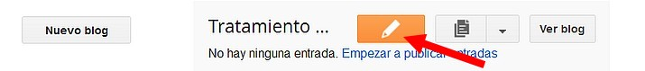
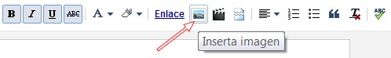
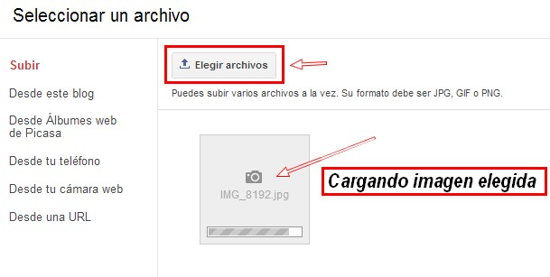
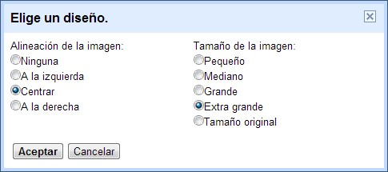
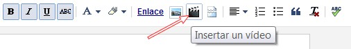
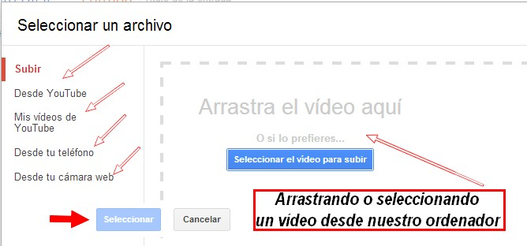
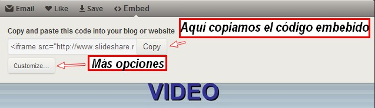
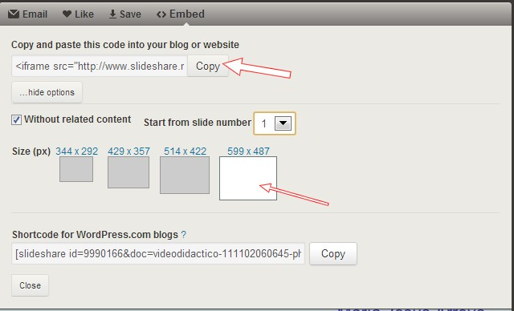
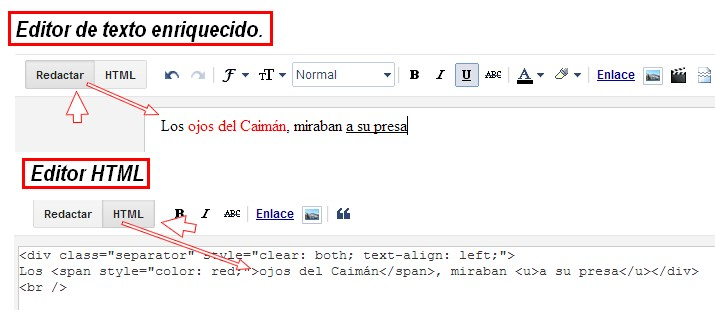

# 6.1 Blogger

**1\. Blogger**

[Blogger](http://www.blogger.com/) es el servicio que ofrece Google para crear un [blog o bitácora](http://es.wikipedia.org/wiki/Blog). Es un de los servicios más populares. Popularidad que radica en su facilidad de uso y los numerosos servicios que entrega a los usuarios.

*   DIRECCIÓN: [http://www.blogger.com](http://www.blogger.com)

**2\. ¿Cómo acceder a blogger?**

1º Para **acceder al blog**, haz clic en [http://aularagondigital.blogspot.com.es/](http://aularagondigital.blogspot.com.es/)

 Imagen 5: autor Julián Trullenque. Tipo de licencia CC by-nc

2º Para poder crear o editar un artículo deberás **registrarte**. En este blog, será el tutor el que te dé permiso para publicar como autor. Entonces entrarás con tu correo (gmail) y tu contraseña. Si no tienes correo gmail, el tutor te facilitará otra forma de entrar.

3º Si estás registrado haz clic en Acceder (parte superior derecha del blog). Entras con correo y contraseña.

4º Clic en **Crear entrada nueva**. Aparecerá un sencillo editor de textos:

Presentación realizada por Julián Trullenque. Licencia CC by-nc

5º Insertamos una foto, escribimos un texto, ponemos de etiqueta "presentación" y hacemos clic en **Publicar**. Si no acabamos el artículo podemos hacer clic en Guardar y ya publicaremos en otro momento.

## ParaSaberMas

Si quieres profundizar más, os dejamos un tutorial muy sencillo elaborado por Raúl Diego Obregón. Licencia CC by-nc-sa. [http://facilytic.catedu.es/wp-content/uploads/2013/10/Blogger_RDObregon.pdf](http://facilytic.catedu.es/wp-content/uploads/2013/10/Blogger_RDObregon.pdf)

Y a través de [José Ramón Olalla](http://www.catedu.es/arablogs/blog.php?id_blog=1145) nos llega este vídeo (subtitulado)

**3\. Insertar una imagen en un blog**

1º Hacemos **clic en el icono Imágenes**. 

Imagen 54: Captura de pantalla propia

2º Nos aparece esta **ventana para la gestión de imágenes**. Seleccionamos Elegir archivos... 

Imagen 55: Captura de pantalla propia

3º Una vez cargada la fotografía podemos elegir las **dimensiones y la alineación.**

Imagen 56: Captura de pantalla propia

**4\. Insertar un vídeo en un blog**

1º Hacemos **clic en el icono Víedo**. 

Imagen 57: Captura de pantalla propia

2º Nos aparece esta **ventana para la gestión de vídeos**. podremos elegir entre estas opciones:

*   Desde nuestro equipo: en la parte central. Los subirá a Youtube.com.
*   Desde Youtube.
*   Desde Mis vídeos de Youtube.
*   Desde Teléfono móbil.
*   Desde una webcam.

Imagen 57: Captura de pantalla propia

2º Hacemos clic en **Seleccionar.**

**5\. Insertar otros objetos**

Ya hemos visto en este módulo que además de imágenes y vídeo se pueden insertar otros objetos. Casi todos los servicios 2.0 en su opción compartir tienes otras dos opciones, la primera es enviar un enlace y la segunda embeber (insertar). Veamos un ejemplo en Slideshare:

**1\. Copiar el código embed**

1º Una vez que tenemos seleccionada la presentación que queremos insertar, hacemos **clic en embed**. En la parte superior derecha.

 Imagen 58: Captura de pantalla propia

 2º Se nos abrirá una ventana con varias opciones. Veamos:

Imagen 59: Captura de pantalla propia

3º Haciendo clic en **Customize**... podemos elegir más opciones: cambiar tamaño, insertar en Wordpress...

Imagen 60: Captura de pantalla propia

4º Seleccionamos el código y lo copiamos. En todos los servicios es similar extraer el código. Solamente hay que buscar el botón, cambiar las opciones y copiar.

**2\. Pegar el código en el editor del blog (HTML)**

En el editor de Blogger tenemos dos barras. Una es un editor de texto enriquecido, que es similar a  un procesador de textos y el el código HTML, que lo reconocerás por tener menos botones. 

1º Hacer clic en HTML.

Imagen 61: Captura de pantalla propia

2º El editor **haz clic en Pegar**. Ha clic en publicar la entrada y observa como queda en el blog.

**[Video didactico](https://www.slideshare.net/magisterioto/video-didactico-9990166 "Video didactico")** from **[Revista Digital El Recreo. Facultad de Educación Toledo](http://www.slideshare.net/magisterioto)**

**Esta es la forma de insertar cualquier objeto de servicios 2.0 en nuestos blogs. Y sirve además para cualquier editor de páginas web, blogs y wiks.**

**6\. ¿Cómo publicar archivos swf en el blog?**

*   **SI TIENES UN SERVIDOR**: sin problemás... con un editor de páginas web (Dreamwer, compozer, Frontpage...) lo insertas en una web (html) y lo subes al domonio.
*   Si utilizas un **CREADOR DE PÁGINAS WEB on-line** (Webnode, Wix, Jimdo...), menos problemas aún, ya que tienen la función de subir FLASH.
*   EN UN BLOG (que sois la mayoría).Aquí es más complicado pero no difícil.

1.  1.  **Sube el archivo swf, a un servido**r. Como seguro que no tienes, guárdalo en la carpeta "public" de tu Dropbox.
    2.  **Copia en el enlace público** que te da Dropbox.
    3.  Sustituye el enlace en el siguiente código. También puedes cambiar el ancho y alto. Te lo pongo en rojo, lo que debes cambiar.
    4.  Copia el código que has modificado y pégalo en tu blog (edición HTML) y ¡ya está!

Para que funcione bien sólo debemos conocer **tres cosas**: la **dirección URL, el ancho y el alto**. El primero de esos datos es el que suele causar estragos porque, como en Blogger no podemos alojar archivos, es común que todos los problemas surjan al utilizar servicios externos que sirven para guardar archivos pero que no nos permiten enlazarlos desde una página web; hay muchos sitios que los admiten, en lo personal, utilizo uno: **DropBox**.

**El código elemental para insertar un archivo de Flash es este:**

<object type="application/x-shockwave-flash" data="**URLarchivo.swf**" width="**ancho**" height="**alto**">  
<param name="movie" value="**URLarchivo.swf**" />  
</object>

