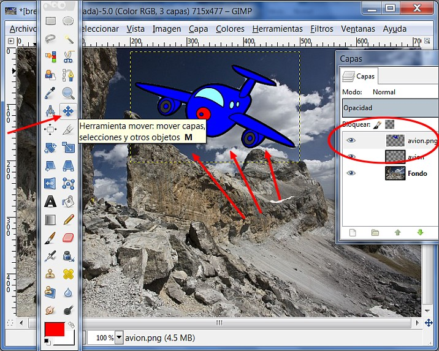

# 7.1 Las capas

### 1\. ¿Qué son?

**Las capas son como papeles transparentes puestos unos encima de otros. La parte que no está rellena en una capa deja ver el contenido de la capa de debajo. **

La ventaja que tiene trabajar con capas es que lo que se haga en una no influye al contenido de las otras. Una capa puede ser borrada, duplicada, combinada con otras. A una capa se le puede cambiar el tamaño de forma independiente, se pueden mover, se les puede cambiar el orden de apilación, etc. También permiten distintos grados de transparencia.

Ellas **nos van a permitir** modificar partes de la imagen sin destruir el original; hacer transparentes algunas zonas de la imagen; combinar los píxeles de una capa con la inferior y obtener una imagen diferente. En definitiva las capas son importantísimas en el tratamiento digital de imágenes.

### 2\. La ventana capas

Cuando abrimos **Gimp**, la ventana que se sitúa a la derecha de nuestra pantalla es el lugar donde se gestionan las capas para todas las imágenes que tengamos abiertas. En caso de que hayamos cerrado de forma independiente esta ventana, para poder mostrarla de nuevo debemos acceder al menú **Ventanas>Diálogos empotrables>Capas**.

<object type="application/x-shockwave-flash" data="http://aularagon.catedu.es/materialesaularagon2013/imagen/capas.swf" width="715" height="480"><param name="src" value="http://aularagon.catedu.es/materialesaularagon2013/imagen/capas.swf"></object>

Presentación realizada por Julián Trullenque. Licencia CC by-nc

### 3\. Trabajando con capas

En este apartado vamos a trabajar sobre imágenes digitales usando las **Capas**. Podrás comprobar la gran potencia que, las capas, proporcionan a un programa de tratamiento de imágenes digitales.

#### 1\. Creando una imagen con capas en GIMP

1º **Descarga el archivo** [capas.rar](http://aularagon.catedu.es/materialesaularagon2013/imagen/capas.rar). Descomprime el archivo y guarda la imágenes en la carpeta de prácticas: brecha.jpg, bob-esponja.png, avion.png.

2º **Abre** la imagen **brecha.jpg**.

3º En la **Ventana Capas** haz doble clic sobre la imagen en miniatura de la capa "brecha.jpg", y cambia el nombre por el de "Fondo" y presiona la tecla **Enter**.  

4º Por defecto, las dimensiones de una capa nueva son iguales a las de la imagen con la que estamos trabajando, pero podemos crearlas más grandes o más pequeñas. Para crear una nueva capa haz clic en el icono **Capa Nueva**.

5º en el menú contextual que aparece elige **Capa nueva...**, pon un tamaño de 300x300 píxeles y relleno transparente a esta nueva capa. **Llámala avion**. Después pulsa **Aceptar**.

6º Observa que en la **Ventana Capas** encuentras las dos capas creadas, "Fondo" y "avion". Si seleccionas esta última, en la **Ventana imagen** se muestra con una zona cuadrada delimitada por una línea discontinua, que marca el tamaño y posición de la capa.

7º Vamos a **pegar la imagen del avión encima de la foto**. Para eso, abrimos al imagen avion.png (es transparente). La abrimos como una capa. Hacemos clic en **Archivo>Abrir como capas** y seleccionamos **avión.png.**

8º Y con la **herramienta mover de la caja de herramientas**, arrastramos y colocamos el objeto donde queremos.

9º Hacemos la **imagen más pequeña**. Con la herramienta **Escalado**, arrastrando una esquina de la capa hacia adentro.

10º Ahora haz lo mismo con la imagen de Bob Esponja y guarda la imagen. Observa en el tutorial como es toda la secuencia.

<object type="application/x-shockwave-flash" data="http://aularagon.catedu.es/materialesaularagon2013/imagen/capas2.swf" width="715" height="600"><param name="src" value="http://aularagon.catedu.es/materialesaularagon2013/imagen/capas2.swf"></object> 

#### 2\. Creando una imagen con capas en Photofiltre

1º **Descarga el archivo** [capas.rar](http://aularagon.catedu.es/materialesaularagon2013/imagen/capas.rar). Descomprime el archivo y guarda la imágenes en la carpeta de prácticas: brecha.jpg, bob-esponja.png, avion.png.

2º **Abre** la imagen **brecha.jpg**.

3º Clic en **Capa>Nuevo>Abrir como capa...** y así abrimos el archivo **avion.png** (es transparente).

4º Con la **Herramienta Selección** colocamos la imagen del avión en el lugar que queramos.

5º Para **redimensionar la imagen** hacemos clic con el botón derecho encima de la imagen (capa). Aparecerá la capa rodeada por una envoltura de línea discontinua y unos puntos. Desplazamos haciendo clic con el ratón hacia el centro, y la imagen queda más pequeña. Si pulsamos la tecla **INTRO**, la capa cambiará de dimensión.

6º Repetimos las operaciones para insertar la imagen **bob-esponja.png**. Mira el tutorial.

<object type="application/x-shockwave-flash" data="http://aularagon.catedu.es/materialesaularagon2013/imagen/capas3.swf" width="715" height="580"><param name="src" value="http://aularagon.catedu.es/materialesaularagon2013/imagen/capas3.swf"></object>

#### 3\. Creando una imagen con capas en Pixrl

1º **Descarga el archivo** [capas.rar](http://aularagon.catedu.es/materialesaularagon2013/imagen/capas.rar). Descomprime el archivo y guarda la imágenes en la carpeta de prácticas: brecha.jpg, bob-esponja.png, avion.png.

2º **Abre** la imagen **brecha.jpg**.

3º Clic en **Capa>Abrir imagen como capa...** y así abrimos el archivo **avion.png** (es transparente).

4º Con la **herramienta Mover** lo colocamos en le lugar que queremos.

5º Para **redimensionar la imagen** hacemos clic en Editar>Transformación libre. Aparecerá la capa rodeada por una envoltura de línea discontinua y unos puntos. Desplazamos haciendo clic con el ratón hacia el centro, y la imagen queda más pequeña. Si pulsamos la tecla **INTRO**, la capa cambiará de dimensión.

6º Repetimos las operaciones para insertar la imagen **bob-esponja.png**. Mira el tutorial.

<object type="application/x-shockwave-flash" data="http://aularagon.catedu.es/materialesaularagon2013/imagen/capas4.swf" width="715" height="580"><param name="src" value="http://aularagon.catedu.es/materialesaularagon2013/imagen/capas4.swf"></object>
