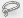
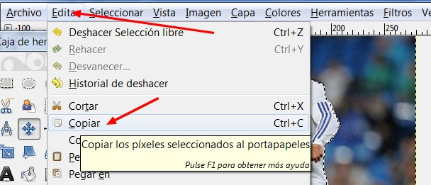
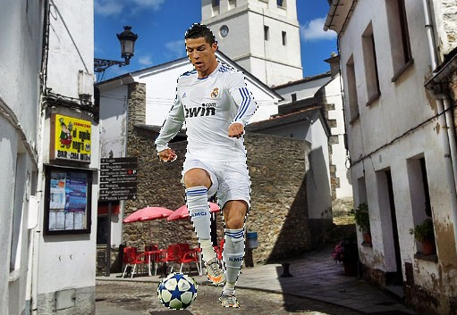
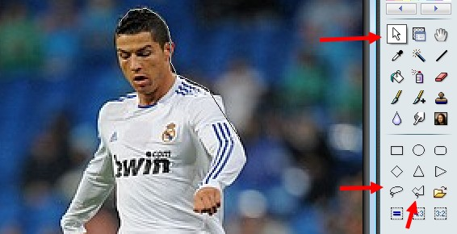
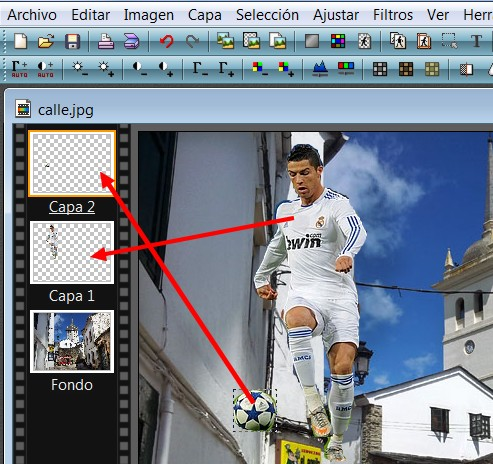
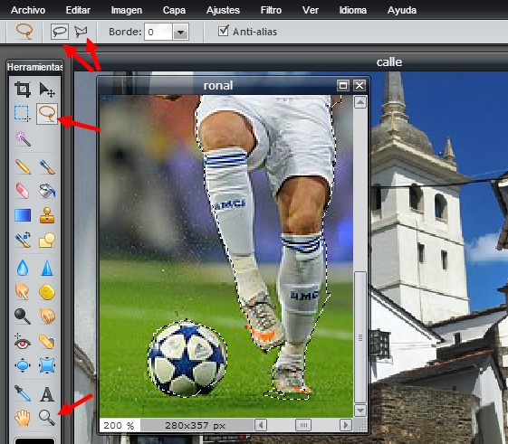
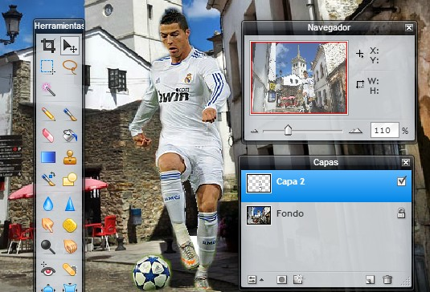

# 7.2 Hacer un fotomontaje

Uno de los principales atractivos es que se pueden hacer [fotomontajes](http://es.wikipedia.org/wiki/Fotomontaje); a través del uso de capas que se superponen unas encima de otras ordenando lo que podemos ver en nuestro fotomontaje. Para realizar un fotomontaje necesitamos al menos 2 capas, una con el fondo de la imagen y otra con la imagen principal. En este tutorial intentaré mostrarle una manera sencilla pero efectiva de recortar una imagen y añadirla a otra.

**1\. Hacer un fotomontaje con GIMP**

1º **Descargar** el archivo [**fotomontajes.rar**](http://aularagon.catedu.es/materialesaularagon2013/imagen/fotomontajes.rar). Descomprimir en una carpeta los tres archivos: **paisaje.jpg, ronal.jpg y paco.jpg**.

2º Ejecutar el editor y abrir el archivo **calle.jpg** que será la capa de fondo.

3º Abrir en otra ventana **ronal.jpg**. Esta imagen es la que vamos a modificar, recortando la silueta del jugador de fútbol para luego pegarla en la capa fondo.

1.  Ampliamos con la herramienta **lupa** la imagen. para tener más precisión. 

2.  Con la herramienta **lazo** iremos recortando la figura. Lo podemos hacer de dos maneras: 

*   *   Pulsando con el botón izquierdo y arrastrando el ratón por la silueta del jugador.
    *   Haciendo clic en varios lugares de la imagen y uniendo uno tras otro los puntos.

 

4º Pulso la tecla Mayús+ratón para agrupar los dos objetos.

5º Una vez que hemos seleccionado la silueta entera, hacemos clic en **Editar>Copiar**. Copiará la imagen seleccionada en el Portapapeles (memoria).

 Imagen 98: Captura de pantalla propia.

6º Vamos a la la imagen **calle.jpg** y creamos capa nueva. Clic en **Capa>Capa nueva**. Que sea del mismo tamaño que la capa calle y a la vez transparente.

7º Pegamos la imagen del portapapeles con clic en **Editar>Pegar**. Y ya está la primera parte el montaje.

 Imagen 99: Captura de pantalla propia.

8º **Ajustamos el tamaño y posición** del jugador en la calle, y ya podemos guardar el archivo.

9º Ahora vamos a pegar la cabeza del segundo personaje en la del futbolista. Seguiremos los mismos pasos, salvo que en vez del **lazo** cogeremos el **recorte inteligente**. La diferencia de éste son el anterior, es que interpreta las diferencias de colores y hace un recorte automático. 

10ª Seguimos el mismo proceso:

1.  Abrimos el archivo paco.jpg.
2.  Recortamos la silueta de la cabeza con la tijera.
3.  Copiamos la imagen.
4.  Creamos otra capa transparente en la imagen calle.
5.  Pegamos la silueta de la cabeza, la posicionamos y colocamos en el lugar que queremos.
6.  Guardamos la imagen resultante.

**2\. Hacer un fotomontaje con Photofiltre**

1º **Descargar** el archivo [**fotomontajes.rar**](http://aularagon.catedu.es/materialesaularagon2013/imagen/fotomontajes.rar). Descomprimir en una carpeta los tres archivos: **paisaje.jpg, ronal.jpg y paco.jpg**.

2º Ejecutar el editor y abrir el archivo **calle.jpg** que será la capa de fondo.

3º Abrir en otra ventana **ronal.jpg**. Esta imagen es la que vamos a modificar, recortando la silueta del jugador de fútbol para luego pegarla en la capa fondo.

1.  1.  Ampliamos con la herramienta **lupa** la imagen. para tener más precisión. 
    2.  Con herramientas de recorte podemos hacer dos cosas diferentes: 
    
    *   *   Con la herramienta **lazo** arrastrando el ratón por la silueta del jugador.
        *   Con la herramienta polígono haciendo clic en varios lugares de la imagen y uniendo uno tras otro los puntos.

 Imagen 100: Captura de pantalla propia.

4º Pulso la tecla Mayús+ratón para agrupar los dos objetos (jugador y balón).

5º Una vez que hemos seleccionado la silueta entera, hacemos clic en **Editar>Copiar**. Copiará la imagen seleccionada en el Portapapeles (memoria).

6º Pegamos la imagen del portapapeles con clic en **Editar>Pegar**. Y ya está la primera parte el montaje. El programa creará una nueva capa con la imagen pegada.

 Imagen 101: Captura de pantalla propia.

7º **Ajustamos el tamaño y posición** del jugador en la calle, y ya podemos guardar el archivo.

8º Ahora vamos a pegar la cabeza del segundo personaje en la del futbolista. Seguiremos los mismos pasos.

1.  1.  Abrimos el archivo paco.jpg.
    2.  Recortamos la silueta de la cabeza con el lazo.
    3.  Copiamos la imagen.
    4.  Pegamos la silueta de la cabeza, la redimensionamos y colocamos en el lugar que queremos.
    5.  Guardamos la imagen resultante.

 

**3\. Hacer un fotomontaje con PIXLR**

1º **Descargar** el archivo [**fotomontajes.rar**](http://aularagon.catedu.es/materialesaularagon2013/imagen/fotomontajes.rar). Descomprimir en una carpeta los tres archivos: **paisaje.jpg, ronal.jpg y paco.jpg**.

2º Ejecutar el editor y abrir el archivo **calle.jpg** que será la capa de fondo.

3º Abrir en otra ventana **ronal.jpg**. Esta imagen es la que vamos a modificar, recortando la silueta del jugador de fútbol para luego pegarla en la capa fondo.

1.  1.  Ampliamos con la herramienta **lupa** la imagen. para tener más precisión. 

    2.  Con herramientas de lazo recortamos la silueta arrastrando el ratón.

    

    *   *   También podemos elegir la herramienta polígono y hacerlo punto a punto. 

 

 Imagen 102: Captura de pantalla propia.

5º Una vez que hemos seleccionado la silueta entera, hacemos clic en **Editar>Copiar**. Copiará la imagen seleccionada en el Portapapeles (memoria).

6º Pegamos la imagen del portapapeles con clic en **Editar>Pegar**. Y ya está la primera parte el montaje. El programa creará una nueva capa con la imagen pegada.

 

  Imagen 103: Captura de pantalla propia.

7º **Ajustamos el tamaño y posición** del jugador en la calle, y ya podemos guardar el archivo.

8º Ahora vamos a pegar la cabeza del segundo personaje en la del futbolista. Seguiremos los mismos pasos.

1.  1.  Abrimos el archivo paco.jpg.
    2.  Recortamos la silueta de la cabeza con el lazo.
    3.  Copiamos la imagen.
    4.  Pegamos la silueta de la cabeza, la redimensionamos y colocamos en el lugar que queremos.
    5.  Guardamos la imagen resultante.

