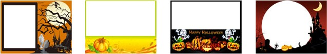
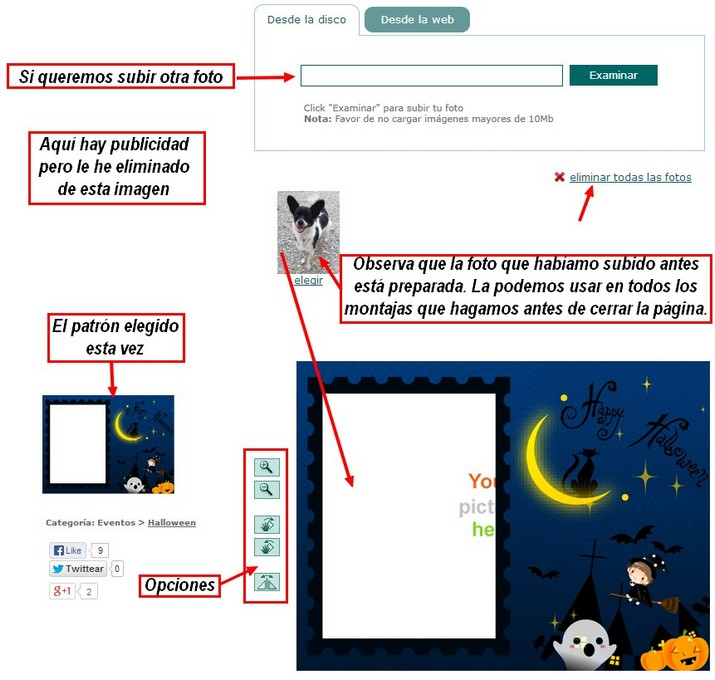

# 7.3 Fotomontajes on-line

Las herramientas web 2.0 están muy presentes en la actualidad y son de gran ayuda para realizar numerosas actividades, un grupo de estas actividades son los [fotomontajes](http://es.wikipedia.org/wiki/Fotomontaje). Vamos a ver una serie de páginas con recursos para hacer divertidos fotomontajes. Procuraremos que sean portales gratuitos y a ser posible que no nos debamos registrar. Hay mucho y muy variados, seguro que encuentras lo que deseas.

En todas estas páginas el funcionamiento es parecido, escojes un fotomontaje, subes la fotografía de tu preferencia, la encuadras dentro de la plantilla de fotomontaje y listo, luego buscas la opción grabar o descargar directamente a tu ordenador.

**CONOCIMIENTOS PREVIOS**

*   Navegar por la red.
*   Utilizar los formularios propuestos para subir fotografías a una determinada página.
*   La mayor parte de las veces nos van a permitir subir una foto con un tamaño, formato o dimensiones determinadas. Debemos saber convertir nuestras imágenes según las características que nos piden.
*   Descargar y guardar archivos de internet. 

**1\. BigHugeLabs : hacer cosas divertidas con sus fotos**

[Big Hube Labs](http://bighugelabs.com/) es un sitio web para realizar proyectos creativos y divertidos con imágenes. Las imágenes a usar pueden ser: subidas desde nuestro ordenador, que estén alojadas en dos de los sitios más populares de la red para alojar imágenes como [Flickr](http://flickr.com/) o introduciendo la URL de una imagen en línea. Ofrece una sorprendente c**antidad de herramientas en línea** para que profesores y alumnos podamos jugar de forma creativa con imágenes propias o con imágenes publicadas en la red con licencia CC.

Crear mosaicos, retratos, sellos, calendarios, rompecabezas, cubos… Cada una de nuestras creaciones puede ser descargada a nuestro ordenador, almacenadas en [Flickr](http://www.flickr.com/) o en [Facebook](http://www.facebook.com/) o enviadas por correo electrónico. Si nos registramos, todas las imágenes que subamos se guardarán en nuestro propio portafolio en [Big Hube Labs](http://bighugelabs.com/)  pudiendo ser usadas una y otra vez.

Sin duda se trata de una forma divertida y creativa de adquirir competencias digitales.

1º **Abrir** el programa: [http://bighugelabs.com/](http://bighugelabs.com/) Vamos a hacer todos los fotomontajes con esta imagen: [perro.jpg](perro.jpg). Puedes utilizarla para hacer las prácticas que quieras.

Imagen 103: Autor Julián Trullenque. Licencia CC by-nc

2º **Elegir el fotomontaje** que queremos hacer. En este caso vamos a elegir "[Pop Art Poster](http://bighugelabs.com/popart.php)". Es una imagen tipo Andy Warhold.

Imagen 104: Captura de pantalla propia.

3º Haciendo clic en **Pop Art Poster** nos aparecerá esta pantalla.

Imagen 105: Captura de pantalla propia.

4º Seguimos esta **secuencia de acciones**:

1.  1.  Elegimos subir el archivo desde nuestro ordenador.
    2.  **Clic** en el botón **Subir Archivo**.
    3.  Elegimos la foto que queremos subir para hacer el montaje.
    4.  **Seleccionamos** la posición Centro y el tamaño de 9 cuadros.
    5.  Hacemos clic en **Create** (crear).

5º Esta es la **imagen resultante**. Podemos guardarla, compartirla... pero vamos a **descargarla directamente**. Vimos como se hacía en la Unidad 2. Obtener recursos de Internet.

Imagen 106: Captura de pantalla propia.

Se pueden hacer más montajes. Lo mejor es que practiques y pruebes a hacer diferentes cosas. Vamos a ver un tutorial para hacer otro efecto con el mismo servicio web 2.0.

**2\. Loonapix: el más fácil**

**Loonapix** es una aplicación web ideal para aquellos usuarios que buscan destacar de alguna manera con sus fotografías, ya que gracias a **Loonapix**vas a poder agregarle **efectos divertidos**, **crear fotomontajes online** y añadir **marcos** a tus fotos.

**Loonapix** destaca por su facilidad de uso que se basa en tan solo elegir el efecto, montaje o marco deseado y posteriormente subir la fotografía ya sea desde el ordenador, o desde una la web, ingresando la URL de la misma.

Imagen 107: Captura de pantalla propia.

**1\. Foto Efectos**

La primer categoría de [Loonapix](http://www.loonapix.com/) es sin duda de la más buscada; Con más de 250 modelos divertidos podrás plasmar tu **imagen en divertidas escenas**; ya sean carteles publicitarios en medio de una gran ciudad, tatuajes en alguna persona famosa, estampas de remeras, bosquejos de algún artísta, entre otros.

1º Entramos en [http://www.loonapix.com/es/effector/](http://www.loonapix.com/es/effector/) Elegimos uno de los efectos, haciendo clic en la imagen.

Imagen 108: Captura de pantalla propia.

2º Subimos la imagen **perro.jpg**.

Imagen 109: Captura de pantalla propia.

3º Y pasado poco tiempo tenemos nuestra imagen creada lista para **compartir y descargar**. 

**2\. Marcos de fotos**

**LoonaPix** mantiene todos los marcos ordenados por categorías. Marcos animados (GIF) motivos de amor, calendarios, de amigos. Sobre eventos como bodas, cumpleaños, navidad, año nuevo, día de San Valentín, semana santa, Halloween, etc. Más de 950 marcos que puedes ver de forma gratuita desde el enlace a continuación.

1º Hacemos clic en Marcos de fotos. Aparece una miniatura de todos los marcos.

Imagen 110: Captura de pantalla propia.

2º Elegimos el marco.

Imagen 111: Captura de pantalla propia.

3º Hacemos clic en **Crear imagen** y ya está creado el marco. Observa que he reflejado la imagen del perro, que ahora mira a la derecha.

Imagen 112: Captura de pantalla propia.

**3\. Efectos caras**

Esta es la aplicación ideal para aquellos usuarios que se divierten al **crear fotomontajes online**. Allí encontrarás 190 plantillas con diferentes cuerpos para que le agregues tu rostro. La forma de hacerlo es igual que las dos anteriores. Elegir el marco y la foto a subir, y luego guardar o compartir.

Imagen 113: Captura de pantalla propia.

**4\. Ajuste de foto**

Este sería el final del recorrido del sitio web de Loonapix; y es aquí donde podrás encontrar una variedad de plantillas para que ajustes tus fotografías en diferentes modelos como figuras geométricas, nubes, estrellas y más...

Imagen 114: Captura de pantalla propia.

## Para saber más

En este apartado te hemos mostrado dos servicios web gratuito para hacer fotomontajes, pero como decimos hay muchos más y no es cuestión de analizarlos todos. Aquí en esta lista tienes enlaces a más páginas web que hacen fotomontajes. En el momento de hacer esto apuntes todas están comprobadas y funcionan. Es posible y seguro que cuando realices el curso haya más páginas y alguna de estas no funcions. Te recomendamos que practiques y pruebe a hacer fotomontajes. Es divertido.

**[Bighugelabs](http://bighugelabs.com/)****,** **[Clip Your Photos](http://clipyourphotos.com/bender)****,** **[Deefunia](http://www.deefunia.com/)****, ****[Faceinhole](http://www.faceinhole.com/)****,** **[Foto Molduras](http://www.fotomolduras.com/)****,** **[Fotoefectos](http://www.fotoefectos.com/)****,** **[Funny.photo](http://funny.pho.to/es/)****,** **[Funphotobox](http://www.funphotobox.com/)****,** **[Imagechef](http://www.imagechef.com/)****,** **[Jpgfun](http://jpgfun.com/)****,** **[Loonapix](http://www.loonapix.com/es/effector)****, ****[Magofun](http://www.magofun.com/)****,** **[Personalized Money](http://www.festisite.com/money/)****,** **[Pho.to](http://pho.to/)****,** **[Photo505](http://photo505.com/)****,** **[PhotoFaceFun](http://www.photofacefun.com/)****,** **[Photofunia](http://photofunia.com/)****,** **[Photomontager](http://photomontager.com/)****,** **[Pic in Motion](http://es.picinmotion.com/)****,** **[Picfast](http://picfast.com/)****,** **[Picjoke](http://es.picjoke.com/)****,** **[Pictures4fun](http://pictures4fun.net/es/)****,** **[Pizap](http://www.pizap.com/)****,** **[Scrapee](http://www.scrapee.net/es)****,** **[Seenow](http://es.seenow.com/)****,** **[writeonit](http://www.writeonit.org/), [enjoypic](http://es.enjoypic.com/).  
**

## Galería de imágenes

*   

*   

*   

*   

*   

*   

*   

*   

*   

*   

*   

*   

*   

*   

*   

*   

*   

*   

$exe.imageGallery.init("exeImageGallery133");

