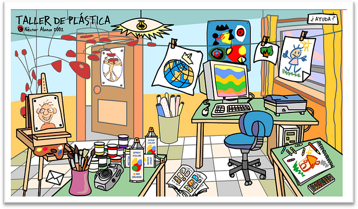

# Módulo 4: MANIPULACIÓN DE IMÁGENES

Taller de plástica de [Nestor Alonso](http://www.flickr.com/photos/nestoralonso/).

La edición digital de imágenes se ocupa de la **edición de imágenes digitales**, comúnmente un gráfico, en la mayoría de los casos fotos o documentos escaneados. Estas imágenes son modificadas para optimizarlas, manipularlas, retocarlas, etc con el fin de alcanzar la meta deseada.

Una de las metas puede ser eliminar las fallas que pueden haberse producido durante el escanéo o al fotografiar, por ejemplo sobreexposición, bajaexposición, falta de contraste, ruido en la imagen, efecto de los ojos rojos, paradoja de las líneas paralelas en perspectiva, etc. Estas fallas se producen por defectos técnicos en los aparatos fotográficos, escáner, condiciones de trabajo precarias, fallas en la operación u originales defectuosos.

Debemos tratar la imagen para que se adapte lo mejor posible al medio al que la vamos a llevar (pantalla, impresión normal, un blog..). En estea apartado aprenderemos las técnicas más básicas para la manipulación de imágenes para adaptarlas a nuestras necesidades.

## Objetivos

1.  **Descargar e instalar un programa de manipulación de imágenes.**
2.  **Uso de aplicaciones instalables y on-line para editar imágenes.**
3.  **Familiarizarse con el entorno de trabajo de los editores de imágenes: área de trabajo, herramientas, opciones, menú...**
4.  **Saber gestionar archivos de imagen: crear, abrir, cerra y exportar.**
5.  **Exportar archivos de imagen en diferentes formatos y tamaños.**
6.  **Aprender a manipular imágenes modificando la iluminación, colores y nitidez.**
7.  **Conocer diferentes filtros y saber utilizarlos para transformar nuestras imágenes.**
8.  **Añadir textos y títulos a la imágenes.**
9.  **Realizar sencillos fotomontajes combinando imágenes tanto con programas instalables como con programas on-line.**
10.  **Añadir imágenes en las entradas de un blog.**

