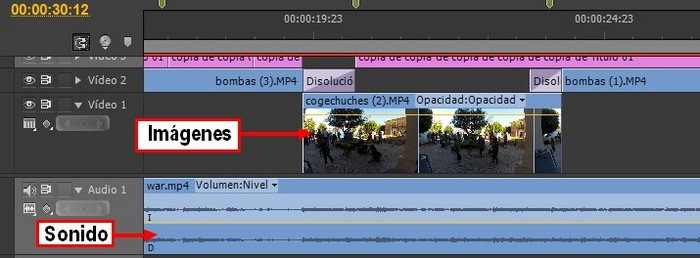

# EDICIÓN DE VÍDEO

https://youtu.be/LmBnUtjxjoA

Video creado por Julián Trullenque para CEIP Brianda de Luna (Alfajarín). Licencia by-nc

## Importante

Una idea elemental acerca del vídeo podría ser entenderlo como un **conjunto de imágenes en movimiento que tienen sonido**. Hasta hace poco, toda la grabación, manipulación y reproducción de vídeo se realizaba de forma analógica pero, con el avance de la tecnología multimedia, es hoy habitual utilizar un ordenador para almacenar, editar y reproducir vídeo digital.

La **Edición de Vídeo Digital** es la elaboración completa y montaje de secuencias de vídeo utilizando medios informáticos.

Este proceso requiere de varias fases: concebir la idea del proyecto final que deseamos generar, capturar o importar las diferentes secuencias de videos (y sus diferentes formatos de grabación), editar las secuencias utilizando programas de edición de video, establecer el tipo de formato de reproducción y la exportación a un soporte físico.

<iframe src="//www.slideshare.net/slideshow/embed_code/key/5NRDZB2kuNLi3y" width="595" height="485" frameborder="0" marginwidth="0" marginheight="0" scrolling="no" style="border:1px solid #CCC; border-width:1px; margin-bottom:5px; max-width: 100%;" allowfullscreen> </iframe> 
 <strong> <a href="//www.slideshare.net/cedecite/45-ideas-para-el-uso-del-mvil-en-el-aula" title="45 ideas para el uso del móvil en el aula. CeDeC" target="_blank">45 ideas para el uso del móvil en el aula. CeDeC</a> </strong> from <strong><a href="https://www.slideshare.net/cedecite" target="_blank">CEDEC</a></strong> 

## Objetivos

1.  **Conocer la terminología básica utilizada en la edición de vídeo digital.**
2.  **Conocer los formatos de vídeo más utilizados y las extensiones que utilizan.**
3.  **Convertir un vídeo de un formato a otro.**
4.  **Saber reproducir un vídeo con nuestro ordenador.**
5.  **Descargar vídeos de la red de diferentes servicios web.**
6.  **Manejar un programad de edición de vídeo.**
7.  **Capturar imágenes de vídeo de diferentes soportes: web, DVD, cámaras, móvil...**
8.  **Editar clips de vídeo: recortar, unir, utilizar transiciones, efectos...**
9.  **Realizar un vídeos sencillo con imágenes fijas.**
10.  **Subtitular un vídeo.**
11.  **Saber grabar una explicación.**
12.  **Exportar vídeo en diferentes formatos.**
13.  **Conocer algunas de las propuestas que se pueden realizar en el aula.**

