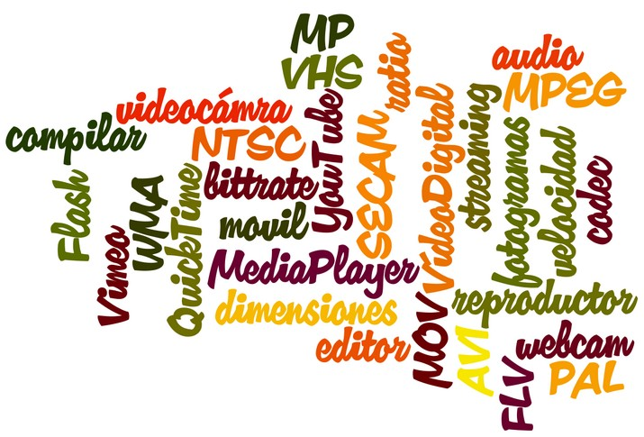

# U1. CONCEPTOS BÁSICOS DE VÍDEO

Vídeo subido a Youtube por [Weblogs SL](http://www.weblogssl.com/)

**BIENVENIDO a este apasionante mundo del video digital**. No es por desanimar, pero ten en cuenta que trabajar con vídeo en el ordenador es bastante complejo. A la hora de "capturar" con nuestro vídeo doméstico, sólo tenemos que elegir el canal, darle al "Rec" y listo, pero cuando se trata de capturar, comprimir o exportar vídeo en el ordenador la cosa no es tan sencilla. Deberemos configurar numerosos parámetros para capturar, editar, exportar y, llegado el caso, realizar un DVD o publicarlo en Internet y, lo peor es que, no sólo hay infinidad de opciones dentro de cada uno de esos parámetros, sino que hay sutiles diferencias que pueden volverte loco.  
Esta unidad pretende ser una **guía de referencia de los términos más comúnmente usados a la hora de trabajar con vídeo digital.** Sin saber qué significan es bastante complicado lograr en nuestros vídeos la mejor calidad posible o, peor todavía, puede que obtengamos vídeos imcompatibles con el formato que deseemos.

**1\. Conceptos básicos de vídeo**

**1\. Dimensiones**

*   Es el **tamaño del video (ancho x alto)** expresado en píxeles cuando se visualiza al 100%, sin agrandar ni reducir. Los reproductores pueden mostrar un video a pantalla completa o con una ampliación del 200%, 300%, etc. En estos casos el video pierde calidad de imagen y esta pérdida depende del formato de archivo.

**2\. Codec**

*   Acrónimo de "codificación/decodificación". Un códec es un **algoritmo especial que reduce el número de bytes que ocupa un archivo de video**. Los archivos codificados con un códec específico requieren el mismo códec para ser decodificados y reproducidos. Algunos de los códecs más utilizados para el formato AVI son: DivX, XviD, CinePak, Intel Indeo 5, DV, etc.

**3\. Fotogramas por segundo**

*   Un video resulta de la exposición imágenes o fotogramas uno detrás de otro. Un parámetro de la calidad del video es el número de fotogramas por segundo que muestra durante su reproducción. Este valor oscila entre 15 y 30. Por ejemplo los vídeos en DVD en Europa exhiben 25 fotogramas por segundo (25 fps).

**4\. Fotogramas Clave**

*   Cuando se aplica un códec de compresión a un video, se suele producir cierta pérdida de la información de sus fotogramas. **Algunos fotogramas (los fotogramas clave) se almacenan completamente en el archivo comprimido, mientras que el resto sólo se guardan parcialmente**. En la descompresión, estos fotogramas intermedios se reconstruyen a partir de los fotogramas clave.

**5\. Sistemas de televisión**

*   **NTSC** (National Television Standards Comité = Comité Nacional de Estándares de Televisión). Cada fotograma está formado por 525 líneas y reproduce 30 fotogramas por segundo. Se utiliza en América del Norte, Centroamérica, Japón, etc.
*   **PAL** (Phase Alternation Line = Línea Alternada en Fase): El vídeo PAL tiene 625 líneas por fotograma y 25 fotogramas por segundo. Es el sistema más extendido actualmente en Europa.
*   **SECAM** (Séquentiel Couleur à Mémoire = Color secuencial con memoria). Muestra 625 líneas y 25 fotogramas por segundo. De origen francés, ha perdido mercado en Europa a favor del sistema PAL.

**6\. Proporción o ratio de aspecto.**

*   Es la **proporción entre la anchura y altura de un vídeo**. Cuando se reproduce un vídeo se suele mantener por defecto esta proporción para evitar deformación de las imágenes. Por este motivo cuando se elige la visualización a pantalla completa, aparecen franjas negras arriba y abajo. Es habitual una relación 4**:3 para los videos domésticos** (352x288 píxeles, por ejemplo) mientras que en DVD se suele trabajar con ratios de 16:9. Actualmente todos los dispositivos de grabación que se venden graban en formato panorámico 16:9.

**2\. Formatos de vídeo**

**Los vídeos digitales se pueden guardar en archivos de distintos formatos**. Cada uno se corresponde con una **extensión específica** del archivo que lo contiene. Existen muchos tipos de formatos de video. Aquí se citan algunos de los más utilizados. Asimismo cada tipo de archivo admite en cada momento un códec de compresión distinto.

**1\. AVI**

*   Es el formato estándar para almacenar video digital. Cuando se captura video desde una cámara digital al ordenador, se suele almacenar en este formato con el códec DV (Digital Video). El archivo AVI puede contener video con una calidad excelente. Sin embargo el peso del archivo resulta siempre muy elevado.
*   El formato AVI puede ser visualizado con la mayoría de reproductores: Windows Media, QuickTime, etc. siempre y cuando se encuentren instalados en el equipo los adecuados códecs para cada tipo de reproductor.
*   Es ideal para guardar videos originales que han sido capturados de la cámara digital (codificados con DV). No es recomendable publicarlos en Internet en este formato por su enorme peso.

**2\. MPEG**

*   Es un formato estándar para la compresión de video digital. Son archivos de extensión *.MPG ó *.MPEG. Admite distintos tipos de códecs de compresión: MPEG-1 (calidad CD), MPEG-2 (calidad DVD), MPEG-3 (orientado al audio MP3) y MPEG-4 (más orientado a dispositivos móviles y a la web). Se reproducen con Windows Media Player y QuickTime.

**3\. MOV**

*   Es el formato de video y audio desarrollado por Apple. Utiliza un códec propio que evoluciona en versiones con bastante rapidez. Este tipo de archivos también pueden tener extensión *.QT. Se recomienda utilizar el reproductor de QuickTime. Existe una versión gratuita del mismo que se puede descargar de Internet. Es ideal para publicar videos en Internet por su razonable calidad/peso.

**4\. WMV**

*   Ha sido desarrollado recientemente por Microsoft. Utiliza el códec MPEG-4 para la compresión de video. También puede tener extensión *.ASF Sólo se puede visualizar con una versión actualizada de Windows Media 7 o superior. Esta aplicación viene integrada dentro de Windows. Es ideal para publicar videos en Internet por razonable calidad/peso.

**5\. FLV**

*   Es un formato que utiliza el reproductor Adobe Flash para visualizar vídeo en Internet. Utiliza el códec Sorenson Spark y el códec On2 VP6. Ambos permiten una alta calidad visual con bitrates reducidos. Son archivos de extensión *.FLV. Se pueden reproducir desde distintos reproductores locales: MPlayer, VLC media player, Riva, Xine, etc.
*   Opción recomendada para la web por su accesibilidad. Al visualizarse a través del reproductor de Flash es accesible desde la mayoría de los sistemas operativos y navegadores web.
*   Los repositorios de vídeo más conocidos en Internet utilizan este formato para la difusión de vídeos: YouTube, Google Video, iFilm, etc. 

## Para saber más

A continuación te remitimos a una página web donde se desarrollan más los conceptos que acabamos de ver. La página es: [http://www.videoedicion.org](http://www.videoedicion.org) y el autor **Ramón Cutanda López** ([VIDEOEDICIÓN](http://www.videoedicion.org/foro/index.php?action=profile;u=43439)). Última actualización en enero de 2011. **Tipo de licencia (CC BY-SA 3.0 ES)**.

*   [CONCEPTOS BÁSICOS DE VÍDEO DIGITAL](http://www.videoedicion.org/documentacion/article/conceptos-basicos-de-video-digital).

