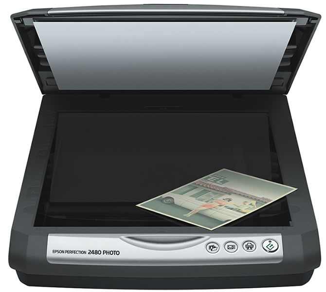

# U1. Desde un periférico

Básicamente podemos utilizar dos aparatos para conseguir fotografías: la **cámara de fotos** y el **sccaner**. Aunque actualmente proliferen mucho el uso de móviles y tablets, que usan la misma tecnología que las cámaras de fotos digitales. También podemos usar para hacer fotos las webcam del ordenador, aunque sacan fotos de peor calidad que los anteriores.

**CONOCIMIENTOS PREVIOS**

*   Conocer los diferentes puertos de comunicación que tiene un ordenador: puerto USB, lector de tarjetas de memoria.
*   Manejo básico de una cámara de fotos digital, o de un teléfono móvil.
*   Conectar los cables de una cámara a un ordenador.
*   Gestión de carpetas y subcarpeta: crear, eliminar, renombrar, copiar y pegar.

**1\. La cámara de fotos**

Hoy en día la cámara digital de fotos es **asequible** para todo el mundo, es **fácil de usar** y las **imágenes** que sacan son **muy buenas**. Por todo ello, es raro conocer a alguien que no tenga una cámara digital. El mecanismo es muy sencillo: sacamos nuestras fotos, que se guardan en una tarjeta de memoria y luego las descargamos a nuestro ordenador. ¿cómo?:

*   Conectando nuestra cámara al ordenador al puerto USB. 
*   Volcando las imágenes directamente de nuestra tarjeta de memoria al ordenador.
*   Utilizando un lector de tarjetas.

Se guardan las fotografías en una carpeta, y ya están listas para trabajar con ellas.

https://youtu.be/aPuuSwnOgbc

**2\. El Scáner**

Un [**escáner de ordenador**](http://es.wikipedia.org/wiki/Esc%C3%A1ner_de_computadora) (escáner proviene del idioma inglés scanner) es un p**eriférico que se utiliza para convertir, mediante el uso de la luz, imágenes impresas o documentos a formato digital**.

Al obtenerse una imagen digital se puede corregir defectos, recortar un área específica de la imagen o también digitalizar texto mediante técnicas de OCR. Estas funciones las puede llevar a cabo el mismo dispositivo o aplicaciones especiales.

Hoy en día es común incluir en el mismo aparato la impresora y el escáner. Son las llamadas impresoras multifunción. También están surgiendo el usar como escáner la cámara de los smartphones.

## Importante

**Extraer documentos de vídeo** de cámaras digitales también entraría dentro de esta unidad, pero como lo desarrollamos en el módulo 6 dedicado al tema de la edición de vídeo, te remitimos a él.

