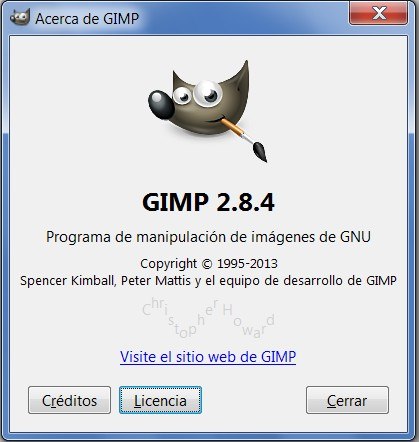
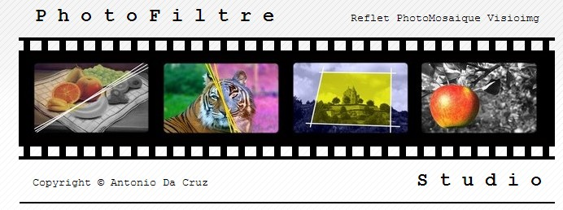

# U1. Empezando

**1\. ¿Qué es GIMP?**

**GIMP** (GNU Image Manipulation Program) es un programa de **edición de imágenes digitales** en forma de mapa de bits, tanto dibujos como fotografías. Es un **programa libre y gratuito**. Forma parte del **proyecto GNU** y está disponible bajo la **Licencia pública general de GNU**.

*   Es el programa de manipulación de gráficos **disponible en más sistemas operativos** (Unix, GNU/Linux, FreeBSD, Solaris, Microsoft Windows y Mac OS X, entre otros).
*   La interfaz de GIMP está **disponible en varios idiomas**, entre ellos: español, inglés (el idioma original), catalán, gallego, euskera, alemán, francés, italiano, ruso, sueco, noruego, coreano y neerlandés.

**2\. ¿Qué es Photofiltre?**

**[PhotoFiltre](http://www.photofiltre-studio.com/) es una aplicación para retocar imágenes de cualquier tipo**:

*   Posee **todo tipo de herramientas de edición gráfica** para que puedas trabajar en tus imágenes de manera cómoda. Si bien no es el Photoshop ni el Gimp, tampoco tiene nada que envidiarles, **es un programa muy completo** en el que encontraras todo lo que necesitas para cada ocasión. Tiene diferentes filtros, y todo tipo de efectos para fotografías para que puedas alcanzar el resultado deseado. 
*   El programa es **totalmente gratuito** por lo que podrás disponer del 100% de las funciones del programa sin ningún problema, esta es una buena oportunidad para iniciarte en este tipo de programas, no lo dudes.

**3\. ¿Qué es PIXLR**

Actualmente existen infinidad de aplicaciones online de edición fotográfica pero pocas tan completas como esta. [PIXLR](http://pixlr.com/editor/) es una aplicación web, con las ventajas que ello conlleva, y además es casi tan potente como un equivalente de Escritorio.

No has de fijarte mucho para comprobar cómo se parece Pixlr a Photoshop. Desde la barra de herramientas a los paneles son similares, así que si usas el editor de Adobe, no te costará hacerte a los mando de este programa.

## Importante

En este curso de "tratamiento de la imagen digital" vamos a basar casi todo el contenido en el uso de **GIMP**, no obstante también haremos referencias a otros programas con "**Photofiltre**" y al editor en línea "**pixrl**".

No obstante **si decides utilizar otro programa, comunícaselo al tutor para que, si es posible, se adapte a tu herramienta de trabajo.**

