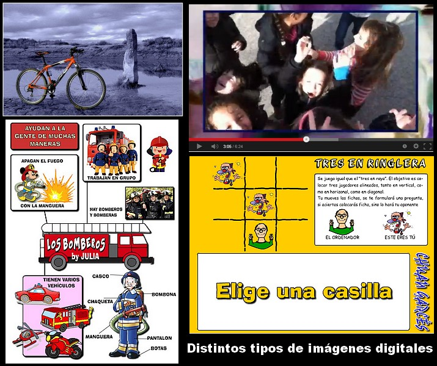
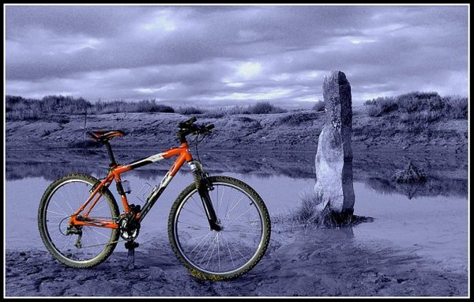
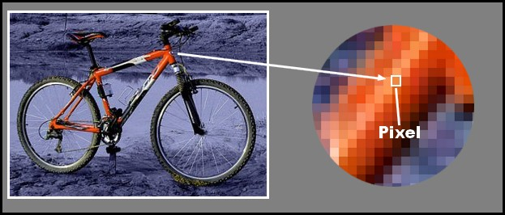

# U1. LA IMAGEN DIGITAL

**Vivimos una era en la que todas las formas de la información están sufriendo un proceso de [digitalización](http://es.wikipedia.org/wiki/Conversi%C3%B3n_anal%C3%B3gica-digital). Las imágenes, por supuesto, no han podido escapar a este proceso. La fotografía, el cine, la televisión, el diseño gráfico producen miles de imágenes digitales, que son almacenadas, enviadas por medios electrónicos, presentadas en una pantalla o impresas en papel en algún dispositivo.**

**1\. ¿Qué es una imagen digital?**

**Una imagen digital es una fotografía, un dibujo, un vídeo, un trabajo artístico o cualquier otra "imagen" que es convertida en un [fichero de ordenador](http://es.wikipedia.org/wiki/Archivo_(inform%C3%A1tica)).**

Consideramos como imágenes digitales a aquellas obtenidas mediante videocámaras, teléfonos móviles, sacanners, cámaras de fotos o generadas directamente por el ordenador.

Imagen 1: Julián Tullenque, Tipo de licencia CC by-nc

Dentro de toda esta tipología de imágenes que podemos encontrar en medios digitales, vamos a hacer una clara distinción:

*   **IMÁGENES ESTÁTICAS**: dibujos, fotogrtafías... 
*   **IMÁGENES DINÁMICAS**: son imágenes en movimiento. Aquí podemos englobar a los vídeos y las animaciones (flash).

**Ejemplo de imagen estática: FOTOGRAFÍA**

Imagen 2: Julián Tullenque, Tipo de licencia CC by-nc

**Un vídeo está compuesto por los sucesión de imágenes estática.**

Video 2: "El amor no duele". Autor: Varios. Tipo de licencia CC by-nc

**Un ejemplo de animación flash (swf). Imágenes en movimiento e interactivas.**

**2\. El pixel**

El [píxel](http://es.wikipedia.org/wiki/P%C3%ADxel) es la unidad mínima de visualización de una imagen digital. Si aplicamos el zoom sobre ella observaremos que está formada por una parrilla de puntos o píxeles. Las cámaras digitales y los escáneres capturan las imágenes en forma de cuadrícula de píxeles.

Imagen 3: autor Julián Trullenque. Tipo de licencia CC by-nc

