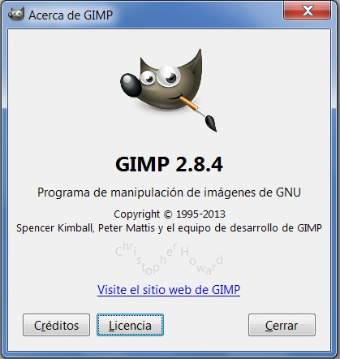

# U1. PROGRAMAS INSTALABLES

Existen montones de programas diferentes para hacer infinidad de cosas distintas. A la hora de elegir un programa de edición de imágenes es **necesario reflexionar**: ¿qué es lo que quieres hacer?, ¿de qué presupuesto dispones?, ¿con qué Sistema Operativo trabajas?...

En esta unidad te voy a presentar una [**lista de aplicaciones de edición de imágenes**](http://listas.20minutos.es/lista/los-12-mejores-programas-de-retoque-fotografico-361420/) comentada, para que te hagas una idea de lo que hay y puedas elegir la que más te convenga. O esta otra sobre [edición on-line](http://ounae.com/mejores-editores-fotos-online-gratis/). Son muchos, y no hay que probarlos todos, con las recomendaciones que te hacemos en este curso, seguro que salldrás satisfecho.

**Adobe PhotoShop**

[PhotoShop](http://www.adobe.com/la/products/photoshop.html) sigue siendo el **rey de la edición de imagen**, con todas las prestaciones avanzadas que requieren los profesionales.  Este programa uno de los mas utilizados y queridos por los diseñadores gráficos y fotógrafos de todo el mundo. El principal problema de este programa es su elevado precio, que lo hace asequible solamente a profesionales de la fotografía.

**GIMP**

[Gimp](http://www.gimp.org/): Otro de los programas referente en cuanto a retoque fotográfico se refiere, ademas de ser **gratuito** de la lista, está a la altura de cualquier programa de pago. Una alternativa de retoque fotográfico muy digna. En su caja de herramientas encontraras todo lo necesario para corregir tus imágenes. Tienes **versiones del programa para los distintos sistemas operativos**, incluidos Linux, Windows y Mac OS X.

**Photoscape**

[Photoscape](http://www.photoscape.org/ps/main/download.php?lc=es): Es un visor, organizador y editor de imágenes asequible sea cual sea tu nivel de conocimientos. Tiene todo lo que necesitas para manipular fotos en tu ordenador y sus resultados para uso cotidiano son variados y atractivos. Es sencillo e intuitivo.

**Photofiltre**

[Photofiltre](http://www.photofiltre.com/): éste es otro programa muy interesante, ya que es sencillo e intuitivo. Lo tenemos instalados en los tablets-PC y se pueden encontrar en la red versiones gratuitas. El problema de este programa es que dependiendo de la versión que tengamos nos cobrará conflictos con Windows 7. Es muy recomendable para hacer pequeños trabajos en nuestras fotos, por su rapidez y sencillez. Además tiene una versión portable.

 

## Importante

**Estas son varias de las alternativas que podemos encontrar a la hora de elegir un programa de edición de imagen. Para este curso hemos elegido trabajar con GIMP por las siguientes razones:**

*   Es gratuito y de código abierto.
*   Es multiplataforma: se puede usar en varios sistemas operativos distintos: Windwos, Linux, MacOs...
*   Tiene muchas prestaciones y es fácil de usar.

**No obstante en el desarrollo de las unidades, también haremos referencia a Photofiltre y Photoscape.**

