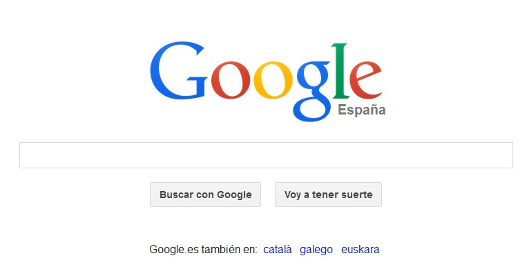
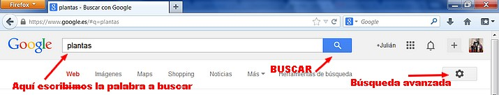
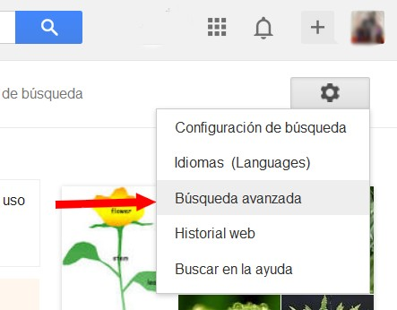
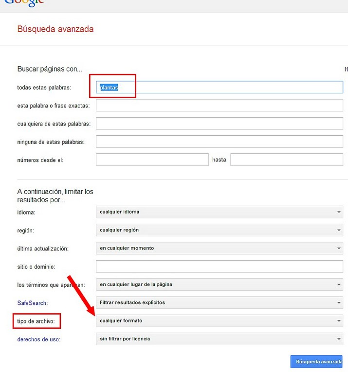
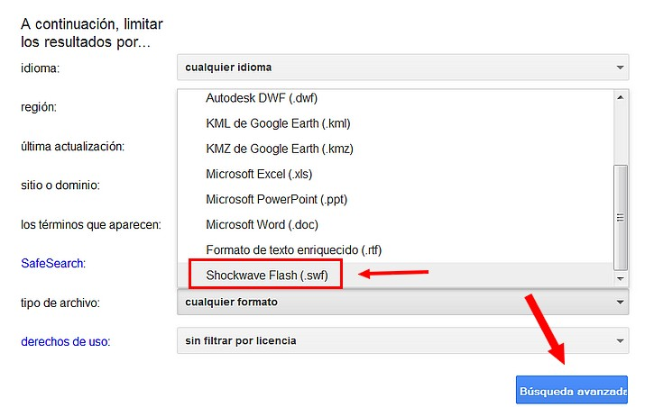
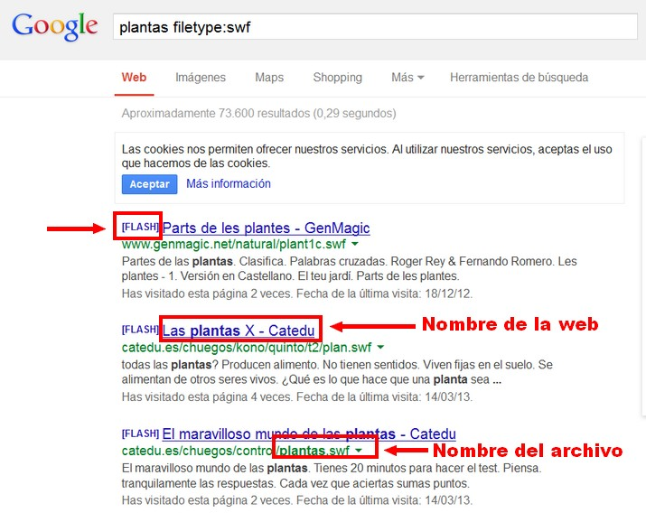

# U2. BÚSQUEDA DE FLASH

**CONOCIMIENTOS PREVIOS**

*   Conocimientos informáticos a nivel de usuario: buscar en la red, manejos de archivos y carpetas, manejo de descargas de la red.
*   Usar la búsqueda avanzada de Google.

**1\. Buscar archivos swf**

Para **encontrar archivos swf** vamos a utilizar la búsqueda **avanzada de Google**.

1º Abre en tu navegador (recomendamos MozillaFirefox y Google Chrome) [Google.es](https://www.google.es/)

 

Imagen 2: Captura de pantalla propia

2º **Escribimos** en el campo de búsqueda la palabra o palabras que queremos encontrar. Por ejemplo "plantas" y hacemos clic en **Buscar**. 

 

 Imagen 3: Captura de pantalla propia

3º Iniciamos la **Búsqueda Avanzada**. 

 

Imagen 4: Captura de pantalla propia

4º Nos aparecerá el siguiente **formulario**:

Imagen 5: Captura de pantalla propia

5º Elegimos en **Tipo de Archivo "Schokwawe Flash". **

 

 Imagen 6: Captura de pantalla propia

6º Y hacemos clic en **Búsqueda Avanzada**. Google nos devolverá estos resultados:

 

 Imagen 7: Captura de pantalla propia

7º Si hacemos clic en el **segundo resultado** se cargará esta página (puedes comprobar que es totalmente interactiva:

## Importante

**Google** es un servicio que **avanza a pasos agigantados**, por lo que normalmente van **modificando el motor de búsqueda constantemente**. En el momento de hacer el tutorial, las búsquedas avanzadas son como te mostramos. es posible que cuando estés haciendo el curso, la disposición de botones, formularios y demás haya cambiado. Pregunta al tutor todas las dudas y dificultades que tengas.

