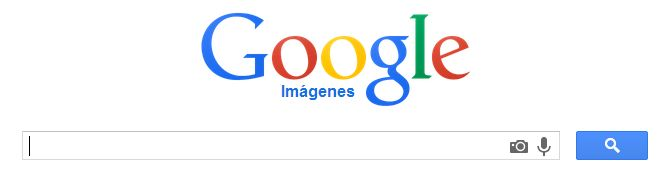
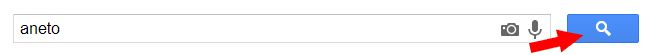
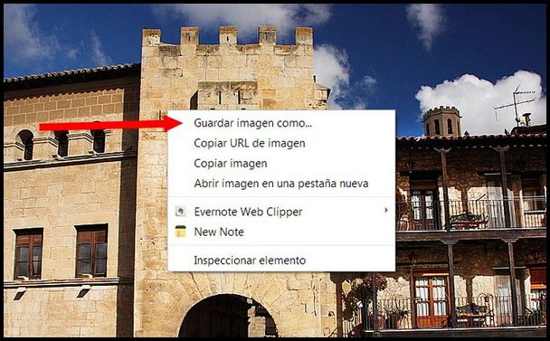
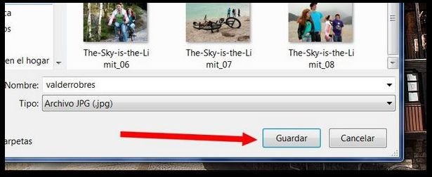

# U2. Buscar y descargar de Internet

Las primeras páginas web estaban formadas casi exclusivamente por texto. Ahora casi **todas las webs incluyen imágenes**. Además hay varios servicios que permiten alojar y compartir nuestras fotografías (Facebook, Picasa, Flirk...). Y cuando queremos una imagen para utilizarla en nuestros trabajos utilizamos **un buscador**. Hay varios buscadores pero en este curso utilizaremos **Google**, ya que pensamos que es el más rápido y el que más recursos nos puede ofrece.

**CONOCIMIENTOS PREVIOS**

*   Gestión de carpetas y subcarpeta: crear, eliminar, renombrar, copiar y pegar. Guardar y organizar documentos y archivos en carpetas.
*   Manejar un navegador (Explorer, Chrome, Mozilla...).

## Importante

**Recuerda que a la hora de utilizar y publicar imágenes de las que no somos propietarios tenemos que respetar las condiciones de uso de la imagen.**

**1\. Busca imágenes con Google**

Antes de empezar os comento que **Google** es un buscador que **evoluciona muy rápidamente**, y que **es posible** que es estos momentos **la estructura de la página no sea la misma que cuando se hicieron los apuntes**. Si tienes dudas puedes **preguntar a tu tutor**.

1º Para utilizar este buscador, lo primero que debemos hacer será abrir la página [google.es](https://www.google.es/). y nos aparecerá esta pantalla:

2º De los **botones** que tenemos en la parte superior derecha, hacemos clic en **"imágenes"** y nos aparecerá entonces una pantalla como ésta:

3º Ya podemos utilizar el buscador para encontrar la imagen que deseamos. Si queremos buscar una imagen sobre el pico Aneto, solo tendremos que escribir la palabra en el rectángulo y hacer "clic" en el icono de la lupa.

Imagen 4: Captura de pantalla propia

## Para saber más

**La búsqueda anterior es una búsqueda simple, pero podemos utilizar este formulario para hacer una búsqueda avanzada utilizando una serie de comandos que te serán útiles y que te animo a probar:**

*   Si quieres buscar una **frase exacta**, **introdúcela entre comillas** (""). Ejemplo: BUSCAR: "cursos aularagon".
*   Para encontrar páginas que **incluyan determinadas palabras** (Gasol), **pero no otras** (Marc), deberemos incluir el signo "-" delante de las que no queremos buscar. Por ejemplo, para descubrir webs que incluyan la palabra "gasol", pero no la palabra "marc": BUSCAR: gasol -marc.
*   Si pretendemos **encontrar una determinada palabra u otra**, usaremos el símbolo "|" (AltGr+1). Por ejemplo, para buscar webs en las que aparezca "tienda" y "zapatos", o bien "tienda" y "pantalones": BUSCAR: tienda (zapatos | pantalones).
*   Si queremos que Google nos **busque una determinada palabra sin que haga interpretaciones**, escribiremos el signo "+" delante. Por ejemplo: si buscamos "OT" nos devolverá imágenes de Operación Triunfo, si buscamos "+OT" será otra cosa.
*   **El asterisco ("*") funciona como un comodín**. Cuando lo pones delante de una palabra y dentro de una frase le estás diciendo a Google que busque la frase exacta que le pides pero que puede intercambiar la palabra del asterisco por otra. 
*   **No es necesario distinguir las mayúsculas de las minúsculas**. Estas dos búsquedas generan los mismos resultados: BUSCAR: AulaRagOn. BUSCAR: aularagon.

**Aquí tienes una animación que te muestra como hacer la búsqueda de imágenes con herramientas avanzadas. Para verlo tendrás que hacer clic en el botón azul (flecha).**

<object type="application/x-shockwave-flash" data="http://aularagon.catedu.es/materialesaularagon2013/imagen/busquedaimagenes.swf" width="715" height="500"><param name="src" value="http://aularagon.catedu.es/materialesaularagon2013/imagen/busquedaimagenes.swf"></object>

**2\. Descarga de imágenes**

**Descargar una imagen de Internet y guardarla es muy sencillo. Una vez que hayamos encontrado en el navegador la imagen hacemos lo siguiente:**

1º Hacer **clic con el botón derecho sobre la imagen**. Se desplegará el siguiente menú:

 

2º Nos aparecerá esta **ventana**. Elegimos el sitio (carpeta, pendrive, disco duro) en la que la queremos guardar.

3º Hacemos clic en guardar. Ya tendremos la imagen en nuestro disco duro para utilizarla o manipularla.

**NOTA**: si utilizamos en comando **"copiar imagen"**, no la guardaremos en el disco duro sino en el portapapeles y con el comando **"pegar"** de nuestro programa de edición la tendremos preparada para ser manipulada.

**Aquí tienes una animación que te muestra como guardar una imagen en tu disco duro. Para verlo tendrás que hacer clic en el botón azul (flecha).**

<object type="application/x-shockwave-flash" data="http://aularagon.catedu.es/materialesaularagon2013/imagen/guardar.swf" width="715" height="500"><param name="src" value="http://aularagon.catedu.es/materialesaularagon2013/imagen/guardar.swf"></object>

## Para saber más

*   **TOTEMGUARD: 15 trucos útiles para enseñar a tus alumnos a buscar en Google de forma profesional**. [http://www.totemguard.com/aulatotem/2011/03/15-trucos-utiles-para-ensenar-a-tus-alumnos-a-buscar-en-google-de-forma-profesional/](http://www.totemguard.com/aulatotem/2011/03/15-trucos-utiles-para-ensenar-a-tus-alumnos-a-buscar-en-google-de-forma-profesional/). Copyright 2011 TOTEMGUARD. All Rights Reserved.  
      
    
*   Artículo sobre los derechos de autor: **"Publicar en un blog de forma responsable.** Tiscar Lara. año 2008: [http://tiscar.com/publicar-un-blog-de-forma-libre-y-responsable/](http://tiscar.com/publicar-un-blog-de-forma-libre-y-responsable/) Licencia [CC by-nc-sa](http://creativecommons.org/licenses/by-nc-sa/3.0/deed.es)

