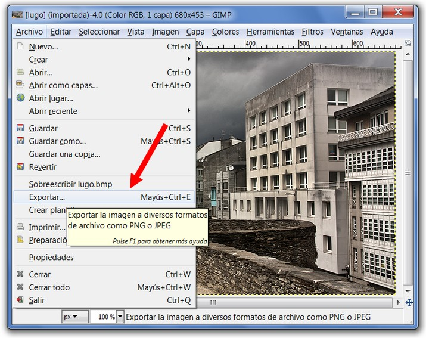
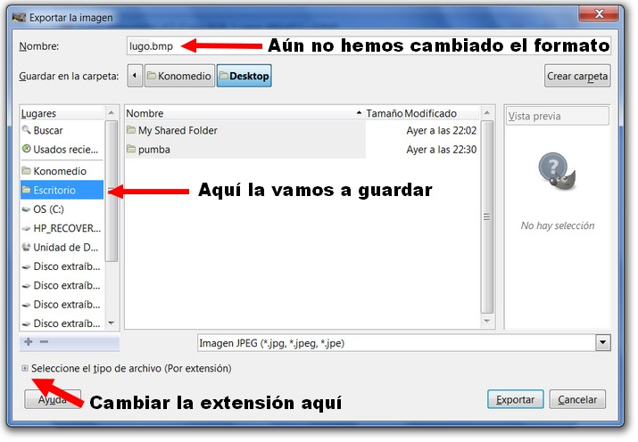
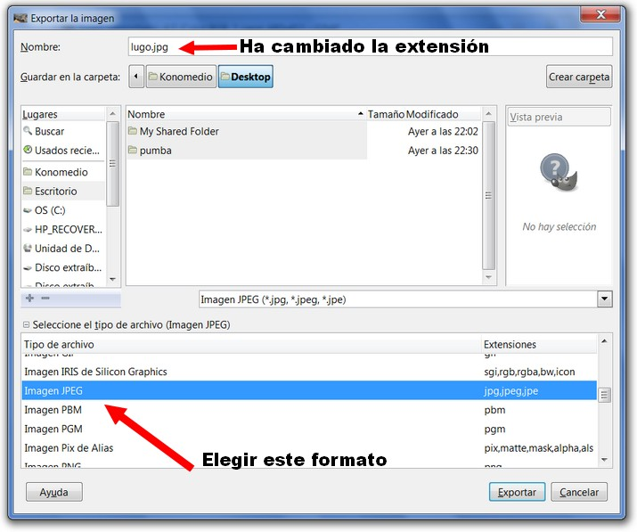
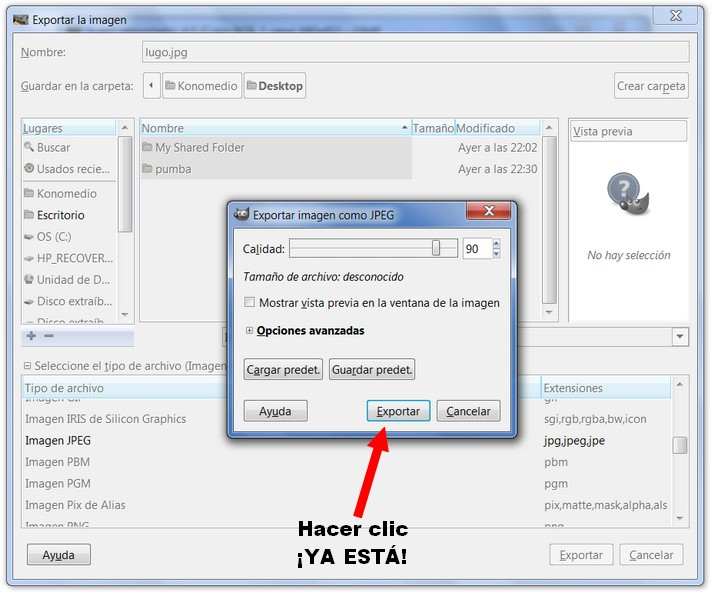
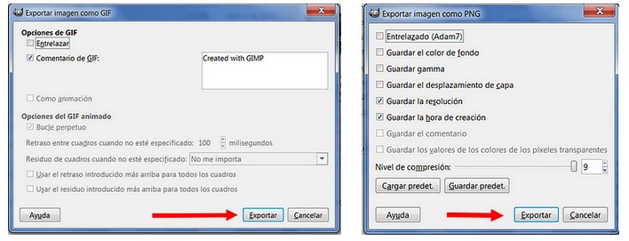
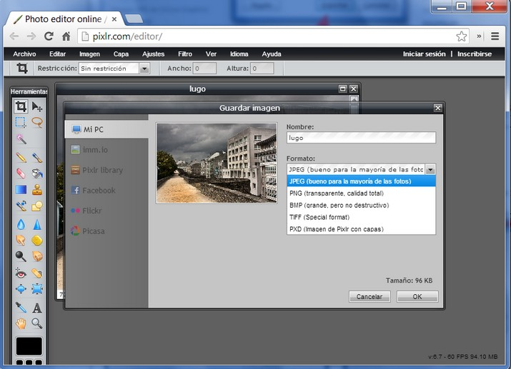

# U2. Formatos de imagen

El propósito de esta tarea es familiarizarse con el uso de un **editor para convertir una imagen de un formato a otro**. Como sabemos los formatos más ligeros y adecuados a la web son: **GIF, PNG y JPEG**. En este caso veremos cómo convertir el archivo original BMP a cada uno de estos formatos.

**1\. Guardar una imagen en otro formato usando Gimp**

1º **Abrimos** la imagen con el editor (ver Unidad 1 "manejo de archivos" en el apartado "abrir archivos").

 

Imagen20: Captura de pantalla propia

2º Aparecerá el siguiente cuadro de dialogo. Hacemos clic en **"Seleccione el tipo de archivo (por extensión)"**.

 

Imagen 21: Captura de pantalla propia  

3º **Elegimos JPEG**. Veremos que ya ha cambiado la extensión en el nombre de archivos.

 

Imagen 22: Captura de pantalla propia  

4º Hacemos clic en **Exportar**. Y aparece el cuadro de diálogo.

 

Imagen 23: Captura de pantalla propia  

5º Hacemos clic en **Exportar**. Observa que se podrá poner más o menos calidad. 90% está bien.

**Para convertir a GIF o PNG el procedimiento es el mismo, salvo que el cuadro que aparece en la imagen 19  (paso 4º) será distinto según se trate de uno u otro formato.**

 

Imagen 24: Captura de pantalla propia  

****2\. Guardar una imagen en otro formato usando Photofiltre****

**En la siguiente presentación se muestra cómo se guarda un archivo en el formato que queremos. Hemos guardado en tres formatos diferentes para que se vean tres formatos diferentes.**

 

**3\. Guardar una imagen en otro formato usando Pixlr**

En [http://pixlr.com](http://pixlr.com/) el proceso es muy similar a Photofiltre. Archivo>Guardar y seleccionar la extensión. lo único es que el programa no permite todas las extensiones y formatos.

 

Imagen 25: Captura de pantalla propia

## Tarea

1.  **Descarga y descomprime** la imagen [playa.rar](http://aularagon.catedu.es/materialesaularagon2013/imagen/playa.rar).
2.  **Abre** la imagen **playa.bmp**.
3.  Con el comando **Guardar**, la guardas en **tres formatos distintos**(jpg, gif y png).
4.  A continuación abre el Explorador de Windows y mira el tamaño de las cuatro imágenes, observa cómo sus tamaños cambian, y observa cómo la calidad de JPG no tiene una pérdida considerable mientras que su tamaño sí que ha disminuido considerablemente.

## ParaSaberMas

Es posible convertir una imagen a otro formato a través de varios servicios 2.0 (convertfiles, zamzar...). Te presentamos [FisPicture](http://www.fixpicture.org/index.php?LANG=es) que en pocos pasos y rápidamente convierte uan imagen a flrmato que desees. Se admiten todos los formatos de imagen populares (jpeg, tiff, png, gif, bmp, tga, . **...**Más de 400 formatos aceptados. 

