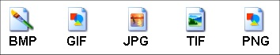

# U2. FORMATOS Y RESOLUCIÓN

Las [**imágenes digitales**](http://es.wikipedia.org/wiki/Imagen_digital) aparecen en numerosos medios de comunicación: publicidad, periódicos, revistas, Internet..., Cada vez son más los lugares en los que aparecen y si se desea controlar la apariencia, modificar el tamaño, añadir texto o cambiar el color de la imagen o de parte de ella, es necesario conocer el funcionamiento básico de un editor de imágenes, como GIMP, Photoshop o Paint Shop Pro.

Antes de estudiar los procedimientos más habituales de optimización y tratamiento de imágenes es conveniente conocer algunas **ideas clave relacionadas con la imagen digital**: 

*   El tamaño de la imagen.
*   La resolución de la imagen.
*   El formato de la imagen.

**1\. Tamaño de la imagen  
**

Uno de los principales factores que determinan el peso de un archivo gráfico es el tamaño de la imagen que contiene, es decir, el número de píxeles (puntos) en anchura y altura. Imágenes más grandes tendrán más peso y tardarán más en cargarse. Mira los ejemplos:

**2\. Resolución de la imagen**

Es el **grado de detalle o calidad de una imagen digital** ya sea escaneada, fotografiada o impresa. Este valor se expresa en **ppp (píxeles por pulgada)**. Cuantos más píxeles contenga una imagen por pulgada lineal, mayor calidad tendrá.

*   La resolución de un monitor se refiere al número de píxeles por pulgada que es capaz de mostrar. La resolución de una pantalla de ordenador PC es de 72 ppp.
*   En una impresora se habla del número de puntos por pulgada que puede imprimir: 600, 1200, etc.
*   Algunos escáneres suelen producir imágenes con una resolución por defecto de 200 ppp.
*   Las cámaras digitales prestan una calidad que se expresa en MegaPíxels. Así por ejemplo una cámara de 8 MP es aquella capaz de tomar una fotografía con 8 millones de píxeles. 

 A continuación se presenta una ilustración sobre cómo se vería la misma imagen en diferentes resoluciones:

Imagen 4: autor Julián Trullenque. Tipo de licencia CC by-nc

## Importante

Depende el uso que vayamos a hacer de la imagen, elegiremos una resolución y un tamaño:

*   Si es para un blog, utilizaremos un tamaño como máximo de 800 puntos en su lado horizontal y como mínimo 400 y una resolución de 70 puntos por pulgada.
*   A mayor tamaño y resolución tardará más en cargarse. Para imprimir en papel fotográfico o utilizaremos la mayor resolución y tamaño que nos permita la cámara fotográfica.

**3\. Formatos de imagen  
**

Las imágenes digitales se pueden guardar en distintos formatos. Cada uno se corresponde con una extensión específica del archivo que lo contiene. Los más utilizados en la actualidad son: BMP, JPG, GIF, PNG, RAW y GIF:

*   **BMP (Bitmap = Mapa de bits)**

Ha sido muy utilizado porque fue desarrollado para aplicaciones Windows. El formato BMP no sufre pérdidas de calidad y por tanto resulta adecuado para guardar imágenes que se desean manipular posteriormente. Ventaja: Guarda gran cantidad de información de la imagen. Inconveniente: El archivo tiene un tamaño muy grande.

*   **JPG o JPEG (Joint Photographic Experts Group)**

Es un formato de imágenes muy popular, soporta 16,7 millones de colores y es el más empleado para las fotografías. Si se descargan archivos de imagen desde la cámara o desde el teléfono, lo más probable es que tengan extensión _.jpg_.

Las imágenes JPG se comprimen y pierden información cada vez que se abren y se vuelven a guardar y van perdiendo calidad. Por tanto, es recomendable hacer una copia de las imágenes _.jpg_ antes de empezar a editarlas.

Los JPG son ideales para Internet porque permiten reducir el tamaño de archivo al guardar una imagen. Un menor tamaño conlleva que las páginas Web se abran más rápido.

*   **GIF (Graphic Interchange Format)**

Es un formato de baja calidad que se utiliza en gráficos con pocos colores (hasta 256). Permite realizar animaciones simples para la Web pero no es adecuado en fotografías,

*   **PNG (Portable Network Graphic)**

Este formato fue desarrollado para superar las limitaciones del GIF. El formato permite imágenes con color verdadero, escala de grises y paleta de 8 bits. Al igual que el GIF es adecuado para imágenes con pocas variaciones de colores.

*   **RAW**

Los archivos RAW provienen de cámaras digitales de alta gama. Son más grandes que los JPG porque no comprimen la imagen y contienen mucha más información sobre ella. También contienen los metadatos, que incluyen información como la fecha y hora de la creación y la configuración de la imagen.

*   **TIFF (Tagged Image File Format)**

Es un formato de alta calidad, utiliza un compresor sin pérdida de información. Si se guarda varias veces una imagen mientras se trabaja en ella, no pierde calidad. TIFF es un conocido formato de archivo para imprimir, escanear o archivar imágenes.

**NOTA: Los formatos de vídeo y animaciones los veremos en el módulo correspondiente.**

