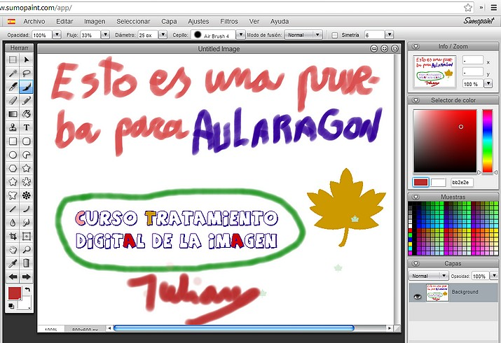

# U2. HERRAMIENTAS ON-LINE

Aparte de todas las anteriores alternativas que sin duda ofrecerán opciones para todos los gustos, queremos destacar otra gama de programas que podrían resultar interesantes para algunas personas. Se trata de los e**ditores online de imágenes y de retoque fotográfico**. Son programas que **funcionan en el propio navegador**, por lo que cualquiera los puede usar con solo entrar en una **página web**.

La ventaja es que **no necesitan instalación y que están disponibles en cualquier ordenador conectado a Internet**. La desventaja es que, por las particularidades de las aplicaciones online, tienen algunos detalles que no las hacen tan cómodas de usar, ni tan versátiles o rápidas como las aplicaciones de escritorio. Sin embargo, su gratuidad las hacen idóneas para muchos casos y a menudo ofrecen algunas funcionalidades originales que pueden ayudarnos a aumentar nuestra creatividad.

**1\. Pixrl**

[Pixrl](http://pixlr.com/): es una aplicación web para la **edición de imágenes** que cuenta con la mayoría de las herramientas de una aplicación de escritorio como soporte para capas, ajustes de brillo, contraste o saturación, filtros, selección mágica, efectos... todo ello a través de una interfaz de diseño limpio y elegante.   
  
Una vez que se accede a su website puedes empezar a editar imágenes sin necesidad de instalar nada ni de registrarse. Las imágenes que editemos se pueden salvar en JPG y PNG, con sus respectivas opciones de calidad.  
  
Pixlr está pensado para usuarios no profesionales que busquen un editor de imágenes simple, veloz y con las prestaciones más utilizadas por la mayoría de las personas. El API Pixlr, aún fase inicial de desarrollo, abre la posibilidad de integrar Pixlr a tu blog, aplicación web o sitio web (COMO EL EJEMPLO EN ESTA PÁGINA)  
  
Pixlr está disponible en castellano de forma completamente gratuita desde [www.pixlr.com](http://www.pixlr.com/)

**La imagen de abajo es una insercción en esta web del programa pixrl. Es totalmente interactivo.**

**2\. SumoPaint**

Hay muchos editores de imágenes on-line, pero hay uno que sorprende por su potencia. Es [Sumo Paint](http://www.sumopaint.com/), uno de los editores de imágenes on-line más intuitivo y versátil. Puedes encontrar gran variedad de pinceles y formas, multitud de filtros, funciones avanzadas de texto y capas, además de trazados vectoriales básicos. Una muy buena herramienta para editar y modificar tus imágenes. Se puede trabajar en español. Hay una versión gratuita. Lo peor es que pone publicidad en la página.

 Imagen 3: Captura de pantalla propia.

## ParaSaberMas

**3\. Otros editores de imágenes en línea**

*   **[Educ@conTIC](http://www.educacontic.es/): Utilidades 2.0: Editores de imagen on-line. **
    *   **[http://www.educacontic.es/blog/utilidades-2-0-editores-de-imagenes-online](http://www.educacontic.es/blog/utilidades-2-0-editores-de-imagenes-online).**
    *   **[http://www.educacontic.es/blog/herramientas-de-edicion-de-imagenes-online](http://www.educacontic.es/blog/herramientas-de-edicion-de-imagenes-online)**

