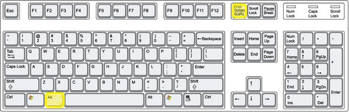

# U3. Capturar pantallas de un ordenador

**1\. ¿Qué es?**

**Una captura de pantalla o "pantallazo", es una simple imagen de lo que aparece en la pantalla del ordenador.**

En ocasiones, podemos requerirte un pantallazo para una incidencia en particular o simplemente para mostrar que aparece en la pantalla. **En otras ocasiones, es más fácil mostrar a los demás mediante un pantallazo  qué es lo que estás viendo en tu ordenador, en lugar de tener que explicarlo. **También nos puede servir para capturar una imagen de una web, un vídeo o una animación que es imposible descargar.

**2\. ¿Cómo se hace?**

1.  **Pulsa "Imprimir pantalla (Ptr Sc) (Imp pant)" o "Alt"+"Imprimir pantalla en tu teclado.**
    *   Pulsando **"Imprimir pantalla"** capturas un pantallazo de **toda la pantalla**.
    *   Pulsando **"Alt"+"Imprimir pantalla"** capturas sólo la **ventana activa.**
    *   La tecla "Imprimir pantalla" también puede denominarse "Impr Pant" o "Prt Sc" y en algunos portátiles se podría requerir una tecla adicional ("FN").
2.  **Abre un nuevo documento en  "PowerPoint (Impress)","Word" u otro programa editor de imágenes.  
    **
3.  **Pulsa "Ctrl" + "V" para pegar el pantallazo en el nuevo documento o usa el botón derecho del ratón y selecciona "Pegar" en el menú de opciones.**
4.  **Guarda el documento en tu carpeta de trabajo.**

Imagen 7: autor betfair.com. Licencia CC by-nc.

**3\. ¿Para qué sirve?**

*   **Mostrar la pantalla de nuestro ordenador.**
*   **Capturar una imagen o un texto de un documento. Luego se pude recortar.**
*   **Extraer una imagen de un juego, una animación o un vídeo.**
*   **...**

## ParaSaberMas

**Windows 7 y 8 incluyen una utilidad denominada "SnippingTool". Es una herramienta para capturar pantalla que permite realizar pantallazos  (denominados ""snips"") parciales de una pantalla.**

[**SnippingTool**](http://xpsnipping.codeplex.com/)

*   **[Usar "recortes para hacer capturas de pantalla](http://windows.microsoft.com/es-xl/windows7/use-snipping-tool-to-capture-screen-shots). Ayuda oficial de Microsoft. [Términos de uso](http://www.microsoft.com/en-us/legal/intellectualproperty/copyright/default.aspx).**

